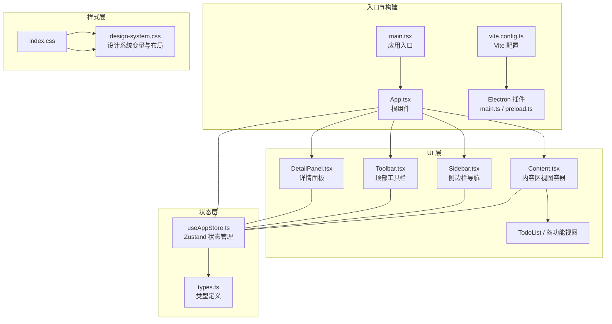
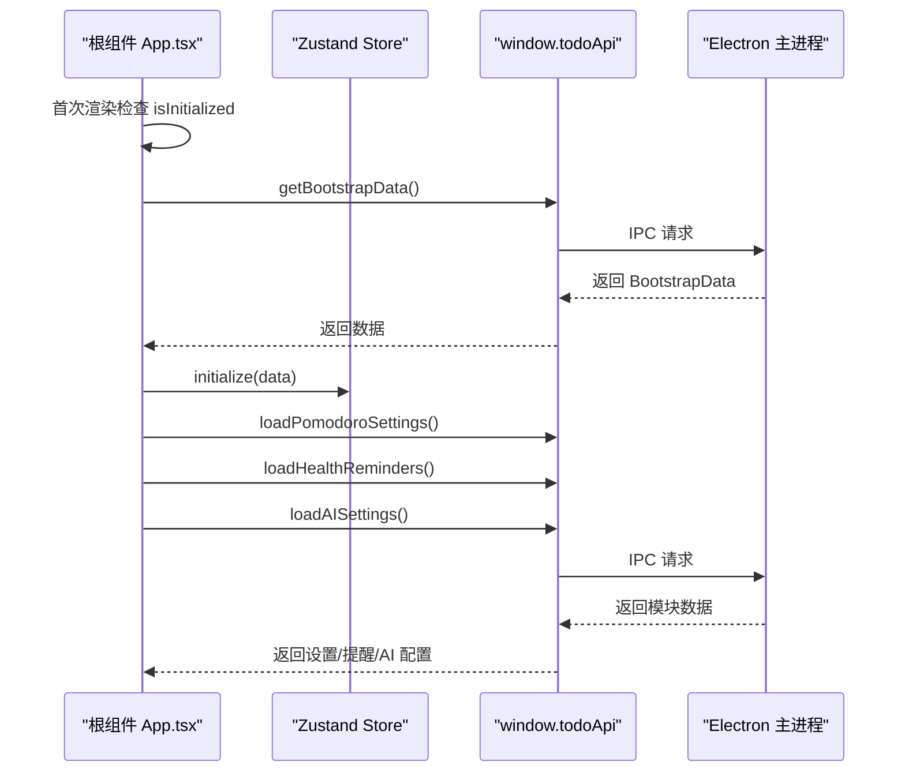
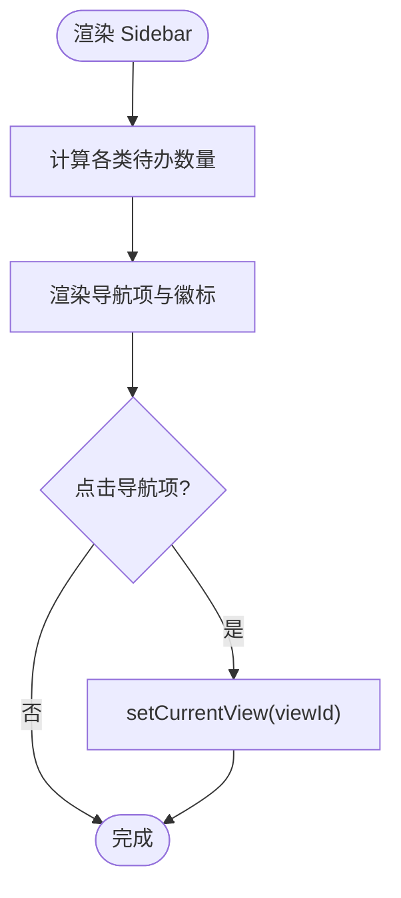
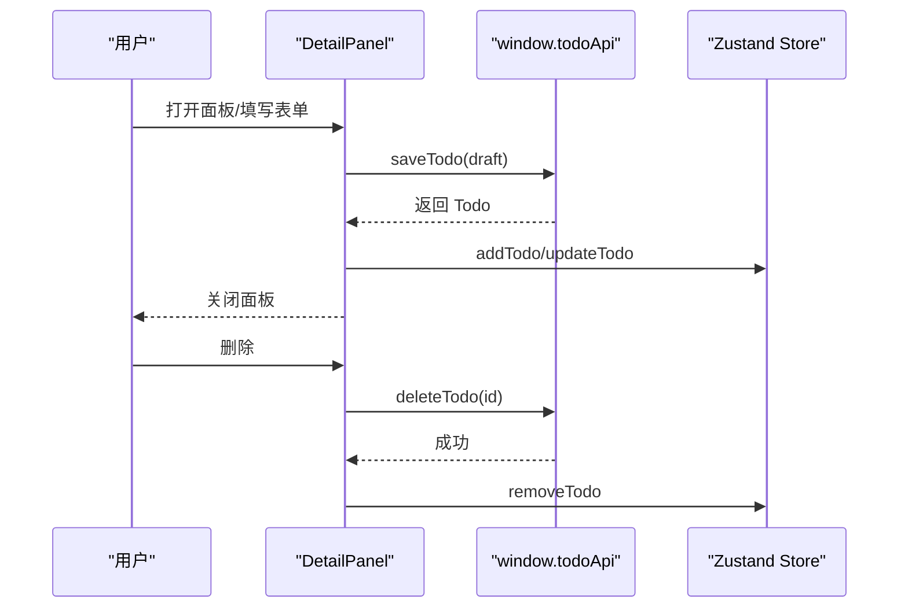
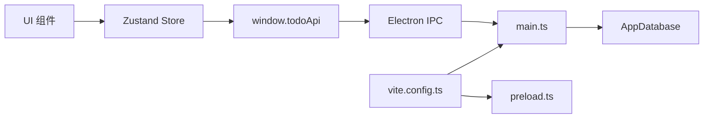
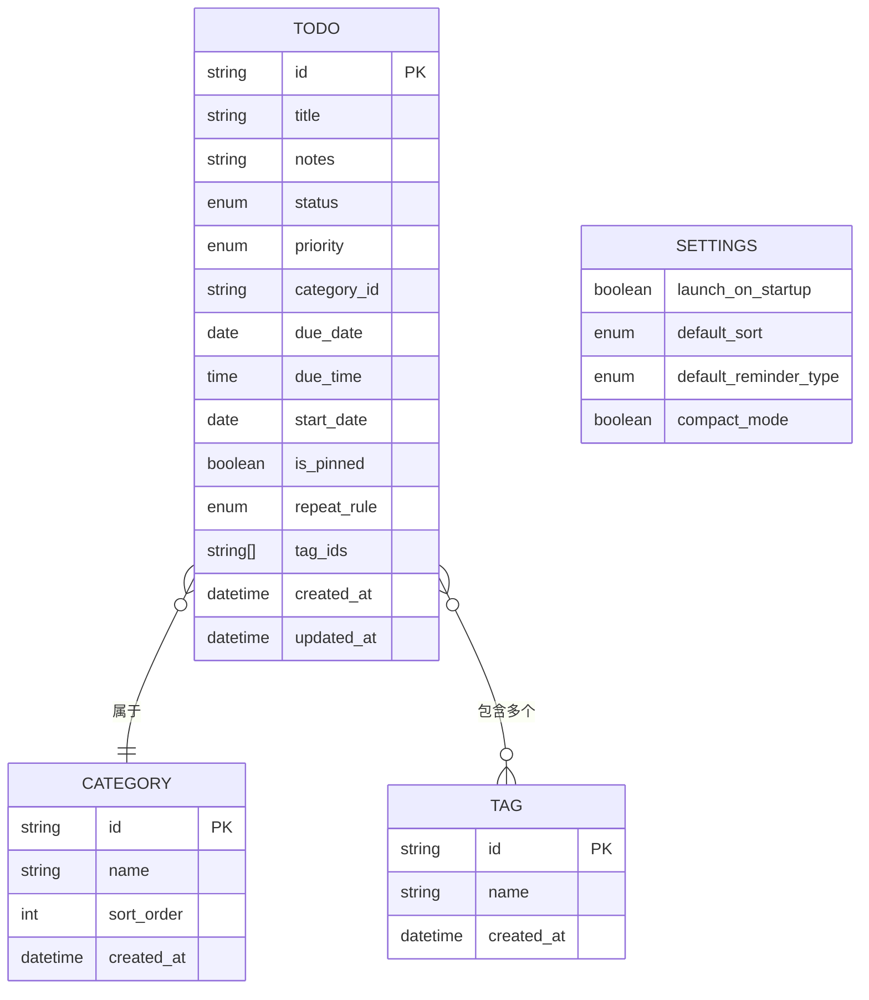

# React 前端架构

<cite>
**本文档引用的文件**
- [main.tsx](file://app/src/main.tsx)
- [App.tsx](file://app/src/App.tsx)
- [useAppStore.ts](file://app/src/store/useAppStore.ts)
- [types.ts](file://app/src/types.ts)
- [components/index.ts](file://app/src/components/index.ts)
- [Sidebar.tsx](file://app/src/components/Sidebar/Sidebar.tsx)
- [Content.tsx](file://app/src/components/Content/Content.tsx)
- [Toolbar.tsx](file://app/src/components/Toolbar/Toolbar.tsx)
- [DetailPanel.tsx](file://app/src/components/DetailPanel/DetailPanel.tsx)
- [RecurringTodosView.tsx](file://app/src/components/RecurringTodos/RecurringTodosView.tsx)
- [SettingsPage.tsx](file://app/src/components/Settings/SettingsPage.tsx)
- [design-system.css](file://app/src/styles/design-system.css)
- [index.css](file://app/src/index.css)
- [vite.config.ts](file://app/vite.config.ts)
- [package.json](file://app/package.json)
- [main.ts (Electron)](file://app/electron/main.ts)
</cite>

## 目录
1. [引言](#引言)
2. [项目结构](#项目结构)
3. [核心组件](#核心组件)
4. [架构总览](#架构总览)
5. [详细组件分析](#详细组件分析)
6. [依赖关系分析](#依赖关系分析)
7. [性能考虑](#性能考虑)
8. [故障排除指南](#故障排除指南)
9. [结论](#结论)
10. [附录](#附录)

## 引言
本文件面向 SnowTodo 的 React 前端架构，系统性阐述应用的整体设计与实现思路。重点覆盖以下方面：
- 根组件 App.tsx 的职责与控制流
- 组件层次结构与模块化设计理念
- 路由系统与视图切换机制
- 状态管理与数据流（基于 Zustand）
- 组件间通信机制（props、事件、状态共享）
- 初始化流程（从 main.tsx 到功能模块加载）
- 组件开发规范、最佳实践与性能优化策略

## 项目结构
SnowTodo 采用 Electron + Vite + React 技术栈，前端代码位于 app/src 目录，通过 Vite 插件与 Electron 主进程对接。项目结构清晰，遵循“功能域 + 组件库”的组织方式。



**图表来源**
- [main.tsx:1-11](file://app/src/main.tsx#L1-L11)
- [App.tsx:1-60](file://app/src/App.tsx#L1-L60)
- [vite.config.ts:1-37](file://app/vite.config.ts#L1-L37)
- [design-system.css:166-296](file://app/src/styles/design-system.css#L166-L296)

**章节来源**
- [main.tsx:1-11](file://app/src/main.tsx#L1-L11)
- [vite.config.ts:1-37](file://app/vite.config.ts#L1-L37)
- [package.json:1-100](file://app/package.json#L1-L100)

## 核心组件
本节聚焦根组件 App.tsx 的职责与控制流，以及状态管理与数据流。

- 根组件职责
  - 应用初始化：首次渲染时通过 window.todoApi 获取引导数据并初始化全局状态
  - 模块数据加载：初始化完成后异步加载各功能模块的数据（如番茄钟、健康提醒、AI 设置）
  - 视图编排：渲染侧边栏、工具栏、内容区、详情面板、重复待办面板与健康提醒弹窗
  - 状态驱动：通过 useAppStore 读取当前视图、面板开关状态、重复待办编辑项等

- 状态管理与数据流
  - 使用 Zustand 管理全局状态，涵盖基础数据（待办、分类、标签、设置）、UI 状态（当前视图、筛选器、排序）、各功能模块状态（番茄钟、健康提醒、AI、时间块、仪表盘、项目）
  - 通过 window.todoApi 与 Electron 主进程交互，执行 CRUD、设置更新、数据导入导出、提醒触发等操作
  - 计算属性（如过滤后的待办列表、今日/即将到来任务等）在 store 内部实现，保证数据一致性与可复用性

- 组件间通信机制
  - Props 传递：父组件通过 props 控制子组件行为（如详情面板的开关、编辑项）
  - 事件处理：子组件通过回调函数更新 store 或调用 API（如搜索框输入、优先级筛选、新建/编辑待办）
  - 状态共享：所有组件共享同一 Zustand store，避免跨层级传递的复杂性

**章节来源**
- [App.tsx:11-57](file://app/src/App.tsx#L11-L57)
- [useAppStore.ts:30-80](file://app/src/store/useAppStore.ts#L30-L80)
- [useAppStore.ts:181-508](file://app/src/store/useAppStore.ts#L181-L508)
- [types.ts:1-278](file://app/src/types.ts#L1-L278)

## 架构总览
下图展示了前端应用的总体架构与数据流向，强调根组件、状态管理、功能视图与 Electron 主进程之间的关系。

```mermaid
graph TB
subgraph "前端"
Root["App.tsx<br/>根组件"] --> Store["useAppStore.ts<br/>Zustand 状态"]
Root --> Views["功能视图<br/>Sidebar/Toolbar/Content/DetailPanel"]
Store --> API["window.todoApi<br/>Electron IPC 封装"]
end
subgraph "Electron 主进程"
Main["main.ts<br/>IPC 注册与调度"]
DB["数据库<br/>AppDatabase"]
end
API <- --> Main
Main --> DB
subgraph "外部集成"
Reminder["提醒循环<br/>定时检查"]
Health["健康提醒循环"]
Shortcut["全局快捷键"]
end
Main --> Reminder
Main --> Health
Main --> Shortcut
```

**图表来源**
- [App.tsx:24-34](file://app/src/App.tsx#L24-L34)
- [useAppStore.ts:541-602](file://app/src/store/useAppStore.ts#L541-L602)
- [main.ts (Electron):227-358](file://app/electron/main.ts#L227-L358)

## 详细组件分析

### 根组件 App.tsx
- 初始化流程
  - 首次渲染检测 isInitialized，若未初始化则调用 window.todoApi.getBootstrapData 获取初始数据
  - 调用 initialize 完成基础数据注入，并加载各模块设置与数据
- 视图编排
  - 渲染侧边栏、主区域（工具栏 + 内容区）、详情面板、重复待办面板、健康提醒弹窗
  - 通过 store 状态控制面板开关与编辑项
- 数据依赖
  - 依赖 useAppStore 的初始化状态、视图切换、面板开关、重复待办列表与编辑项



**图表来源**
- [App.tsx:24-34](file://app/src/App.tsx#L24-L34)
- [useAppStore.ts:237-246](file://app/src/store/useAppStore.ts#L237-L246)
- [useAppStore.ts:394-447](file://app/src/store/useAppStore.ts#L394-L447)

**章节来源**
- [App.tsx:11-57](file://app/src/App.tsx#L11-L57)
- [useAppStore.ts:237-246](file://app/src/store/useAppStore.ts#L237-L246)

### Sidebar 侧边栏
- 导航与计数
  - 基于 currentView 渲染当前激活项
  - 计算今日/全部/即将到期/已完成/提醒数量并在导航项上显示徽标
- 功能分区
  - 效率工具（项目集合、番茄工作法、时间块视图、仪表盘、健康小助手、AI 助手）
  - 管理（每日待办、提醒）
  - 分类与标签（动态渲染）
- 交互
  - 点击切换 currentView
  - 点击分类/标签设置对应过滤条件



**图表来源**
- [Sidebar.tsx:33-58](file://app/src/components/Sidebar/Sidebar.tsx#L33-L58)
- [Sidebar.tsx:73-188](file://app/src/components/Sidebar/Sidebar.tsx#L73-L188)

**章节来源**
- [Sidebar.tsx:30-202](file://app/src/components/Sidebar/Sidebar.tsx#L30-L202)

### Toolbar 工具栏
- 标题与搜索
  - 根据 currentView 显示标题
  - 搜索框绑定 searchQuery，支持实时过滤
- 筛选器
  - 优先级筛选（全部/高/中/低）
- 行为
  - 新建待办按钮打开详情面板

**章节来源**
- [Toolbar.tsx:16-77](file://app/src/components/Toolbar/Toolbar.tsx#L16-L77)

### Content 内容区
- 视图路由
  - 根据 currentView 渲染不同视图：设置页、提醒、重复待办、番茄钟、仪表盘、健康、AI、时间块、项目集合
  - 默认视图（today/all/upcoming/completed/categories/tags）渲染 TodoList
- 加载态
  - isLoading 时显示加载中状态

**章节来源**
- [Content.tsx:14-63](file://app/src/components/Content/Content.tsx#L14-L63)

### DetailPanel 详情面板
- 编辑与新建
  - 基于 selectedTodoId 决定编辑或新建模式
  - 默认值来自分类、设置与当前日期
- 表单字段
  - 标题、备注、优先级、截止日期/时间、开始日期、分类、标签、重复规则、提醒设置、置顶
- 图片管理
  - 支持拖拽、粘贴、文件选择上传图片；支持本地临时存储与持久化
- 保存与删除
  - 保存时调用 window.todoApi.saveTodo 并同步更新 store
  - 删除时调用 window.todoApi.deleteTodo 并更新 store



**图表来源**
- [DetailPanel.tsx:166-185](file://app/src/components/DetailPanel/DetailPanel.tsx#L166-L185)
- [DetailPanel.tsx:193-198](file://app/src/components/DetailPanel/DetailPanel.tsx#L193-L198)

**章节来源**
- [DetailPanel.tsx:33-507](file://app/src/components/DetailPanel/DetailPanel.tsx#L33-L507)

### RecurringTodosView 重复待办视图
- 数据加载
  - 首次渲染调用 loadRecurringTodos 获取模板列表
- 操作
  - 启用/停用、编辑、删除
  - 打开 RecurringTodoPanel 进行新增或编辑
- 展示
  - 模式标签、提醒时间、分类与标签、状态与最后生成时间

**章节来源**
- [RecurringTodosView.tsx:28-218](file://app/src/components/RecurringTodos/RecurringTodosView.tsx#L28-L218)

### SettingsPage 设置页
- 设置项
  - 开机自启、默认排序、默认提醒方式
- 数据管理
  - 导出数据、导入数据（导入成功后重新初始化 store）

**章节来源**
- [SettingsPage.tsx:5-147](file://app/src/components/Settings/SettingsPage.tsx#L5-L147)

## 依赖关系分析
- 组件依赖
  - 所有 UI 组件均依赖 useAppStore 以读取状态与派发动作
  - Content 作为视图容器，按 currentView 动态渲染具体视图
  - Sidebar/Toolbar/DetailPanel 等组件通过 store 更新应用状态
- 外部依赖
  - Electron 主进程通过 IPC 暴露统一接口，前端通过 window.todoApi 调用
  - Vite 插件将前端与 Electron 主进程/预加载脚本集成



**图表来源**
- [useAppStore.ts:541-602](file://app/src/store/useAppStore.ts#L541-L602)
- [vite.config.ts:7-32](file://app/vite.config.ts#L7-L32)
- [main.ts (Electron):227-358](file://app/electron/main.ts#L227-L358)

**章节来源**
- [components/index.ts:1-10](file://app/src/components/index.ts#L1-L10)
- [vite.config.ts:1-37](file://app/vite.config.ts#L1-L37)
- [package.json:16-26](file://app/package.json#L16-L26)

## 性能考虑
- 状态粒度与计算属性
  - 将过滤、排序、统计等逻辑放入 store 的计算属性，减少组件重复计算
  - 使用 getFilteredTodos、getTodayTodos 等方法，确保数据一致性与可测试性
- 渲染优化
  - Content 根据 currentView 条件渲染，避免不必要的子树
  - DetailPanel 在关闭时清理轻量态（如 lightbox），降低内存占用
- 异步加载
  - 初始化阶段分批加载模块数据，避免阻塞首屏渲染
- 图片处理
  - 详情面板对图片上传采用并发 Promise.all，提升用户体验
- 样式与布局
  - 设计系统 CSS 变量集中管理，便于主题与布局统一

[本节为通用指导，无需特定文件引用]

## 故障排除指南
- 初始化失败
  - 检查 window.todoApi.getBootstrapData 是否返回有效数据
  - 确认 Electron 主进程 IPC 注册正常
- 视图不更新
  - 确认 currentView 切换是否正确派发 setCurrentView
  - 检查 store 中对应数据是否更新（如 todos、categories、tags）
- 详情面板无法保存
  - 检查必填字段（如标题）是否为空
  - 确认 window.todoApi.saveTodo 返回值并更新 store
- 图片上传异常
  - 确认文件类型为图片且大小合理
  - 检查本地临时图片与持久化同步逻辑

**章节来源**
- [App.tsx:24-34](file://app/src/App.tsx#L24-L34)
- [DetailPanel.tsx:166-185](file://app/src/components/DetailPanel/DetailPanel.tsx#L166-L185)
- [useAppStore.ts:237-246](file://app/src/store/useAppStore.ts#L237-L246)

## 结论
SnowTodo 的前端架构以 App.tsx 为核心，通过 Zustand 实现集中式状态管理，结合 Electron IPC 提供稳定的数据访问能力。组件采用功能域划分与模块化设计，具备良好的可维护性与扩展性。通过计算属性与条件渲染，应用在保证功能完整性的同时兼顾性能与用户体验。

## 附录

### 组件开发规范与最佳实践
- 组件拆分
  - 以功能域为单位拆分组件，避免过度嵌套
  - 通过 components/index.ts 统一导出，便于复用
- 状态管理
  - 将业务逻辑收敛至 store，组件仅负责渲染与事件分发
  - 使用计算属性封装复杂筛选与排序逻辑
- 事件与回调
  - 子组件通过回调更新 store 或调用 window.todoApi，避免直接修改全局状态
- 类型安全
  - 所有数据结构在 types.ts 中定义，确保前后端一致
- 样式与主题
  - 使用 design-system.css 的 CSS 变量，统一颜色、字体、间距与阴影

**章节来源**
- [components/index.ts:1-10](file://app/src/components/index.ts#L1-L10)
- [types.ts:1-278](file://app/src/types.ts#L1-L278)
- [design-system.css:1-95](file://app/src/styles/design-system.css#L1-L95)

### 数据模型概览


**图表来源**
- [types.ts:168-206](file://app/src/types.ts#L168-L206)
- [types.ts:148-159](file://app/src/types.ts#L148-L159)
- [types.ts:155-159](file://app/src/types.ts#L155-L159)
- [types.ts:161-166](file://app/src/types.ts#L161-L166)