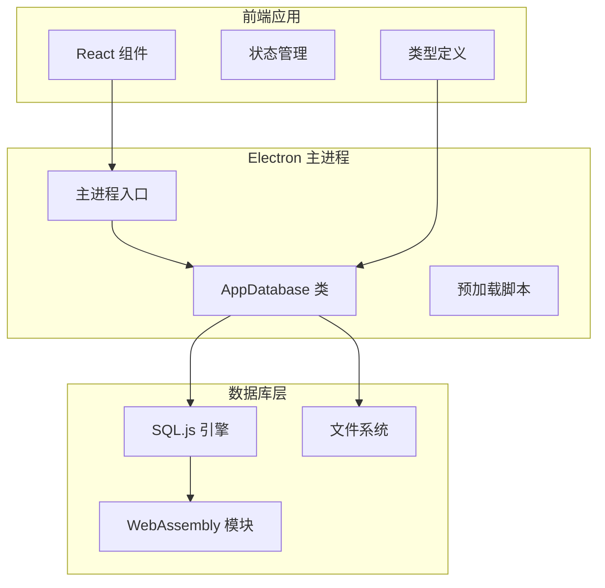
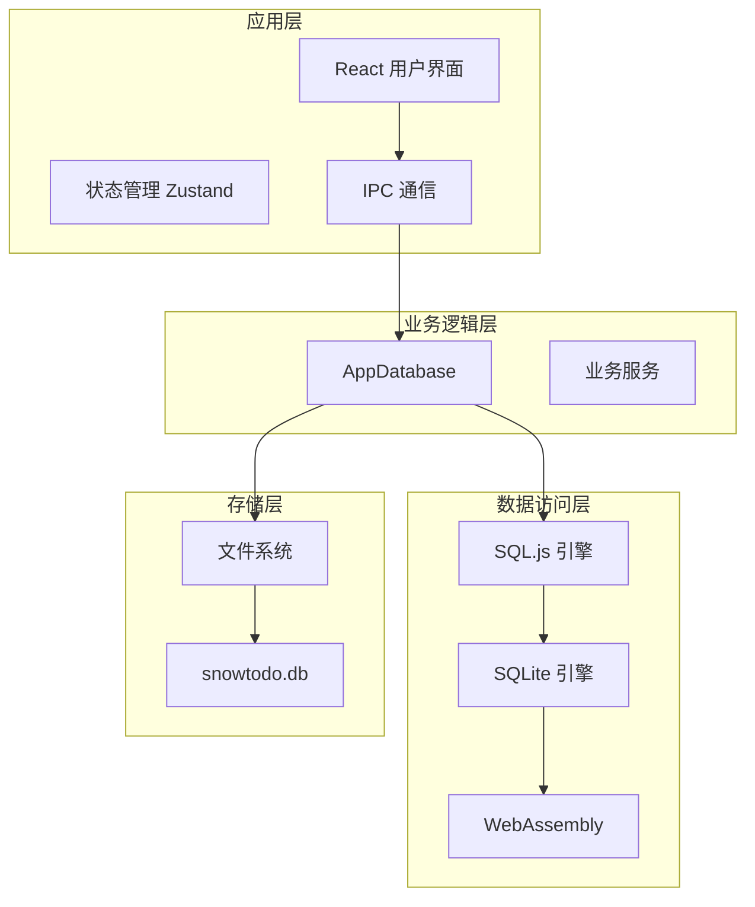
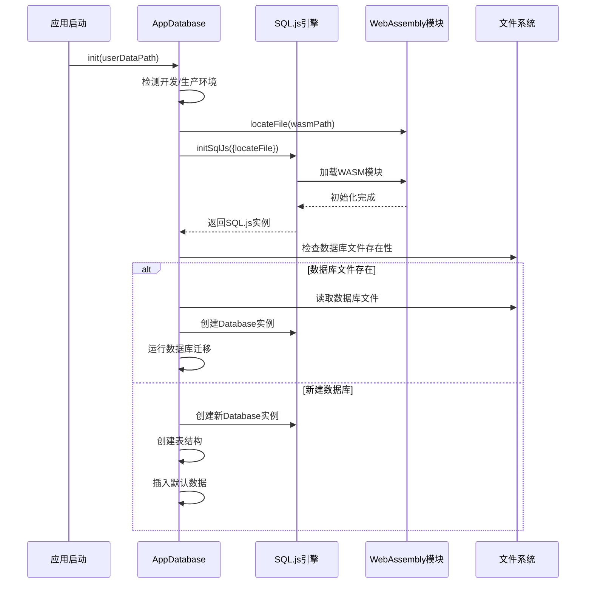
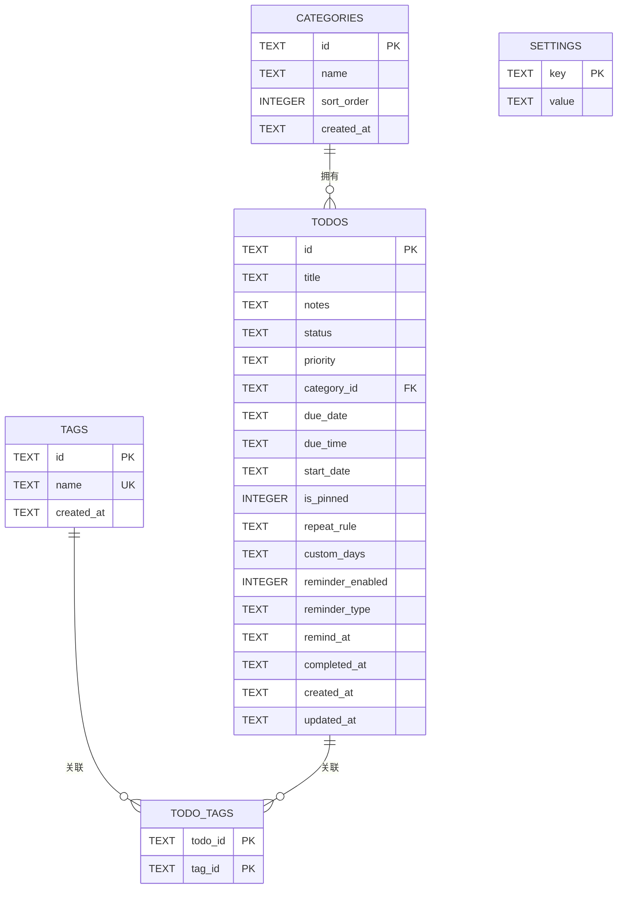
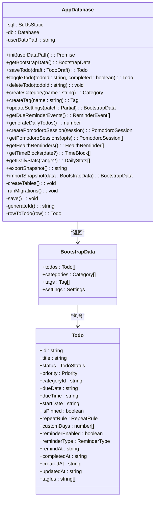
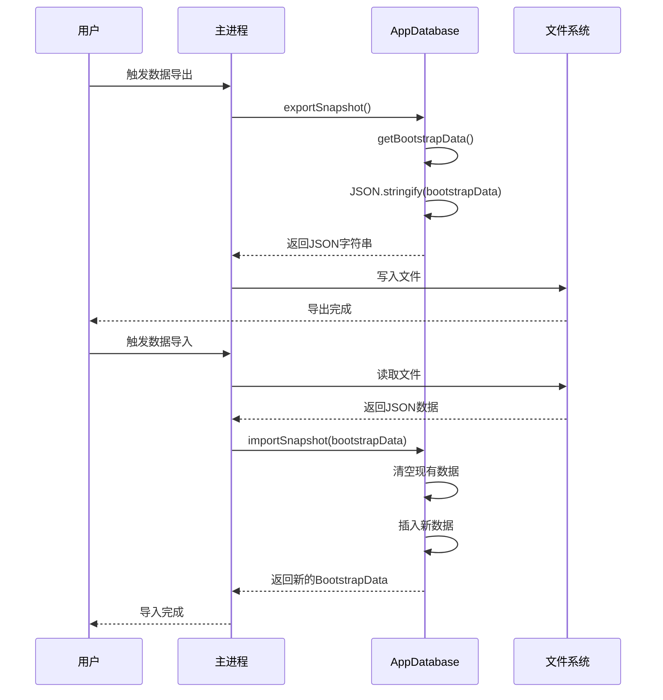
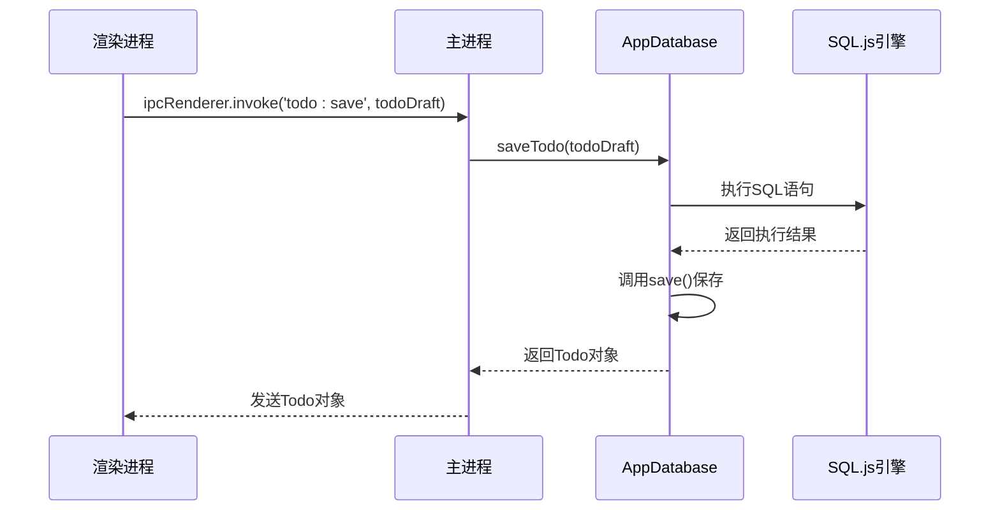
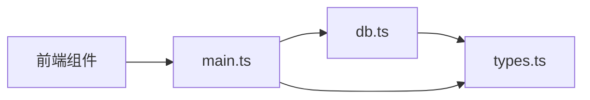

# 数据库集成架构

<cite>
**本文档引用的文件**
- [db.ts](file://app/electron/db.ts)
- [main.ts](file://app/electron/main.ts)
- [types.ts](file://app/src/types.ts)
- [package.json](file://app/package.json)
</cite>

## 目录
1. [简介](#简介)
2. [项目结构](#项目结构)
3. [核心组件](#核心组件)
4. [架构概览](#架构概览)
5. [详细组件分析](#详细组件分析)
6. [依赖关系分析](#依赖关系分析)
7. [性能考虑](#性能考虑)
8. [故障排除指南](#故障排除指南)
9. [结论](#结论)

## 简介

SnowTodo 是一个基于 Electron 和 React 的本地待办事项应用，采用 SQL.js 作为数据库引擎实现数据持久化。本文档深入解析了数据库集成架构，包括 WebAssembly 数据库的工作机制、SQLite 引擎的集成方式、数据库初始化流程、表结构设计、数据模型定义、数据库操作封装策略、类型安全的数据库访问实现、数据持久化策略（备份、恢复、迁移机制），以及性能优化和故障处理方案。

## 项目结构

SnowTodo 采用模块化架构，数据库相关代码主要集中在 Electron 主进程中：



**图表来源**
- [db.ts:55-90](file://app/electron/db.ts#L55-L90)
- [main.ts:1-52](file://app/electron/main.ts#L1-L52)

**章节来源**
- [db.ts:55-90](file://app/electron/db.ts#L55-L90)
- [main.ts:1-52](file://app/electron/main.ts#L1-L52)

## 核心组件

### AppDatabase 类

AppDatabase 是数据库的核心控制器，负责：
- SQL.js 引擎初始化和管理
- 数据库文件的创建、加载和保存
- 表结构管理和迁移
- 数据持久化和备份恢复
- 类型安全的数据访问接口

### 数据类型系统

应用使用 TypeScript 定义了完整的数据模型：
- Todo 待办事项实体
- Category 分类实体  
- Tag 标签实体
- Settings 设置实体
- PomodoroSession 番茄钟会话
- HealthReminder 健康提醒
- TimeBlock 时间块
- DailyStats 每日统计

**章节来源**
- [db.ts:55-90](file://app/electron/db.ts#L55-L90)
- [types.ts:168-213](file://app/src/types.ts#L168-L213)

## 架构概览

SnowTodo 的数据库架构采用三层设计模式：



**图表来源**
- [db.ts:55-90](file://app/electron/db.ts#L55-L90)
- [main.ts:227-358](file://app/electron/main.ts#L227-L358)

## 详细组件分析

### SQL.js 集成实现

#### WebAssembly 引擎初始化

SQL.js 通过 WebAssembly 技术在浏览器环境中运行 SQLite 引擎。AppDatabase 类实现了智能的 WASM 文件定位机制：



**图表来源**
- [db.ts:60-90](file://app/electron/db.ts#L60-L90)

#### 数据库初始化流程

数据库初始化包含以下关键步骤：

1. **WASM 文件定位**：根据开发或生产环境确定 sql-wasm.wasm 的路径
2. **SQL.js 初始化**：使用自定义 locateFile 函数初始化引擎
3. **数据库文件检查**：检测用户数据目录中的 snowtodo.db 文件
4. **迁移处理**：对现有数据库执行版本迁移
5. **表结构创建**：为新数据库创建完整的表结构
6. **默认数据插入**：插入初始配置和默认数据

**章节来源**
- [db.ts:60-90](file://app/electron/db.ts#L60-L90)
- [db.ts:299-504](file://app/electron/db.ts#L299-L504)

### 数据模型设计

#### 核心实体关系



**图表来源**
- [db.ts:300-342](file://app/electron/db.ts#L300-L342)

#### 扩展功能表结构

除了核心实体外，应用还支持多种扩展功能：

| 表名 | 功能描述 | 主要字段 |
|------|----------|----------|
| pomodoro_sessions | 番茄钟会话记录 | id, todo_id, start_time, end_time, duration, completed |
| health_reminders | 健康提醒设置 | id, name, icon, message, enabled, trigger_type |
| reminder_history | 提醒历史记录 | id, reminder_id, triggered_at, responded, snoozed |
| time_blocks | 时间块安排 | id, todo_id, title, start_time, end_time, color |
| themes | 主题配置 | id, name, config, is_built_in |
| ai_settings | AI 设置 | id, provider, api_url, model, temperature |
| daily_stats | 每日统计 | id, date, completed_count, total_focus_minutes |
| todo_images | 待办图片附件 | id, todo_id, data, mime_type, created_at |
| project_cells | 项目格子 | id, project_id, cell_date, content, images |

**章节来源**
- [db.ts:389-499](file://app/electron/db.ts#L389-L499)

### 数据库操作封装策略

#### 类型安全的数据访问

AppDatabase 类提供了类型安全的数据库访问方法：



**图表来源**
- [db.ts:55-1825](file://app/electron/db.ts#L55-L1825)
- [types.ts:168-213](file://app/src/types.ts#L168-L213)

#### 数据持久化策略

应用实现了完整的数据持久化机制：

1. **实时保存**：每次数据库操作后自动调用保存方法
2. **二进制格式**：使用 SQL.js 的 export 方法将内存数据库转换为二进制缓冲区
3. **文件存储**：将二进制数据写入用户数据目录的 snowtodo.db 文件
4. **增量更新**：只在必要时触发保存操作，减少磁盘 I/O

**章节来源**
- [db.ts:626-630](file://app/electron/db.ts#L626-L630)
- [db.ts:789-795](file://app/electron/db.ts#L789-L795)

### 数据备份与恢复机制

#### 备份功能实现

应用提供了完整的数据备份和恢复功能：



**图表来源**
- [main.ts:195-225](file://app/electron/main.ts#L195-L225)
- [db.ts:970-1023](file://app/electron/db.ts#L970-L1023)

#### 迁移机制设计

数据库迁移系统确保向后兼容性：

1. **列级迁移**：添加新列到现有表
2. **表级迁移**：创建新表和索引
3. **数据迁移**：填充默认数据和配置
4. **版本控制**：通过 try-catch 确保迁移过程的稳定性

**章节来源**
- [db.ts:92-297](file://app/electron/db.ts#L92-L297)

### IPC 接口设计

应用通过 IPC 机制向前端暴露数据库操作：



**图表来源**
- [main.ts:227-358](file://app/electron/main.ts#L227-L358)

**章节来源**
- [main.ts:227-358](file://app/electron/main.ts#L227-L358)

## 依赖关系分析

### 外部依赖

应用的主要外部依赖包括：

```mermaid
graph TB
subgraph "核心依赖"
SQLJS[sql.js ^1.14.1]
Electron[electron ^41.2.1]
React[react ^19.2.4]
end
subgraph "开发依赖"
TS[typescript ~6.0.2]
ESLint[eslint ^9.39.4]
Vite[vite ^8.0.4]
Builder[electron-builder ^26.8.1]
end
subgraph "类型定义"
TSSQLJS[@types/sql.js ^1.4.11]
TSNode[@types/node ^24.12.2]
TSReact[@types/react ^19.2.14]
end
App --> SQLJS
App --> Electron
App --> React
Dev --> TS
Dev --> ESLint
Dev --> Vite
Dev --> Builder
Types --> TSSQLJS
Types --> TSNode
Types --> TSReact
```

**图表来源**
- [package.json:16-49](file://app/package.json#L16-L49)

### 内部模块依赖



**图表来源**
- [db.ts:5-24](file://app/electron/db.ts#L5-L24)
- [main.ts:5-6](file://app/electron/main.ts#L5-L6)

**章节来源**
- [package.json:16-49](file://app/package.json#L16-L49)
- [db.ts:5-24](file://app/electron/db.ts#L5-L24)
- [main.ts:5-6](file://app/electron/main.ts#L5-L6)

## 性能考虑

### 索引策略

应用实现了全面的索引策略以优化查询性能：

| 索引名称 | 目标表 | 字段 | 查询场景 |
|----------|--------|------|----------|
| idx_todos_status | todos | status | 状态过滤查询 |
| idx_todos_due_date | todos | due_date | 逾期和到期提醒 |
| idx_todos_category | todos | category_id | 分类筛选 |
| idx_recurring_active | recurring_todos | is_active | 活跃模板查询 |
| idx_pomodoro_todo | pomodoro_sessions | todo_id | 任务统计 |
| idx_pomodoro_start | pomodoro_sessions | start_time | 时间范围查询 |
| idx_timeblock_start | time_blocks | start_time | 日程安排 |
| idx_daily_stats_date | daily_stats | date | 统计报表 |
| idx_health_enabled | health_reminders | enabled | 启用状态查询 |
| idx_todo_images_todo | todo_images | todo_id | 附件查询 |
| idx_project_cells_date | project_cells | cell_date | 项目视图 |
| idx_project_cells_project | project_cells | project_id | 项目筛选 |

### 查询优化

1. **批量操作**：使用事务和批量插入减少数据库往返
2. **延迟保存**：合并多个操作后再进行持久化
3. **索引利用**：针对常用查询条件建立索引
4. **分页查询**：对大量数据使用 LIMIT 和 OFFSET

### 内存管理

1. **WASM 内存**：SQL.js 在 WebAssembly 中运行，避免主线程阻塞
2. **增量更新**：只更新必要的数据，减少内存占用
3. **连接池**：单例模式管理数据库连接

## 故障排除指南

### 常见问题及解决方案

#### 数据库初始化失败

**症状**：应用启动时报错，无法创建或加载数据库文件

**可能原因**：
1. WASM 文件缺失或路径错误
2. 用户数据目录权限不足
3. 数据库文件损坏

**解决方法**：
1. 检查 sql-wasm.wasm 文件是否存在
2. 验证用户数据目录的读写权限
3. 删除损坏的数据库文件重新初始化

#### 数据迁移错误

**症状**：升级后应用无法正常启动

**解决方法**：
1. 查看控制台错误日志
2. 手动删除数据库文件触发重新初始化
3. 检查迁移脚本的兼容性

#### 性能问题

**症状**：应用响应缓慢，特别是大数据量时

**优化建议**：
1. 确保所有查询都使用适当的索引
2. 避免全表扫描的大查询
3. 使用分页处理大量数据

**章节来源**
- [db.ts:92-297](file://app/electron/db.ts#L92-L297)
- [db.ts:60-90](file://app/electron/db.ts#L60-L90)

## 结论

SnowTodo 的数据库集成架构展现了现代桌面应用的最佳实践：

1. **技术选型合理**：SQL.js 提供了可靠的本地数据库解决方案
2. **架构设计清晰**：分层架构确保了代码的可维护性和可测试性
3. **类型安全完善**：完整的 TypeScript 类型系统保证了数据访问的安全性
4. **性能优化到位**：合理的索引策略和查询优化确保了良好的用户体验
5. **扩展性强**：模块化的数据库设计便于功能扩展和维护

通过 WebAssembly 技术的应用，SnowTodo 实现了高性能的本地数据存储，为用户提供了流畅的使用体验。数据库迁移机制确保了应用的长期可用性和数据完整性，而完善的备份恢复功能则为用户提供了可靠的数据安全保障。