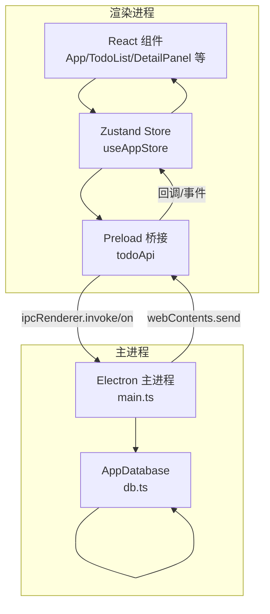
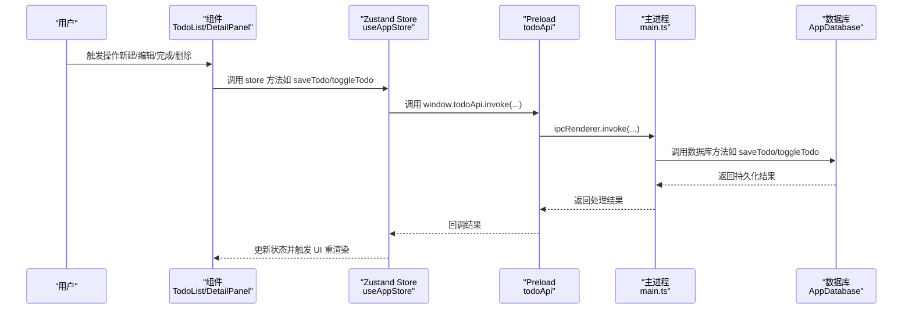
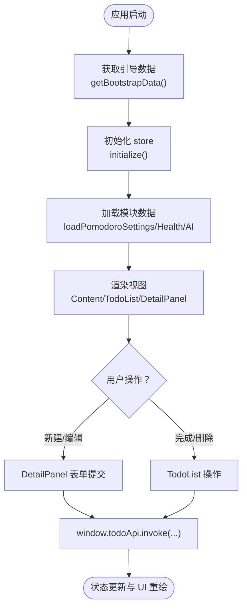
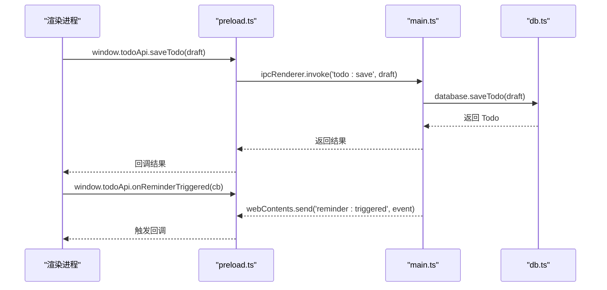
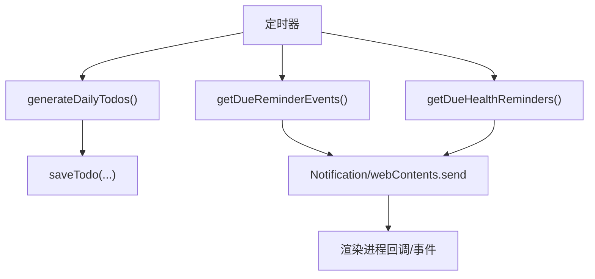
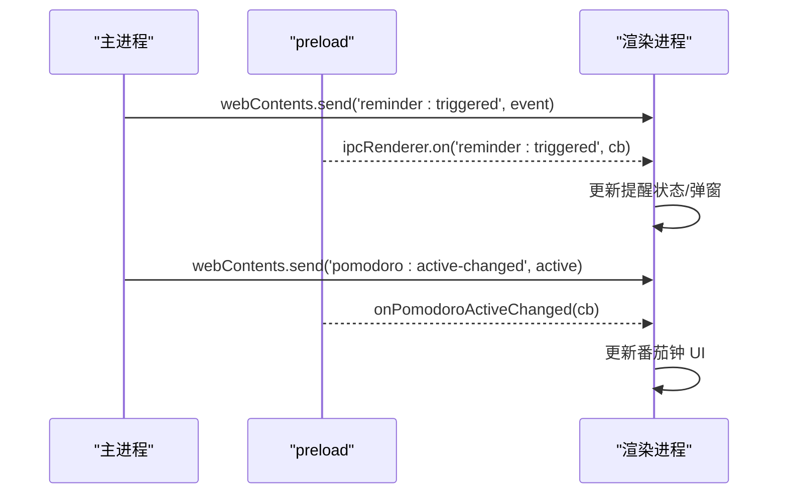
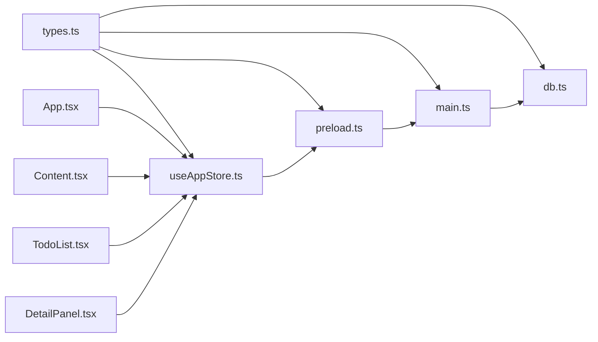

# 数据流设计

<cite>
**本文引用的文件**
- [main.ts](file://app/electron/main.ts)
- [preload.ts](file://app/electron/preload.ts)
- [db.ts](file://app/electron/db.ts)
- [useAppStore.ts](file://app/src/store/useAppStore.ts)
- [types.ts](file://app/src/types.ts)
- [App.tsx](file://app/src/App.tsx)
- [main.tsx](file://app/src/main.tsx)
- [Content.tsx](file://app/src/components/Content/Content.tsx)
- [TodoList.tsx](file://app/src/components/Content/TodoList.tsx)
- [DetailPanel.tsx](file://app/src/components/DetailPanel/DetailPanel.tsx)
</cite>

## 目录
1. [简介](#简介)
2. [项目结构](#项目结构)
3. [核心组件](#核心组件)
4. [架构总览](#架构总览)
5. [详细组件分析](#详细组件分析)
6. [依赖关系分析](#依赖关系分析)
7. [性能考虑](#性能考虑)
8. [故障排查指南](#故障排查指南)
9. [结论](#结论)
10. [附录](#附录)

## 简介
本文件面向 SnowTodo 的数据流设计，系统性阐述从用户操作到数据库持久化的完整数据流路径，覆盖以下方面：
- 用户交互与组件状态更新
- 渲染进程与主进程之间的 IPC 通信
- 主进程处理逻辑与数据库操作
- 状态回传与双向通信机制
- 数据一致性保障、错误处理策略与性能优化
- 数据流监控、调试方法与故障排查

## 项目结构
SnowTodo 采用 Electron + React 架构，前端使用 Zustand 管理全局状态，通过 preload 暴露的 todoApi 与主进程进行 IPC 通信；主进程负责数据库操作与定时任务；数据库基于 sql.js（WebAssembly）实现本地嵌入式存储。

图表来源
- [main.ts:18-52](file://app/electron/main.ts#L18-L52)
- [preload.ts:18-116](file://app/electron/preload.ts#L18-L116)
- [db.ts:55-90](file://app/electron/db.ts#L55-L90)
- [useAppStore.ts:181-508](file://app/src/store/useAppStore.ts#L181-L508)
- [App.tsx:11-34](file://app/src/App.tsx#L11-L34)

章节来源
- [main.ts:18-52](file://app/electron/main.ts#L18-L52)
- [preload.ts:18-116](file://app/electron/preload.ts#L18-L116)
- [db.ts:55-90](file://app/electron/db.ts#L55-L90)
- [useAppStore.ts:181-508](file://app/src/store/useAppStore.ts#L181-L508)
- [App.tsx:11-34](file://app/src/App.tsx#L11-L34)

## 核心组件
- 渲染进程组件与状态管理
  - App.tsx：应用入口，初始化引导数据
  - Content.tsx：根据当前视图渲染不同页面
  - TodoList.tsx：待办列表与交互
  - DetailPanel.tsx：待办详情与编辑
  - useAppStore.ts：Zustand 全局状态，封装 CRUD 与模块化数据加载
- 预加载桥接层
  - preload.ts：通过 contextBridge 暴露 todoApi，统一 IPC 调用与事件监听
- 主进程
  - main.ts：注册 IPC 处理器、定时任务、托盘与通知
  - db.ts：AppDatabase 封装 sql.js，提供各类数据访问与写入接口
- 类型定义
  - types.ts：Todo、Settings、Pomodoro、Health、TimeBlock、ProjectCell 等类型

章节来源
- [App.tsx:11-34](file://app/src/App.tsx#L11-L34)
- [Content.tsx:14-63](file://app/src/components/Content/Content.tsx#L14-L63)
- [TodoList.tsx:16-75](file://app/src/components/Content/TodoList.tsx#L16-L75)
- [DetailPanel.tsx:33-506](file://app/src/components/DetailPanel/DetailPanel.tsx#L33-L506)
- [useAppStore.ts:181-508](file://app/src/store/useAppStore.ts#L181-L508)
- [preload.ts:18-116](file://app/electron/preload.ts#L18-L116)
- [main.ts:227-358](file://app/electron/main.ts#L227-L358)
- [db.ts:55-1825](file://app/electron/db.ts#L55-L1825)
- [types.ts:1-278](file://app/src/types.ts#L1-L278)

## 架构总览
渲染进程通过 window.todoApi 发起同步调用（invoke）或订阅事件（on），主进程在 ipcMain.handle 中执行数据库操作，并在必要时向渲染进程推送事件（webContents.send）。数据库采用 sql.js，支持迁移与索引，确保数据一致性与查询效率。

图表来源
- [TodoList.tsx:83-87](file://app/src/components/Content/TodoList.tsx#L83-L87)
- [DetailPanel.tsx:166-185](file://app/src/components/DetailPanel/DetailPanel.tsx#L166-L185)
- [useAppStore.ts:264-272](file://app/src/store/useAppStore.ts#L264-L272)
- [preload.ts:23-26](file://app/electron/preload.ts#L23-L26)
- [main.ts:229-232](file://app/electron/main.ts#L229-L232)
- [db.ts:716-796](file://app/electron/db.ts#L716-L796)

## 详细组件分析

### 用户交互与组件状态更新
- App.tsx 在首次挂载时通过 window.todoApi.getBootstrapData 获取初始数据，随后初始化 store 并加载各模块数据。
- Content.tsx 根据 currentView 渲染不同视图，TodoList.tsx 负责渲染待办列表与空状态提示。
- DetailPanel.tsx 提供待办编辑表单，支持拖拽/粘贴图片上传、标签选择、重复规则配置等。

图表来源
- [App.tsx:24-34](file://app/src/App.tsx#L24-L34)
- [Content.tsx:14-63](file://app/src/components/Content/Content.tsx#L14-L63)
- [TodoList.tsx:83-87](file://app/src/components/Content/TodoList.tsx#L83-L87)
- [DetailPanel.tsx:166-185](file://app/src/components/DetailPanel/DetailPanel.tsx#L166-L185)

章节来源
- [App.tsx:24-34](file://app/src/App.tsx#L24-L34)
- [Content.tsx:14-63](file://app/src/components/Content/Content.tsx#L14-L63)
- [TodoList.tsx:83-87](file://app/src/components/Content/TodoList.tsx#L83-L87)
- [DetailPanel.tsx:166-185](file://app/src/components/DetailPanel/DetailPanel.tsx#L166-L185)

### IPC 通信与主进程处理
- 预加载层暴露统一 API（todoApi），封装 invoke 与 on 事件监听，屏蔽底层 ipcRenderer 细节。
- 主进程在 registerIpc 中注册 ipcMain.handle，将渲染进程请求映射到 AppDatabase 的具体方法。
- 主进程还负责定时任务（提醒与健康提醒）、托盘与全局快捷键，必要时通过 webContents.send 推送事件给渲染进程。

图表来源
- [preload.ts:23-26](file://app/electron/preload.ts#L23-L26)
- [main.ts:229-232](file://app/electron/main.ts#L229-L232)
- [db.ts:716-796](file://app/electron/db.ts#L716-L796)
- [preload.ts:43-47](file://app/electron/preload.ts#L43-L47)
- [main.ts:98-118](file://app/electron/main.ts#L98-L118)

章节来源
- [preload.ts:18-116](file://app/electron/preload.ts#L18-L116)
- [main.ts:227-358](file://app/electron/main.ts#L227-L358)
- [db.ts:716-833](file://app/electron/db.ts#L716-L833)

### 主进程处理与数据库操作
- AppDatabase 负责：
  - 初始化 sql.js 与数据库文件，运行迁移与索引创建
  - 提供 CRUD 与聚合查询（如 getBootstrapData、getDueReminderEvents、getDueHealthReminders）
  - 定时生成“每日待办”（generateDailyTodos）
  - 记录提醒历史（recordReminder、recordHealthReminderTrigger）
  - 导入/导出快照（exportSnapshot/importSnapshot）
- 主进程在定时循环中调用数据库方法，触发提醒与健康提醒事件，并通过 webContents.send 推送到渲染进程。

图表来源
- [main.ts:120-139](file://app/electron/main.ts#L120-L139)
- [main.ts:161-177](file://app/electron/main.ts#L161-L177)
- [db.ts:1184-1252](file://app/electron/db.ts#L1184-L1252)
- [db.ts:882-940](file://app/electron/db.ts#L882-L940)
- [db.ts:1406-1467](file://app/electron/db.ts#L1406-L1467)

章节来源
- [main.ts:120-177](file://app/electron/main.ts#L120-L177)
- [db.ts:882-940](file://app/electron/db.ts#L882-L940)
- [db.ts:1184-1252](file://app/electron/db.ts#L1184-L1252)
- [db.ts:1406-1467](file://app/electron/db.ts#L1406-L1467)

### 状态回传与双向通信
- 渲染进程到主进程：通过 window.todoApi.invoke 发起同步请求，主进程返回结果并更新 store。
- 主进程到渲染进程：通过 webContents.send 推送事件（如 reminder:triggered、health-reminder:triggered、pomodoro:toggle、pomodoro:active-changed），渲染进程通过 on* 方法注册监听器接收并更新 UI。
- 全局快捷键：主进程根据设置注册全局快捷键，触发后向渲染进程发送 pomodoro:toggle 事件。

图表来源
- [main.ts:98-118](file://app/electron/main.ts#L98-L118)
- [main.ts:286-292](file://app/electron/main.ts#L286-L292)
- [preload.ts:43-47](file://app/electron/preload.ts#L43-L47)
- [preload.ts:69-73](file://app/electron/preload.ts#L69-L73)

章节来源
- [main.ts:98-118](file://app/electron/main.ts#L98-L118)
- [main.ts:286-292](file://app/electron/main.ts#L286-L292)
- [preload.ts:43-47](file://app/electron/preload.ts#L43-L47)
- [preload.ts:69-73](file://app/electron/preload.ts#L69-L73)

### 数据一致性与错误处理
- 数据一致性
  - 使用事务性 SQL 操作（INSERT/UPDATE/DELETE），并在关键路径后调用 save() 将内存数据库导出到文件。
  - 迁移脚本在启动时自动运行，确保表结构与索引一致。
  - 生成每日待办时先检查是否已生成，避免重复。
- 错误处理
  - 主进程定时循环捕获异常并记录日志，避免崩溃影响应用运行。
  - 数据库方法内部 try/catch 包裹，失败时记录错误并返回安全状态。
  - 导入快照时清理旧数据再写入，保证数据完整性。

章节来源
- [db.ts:626-630](file://app/electron/db.ts#L626-L630)
- [db.ts:974-1023](file://app/electron/db.ts#L974-L1023)
- [main.ts:132-134](file://app/electron/main.ts#L132-L134)
- [db.ts:1234-1236](file://app/electron/db.ts#L1234-L1236)

### 性能优化
- 索引优化：为高频查询字段建立索引（如 pomodoro_sessions、time_blocks、daily_stats、health_reminders）。
- 查询裁剪：按需查询（如 getTodayPomodoroSessions、getDueHealthReminders），减少不必要的数据传输。
- 异步批量：图片上传使用 Promise.all 并行处理，提升用户体验。
- 缓存与本地状态：store 中维护本地状态，避免频繁 IPC 调用。

章节来源
- [db.ts:197-206](file://app/electron/db.ts#L197-L206)
- [db.ts:1322-1329](file://app/electron/db.ts#L1322-L1329)
- [db.ts:1406-1457](file://app/electron/db.ts#L1406-L1457)
- [DetailPanel.tsx:89-101](file://app/src/components/DetailPanel/DetailPanel.tsx#L89-L101)

## 依赖关系分析

图表来源
- [types.ts:1-278](file://app/src/types.ts#L1-L278)
- [useAppStore.ts:1-604](file://app/src/store/useAppStore.ts#L1-L604)
- [preload.ts:1-117](file://app/electron/preload.ts#L1-L117)
- [main.ts:1-391](file://app/electron/main.ts#L1-L391)
- [db.ts:1-1825](file://app/electron/db.ts#L1-L1825)
- [App.tsx:1-60](file://app/src/App.tsx#L1-L60)
- [Content.tsx:1-65](file://app/src/components/Content/Content.tsx#L1-L65)
- [TodoList.tsx:1-189](file://app/src/components/Content/TodoList.tsx#L1-L189)
- [DetailPanel.tsx:1-507](file://app/src/components/DetailPanel/DetailPanel.tsx#L1-L507)

章节来源
- [types.ts:1-278](file://app/src/types.ts#L1-L278)
- [useAppStore.ts:1-604](file://app/src/store/useAppStore.ts#L1-L604)
- [preload.ts:1-117](file://app/electron/preload.ts#L1-L117)
- [main.ts:1-391](file://app/electron/main.ts#L1-L391)
- [db.ts:1-1825](file://app/electron/db.ts#L1-L1825)
- [App.tsx:1-60](file://app/src/App.tsx#L1-L60)
- [Content.tsx:1-65](file://app/src/components/Content/Content.tsx#L1-L65)
- [TodoList.tsx:1-189](file://app/src/components/Content/TodoList.tsx#L1-L189)
- [DetailPanel.tsx:1-507](file://app/src/components/DetailPanel/DetailPanel.tsx#L1-L507)

## 性能考虑
- 数据库层面
  - 启动时一次性执行迁移与索引创建，避免后续运行时开销。
  - 对高频查询字段建立索引，减少全表扫描。
- 渲染进程层面
  - 使用 zustand 精准更新状态，避免全局重渲染。
  - 图片上传采用并行处理，缩短等待时间。
- 主进程层面
  - 定时任务间隔合理（提醒 30 秒、健康提醒 1 分钟），兼顾实时性与资源占用。
  - 事件推送仅在必要时触发，避免过度通信。

## 故障排查指南
- 数据未持久化
  - 检查数据库是否成功保存（save() 是否被调用）。
  - 确认数据库文件是否存在且可写。
- IPC 调用无响应
  - 确认 preload 暴露的 API 名称与主进程注册的一致。
  - 检查主进程是否正确注册 ipcMain.handle。
- 定时提醒未触发
  - 检查 getDueReminderEvents 与 getDueHealthReminders 的过滤条件。
  - 确认 webContents.send 是否被调用。
- 健康提醒重复触发
  - 检查 reminder_history 是否正确记录最近触发时间。
- 导入/导出失败
  - 检查 JSON 结构与类型定义是否匹配。
  - 确认导入时是否清理旧数据后再写入。

章节来源
- [db.ts:626-630](file://app/electron/db.ts#L626-L630)
- [db.ts:882-940](file://app/electron/db.ts#L882-L940)
- [db.ts:1406-1467](file://app/electron/db.ts#L1406-L1467)
- [db.ts:974-1023](file://app/electron/db.ts#L974-L1023)
- [main.ts:120-177](file://app/electron/main.ts#L120-L177)

## 结论
SnowTodo 的数据流以“渲染进程状态 + preload 桥接 + 主进程 IPC + AppDatabase 数据库”为核心，形成清晰的分层与职责边界。通过 invoke/on 的双向通信、sql.js 的本地持久化、索引与迁移机制，系统实现了稳定、可扩展且高性能的数据流转。建议在后续迭代中进一步完善数据校验、埋点与可视化监控，以增强可观测性与可维护性。

## 附录
- 关键 IPC 端点概览
  - todo:*：待办 CRUD、开关、恢复、删除
  - category:create/tag:create：分类/标签创建
  - settings:update：设置更新
  - data:export/data:import：数据导出/导入
  - window:action：窗口动作
  - recurring:*：长期每日待办
  - pomodoro:*：番茄钟设置与会话
  - health:*：健康提醒
  - ai:*：AI 设置
  - timeblock:*：时间块
  - stats:*：每日统计
  - todo:* 图片：图片增删查
  - project:*：项目格子

章节来源
- [main.ts:227-358](file://app/electron/main.ts#L227-L358)
- [preload.ts:18-116](file://app/electron/preload.ts#L18-L116)