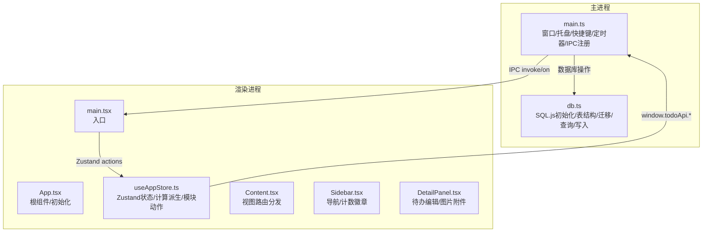
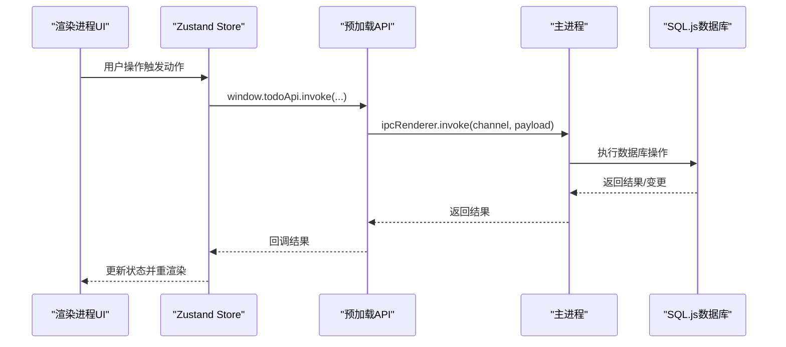
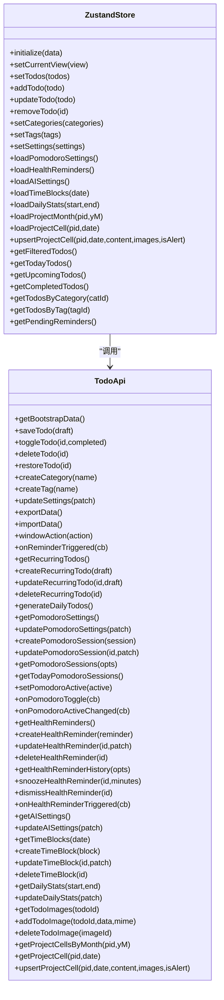
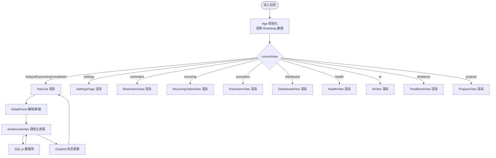
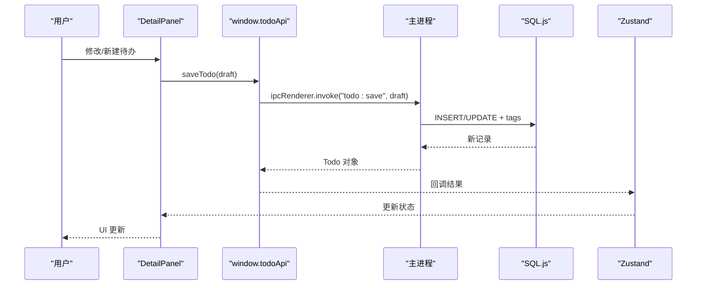
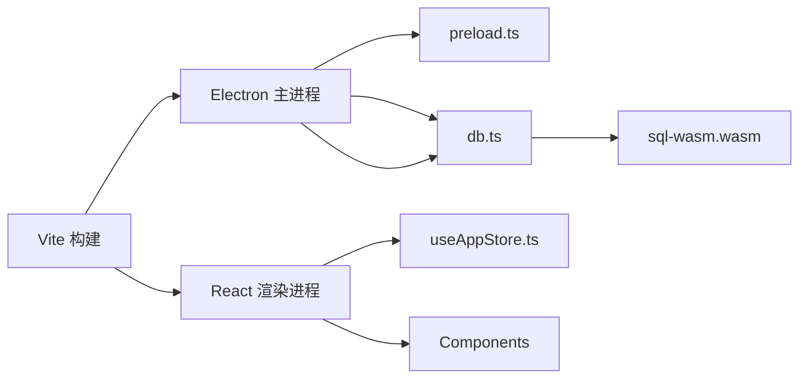

# 架构设计

<cite>
**本文引用的文件**
- [app/electron/main.ts](file://app/electron/main.ts)
- [app/electron/preload.ts](file://app/electron/preload.ts)
- [app/electron/db.ts](file://app/electron/db.ts)
- [app/src/main.tsx](file://app/src/main.tsx)
- [app/src/App.tsx](file://app/src/App.tsx)
- [app/src/store/useAppStore.ts](file://app/src/store/useAppStore.ts)
- [app/src/types.ts](file://app/src/types.ts)
- [app/src/components/Sidebar/Sidebar.tsx](file://app/src/components/Sidebar/Sidebar.tsx)
- [app/src/components/Content/Content.tsx](file://app/src/components/Content/Content.tsx)
- [app/src/components/DetailPanel/DetailPanel.tsx](file://app/src/components/DetailPanel/DetailPanel.tsx)
- [app/package.json](file://app/package.json)
- [app/vite.config.ts](file://app/vite.config.ts)
- [app/tsconfig.json](file://app/tsconfig.json)
</cite>

## 目录
1. [简介](#简介)
2. [项目结构](#项目结构)
3. [核心组件](#核心组件)
4. [架构总览](#架构总览)
5. [详细组件分析](#详细组件分析)
6. [依赖关系分析](#依赖关系分析)
7. [性能考量](#性能考量)
8. [故障排查指南](#故障排查指南)
9. [结论](#结论)
10. [附录](#附录)

## 简介
本项目是一个基于 Electron 的本地待办应用，采用 React + Zustand 前端架构，结合 SQL.js 在渲染进程中以 WebAssembly 方式运行嵌入式数据库，实现数据持久化与跨平台部署。应用通过主进程负责系统集成（托盘、全局快捷键、定时提醒、数据导入导出），渲染进程负责 UI 交互与状态管理，二者通过 IPC 通道进行安全通信。

## 项目结构
- 主进程（Electron）：负责窗口生命周期、托盘、全局快捷键、定时任务、数据导入导出、以及与数据库的桥接。
- 渲染进程（React）：负责 UI 组件、状态管理（Zustand）、路由分发（通过视图切换）、以及与主进程的 IPC 调用。
- 数据层（SQL.js + WebAssembly）：在用户数据目录下持久化 SQLite 数据，支持迁移与索引优化。
- 构建与打包：Vite + Electron Builder，将主进程与渲染进程分别构建并打包为可执行程序或便携包。

**图表来源**
- [app/electron/main.ts:18-52](file://app/electron/main.ts#L18-L52)
- [app/electron/db.ts:60-90](file://app/electron/db.ts#L60-L90)
- [app/src/main.tsx:1-11](file://app/src/main.tsx#L1-L11)
- [app/src/App.tsx:11-34](file://app/src/App.tsx#L11-L34)
- [app/src/store/useAppStore.ts:181-250](file://app/src/store/useAppStore.ts#L181-L250)
- [app/src/components/Content/Content.tsx:14-63](file://app/src/components/Content/Content.tsx#L14-L63)
- [app/src/components/Sidebar/Sidebar.tsx:30-58](file://app/src/components/Sidebar/Sidebar.tsx#L30-L58)
- [app/src/components/DetailPanel/DetailPanel.tsx:33-185](file://app/src/components/DetailPanel/DetailPanel.tsx#L33-L185)

**章节来源**
- [app/package.json:1-100](file://app/package.json#L1-L100)
- [app/vite.config.ts:1-37](file://app/vite.config.ts#L1-L37)
- [app/tsconfig.json:1-8](file://app/tsconfig.json#L1-L8)

## 核心组件
- 主进程入口与窗口管理：创建 BrowserWindow、托盘、菜单、最小化隐藏策略、开发/生产资源加载。
- 预加载脚本：通过 contextBridge 暴露受控 API（window.todoApi），封装 ipcRenderer.invoke 与 on 事件监听。
- 数据库层：SQL.js 初始化（WASM 文件定位）、表结构与迁移、Bootstrap 数据读取、各类 CRUD 与统计查询。
- 渲染入口与根组件：初始化 Zustand store，拉取 Bootstrap 数据，按视图渲染内容。
- 状态管理（Zustand）：集中管理待办、分类、标签、设置、番茄钟、健康提醒、AI 设置、时间块、仪表盘等模块状态与派生计算。
- 组件体系：侧边栏导航、内容区视图路由、详情面板（含图片附件）、各功能模块视图。

**章节来源**
- [app/electron/main.ts:18-52](file://app/electron/main.ts#L18-L52)
- [app/electron/preload.ts:18-116](file://app/electron/preload.ts#L18-L116)
- [app/electron/db.ts:60-90](file://app/electron/db.ts#L60-L90)
- [app/src/main.tsx:1-11](file://app/src/main.tsx#L1-L11)
- [app/src/App.tsx:11-34](file://app/src/App.tsx#L11-L34)
- [app/src/store/useAppStore.ts:181-250](file://app/src/store/useAppStore.ts#L181-L250)

## 架构总览
本系统采用“主进程 + 渲染进程”的经典 Electron 架构：
- 主进程负责系统级能力与数据持久化，渲染进程负责 UI 与业务逻辑。
- IPC 采用 request-response（invoke）与事件（on）两种模式，确保安全与解耦。
- 数据库采用 SQL.js + WebAssembly，避免 Node.js 原生模块复杂度，便于跨平台打包。

**图表来源**
- [app/src/store/useAppStore.ts:295-298](file://app/src/store/useAppStore.ts#L295-L298)
- [app/electron/preload.ts:23-26](file://app/electron/preload.ts#L23-L26)
- [app/electron/main.ts:220-225](file://app/electron/main.ts#L220-L225)
- [app/electron/db.ts:711-791](file://app/electron/db.ts#L711-L791)

## 详细组件分析

### 主进程（main.ts）
- 窗口创建与行为：窗口尺寸、最小化隐藏、开发/生产资源加载。
- 托盘与菜单：双击显示主窗口、退出选项。
- 定时任务：每 30 秒检查并生成每日待办，每 60 秒检查健康提醒；支持全局快捷键切换番茄钟。
- IPC 注册：提供待办 CRUD、分类/标签创建、设置更新、数据导入导出、窗口控制、番茄钟、健康提醒、AI 设置、时间块、统计数据、图片附件、项目单元格等接口。
- 启动流程：初始化数据库、应用启动项、注册 IPC、创建窗口、托盘、启动定时器、注册全局快捷键。

**章节来源**
- [app/electron/main.ts:18-52](file://app/electron/main.ts#L18-L52)
- [app/electron/main.ts:94-185](file://app/electron/main.ts#L94-L185)
- [app/electron/main.ts:187-217](file://app/electron/main.ts#L187-L217)
- [app/electron/main.ts:219-350](file://app/electron/main.ts#L219-L350)
- [app/electron/main.ts:352-361](file://app/electron/main.ts#L352-L361)

### 预加载脚本（preload.ts）
- 通过 contextBridge.exposeInMainWorld 暴露 window.todoApi，封装所有 IPC 接口。
- 包含基础数据、待办 CRUD、分类/标签、设置、窗口控制、提醒事件、番茄钟、健康提醒、AI 设置、时间块、统计数据、图片附件、项目单元格等方法。
- 提供事件监听器的返回值用于移除监听，保证内存安全。

**章节来源**
- [app/electron/preload.ts:18-116](file://app/electron/preload.ts#L18-L116)

### 数据库层（db.ts）
- SQL.js 初始化：根据开发/打包环境定位 sql-wasm.wasm，创建/加载数据库文件。
- 表结构与迁移：包含 todos、categories、tags、settings、recurring_todos、pomodoro_sessions、health_reminders、reminder_history、time_blocks、themes、ai_settings、daily_stats、todo_images、project_cells 等表，并维护索引与默认数据。
- Bootstrap 数据：一次性读取 todos、categories、tags、settings。
- CRUD 与查询：待办保存/切换/删除/恢复、分类/标签创建、设置更新、图片附件增删查、项目单元格增改查、统计数据读写等。
- 导出/导入：导出 JSON 快照，导入时重建数据库并应用设置。

**章节来源**
- [app/electron/db.ts:60-90](file://app/electron/db.ts#L60-L90)
- [app/electron/db.ts:299-504](file://app/electron/db.ts#L299-L504)
- [app/electron/db.ts:671-709](file://app/electron/db.ts#L671-L709)
- [app/electron/db.ts:711-791](file://app/electron/db.ts#L711-L791)
- [app/electron/db.ts:1816-1816](file://app/electron/db.ts#L1816-L1816)

### 渲染入口与根组件（main.tsx, App.tsx）
- 渲染入口：创建 React Root，挂载 App。
- 根组件：首次初始化时通过 window.todoApi.getBootstrapData 获取初始数据，随后加载各模块数据（番茄钟、健康提醒、AI 设置）。

**章节来源**
- [app/src/main.tsx:1-11](file://app/src/main.tsx#L1-L11)
- [app/src/App.tsx:11-34](file://app/src/App.tsx#L11-L34)

### 状态管理（Zustand）
- 状态模型：包含 todos、categories、tags、settings、当前视图、选中项、过滤条件、排序、番茄钟、健康提醒、AI 设置、时间块、统计数据、项目单元格等。
- 动作函数：提供初始化、导航切换、待办 CRUD、分类/标签管理、筛选与排序、番茄钟、健康提醒、AI 设置、时间块、统计数据、项目单元格等动作。
- 计算派生：提供过滤后的待办列表、今日待办、即将到期、已完成、按分类/标签筛选、待处理提醒等。
- 异步加载：通过 window.todoApi.* 异步调用主进程接口，更新本地状态。

**图表来源**
- [app/src/store/useAppStore.ts:181-508](file://app/src/store/useAppStore.ts#L181-L508)
- [app/electron/preload.ts:18-116](file://app/electron/preload.ts#L18-L116)

**章节来源**
- [app/src/store/useAppStore.ts:181-508](file://app/src/store/useAppStore.ts#L181-L508)

### 组件层次与路由
- 侧边栏（Sidebar）：提供导航项与徽章计数，支持分类/标签筛选。
- 内容区（Content）：根据 currentView 渲染不同视图（待办列表、设置、提醒、每日待办、番茄钟、仪表盘、健康、AI、时间块、项目集合等）。
- 详情面板（DetailPanel）：待办编辑/新建、标签管理、重复规则、提醒设置、图片附件上传/粘贴/拖拽、删除等。

**图表来源**
- [app/src/components/Content/Content.tsx:14-63](file://app/src/components/Content/Content.tsx#L14-L63)
- [app/src/components/Sidebar/Sidebar.tsx:30-58](file://app/src/components/Sidebar/Sidebar.tsx#L30-L58)
- [app/src/components/DetailPanel/DetailPanel.tsx:33-185](file://app/src/components/DetailPanel/DetailPanel.tsx#L33-L185)
- [app/src/store/useAppStore.ts:295-298](file://app/src/store/useAppStore.ts#L295-L298)

**章节来源**
- [app/src/components/Sidebar/Sidebar.tsx:30-58](file://app/src/components/Sidebar/Sidebar.tsx#L30-L58)
- [app/src/components/Content/Content.tsx:14-63](file://app/src/components/Content/Content.tsx#L14-L63)
- [app/src/components/DetailPanel/DetailPanel.tsx:33-185](file://app/src/components/DetailPanel/DetailPanel.tsx#L33-L185)

### 数据流设计（从用户操作到数据库持久化）
- 用户在 DetailPanel 中填写/修改待办信息，点击保存。
- DetailPanel 调用 window.todoApi.saveTodo(draft)，内部通过 ipcRenderer.invoke 调用主进程。
- 主进程在 AppDatabase 中执行 SQL 插入/更新，写入 tags 关联，持久化到磁盘。
- 主进程返回新待办对象，渲染进程使用 Zustand 更新本地状态，UI 重新渲染。

**图表来源**
- [app/src/components/DetailPanel/DetailPanel.tsx:166-185](file://app/src/components/DetailPanel/DetailPanel.tsx#L166-L185)
- [app/electron/preload.ts:23-26](file://app/electron/preload.ts#L23-L26)
- [app/electron/main.ts:220-225](file://app/electron/main.ts#L220-L225)
- [app/electron/db.ts:711-791](file://app/electron/db.ts#L711-L791)
- [app/src/store/useAppStore.ts:265-272](file://app/src/store/useAppStore.ts#L265-L272)

**章节来源**
- [app/src/components/DetailPanel/DetailPanel.tsx:166-185](file://app/src/components/DetailPanel/DetailPanel.tsx#L166-L185)
- [app/electron/db.ts:711-791](file://app/electron/db.ts#L711-L791)

### SQL.js 集成与 WebAssembly 工作原理
- 初始化：根据开发/打包状态定位 sql-wasm.wasm 文件，调用 initSqlJs 并传入 locateFile。
- 数据库存储：数据库文件位于用户数据目录，首次运行创建表结构与默认数据，后续运行执行迁移。
- 查询与写入：通过 SQL 语句执行 CRUD 与统计查询，最终将二进制数据写回磁盘。
- 性能与兼容性：SQL.js 通过 WebAssembly 提供高性能 SQL 执行，避免原生模块依赖，利于跨平台打包。

**章节来源**
- [app/electron/db.ts:60-90](file://app/electron/db.ts#L60-L90)
- [app/electron/db.ts:299-504](file://app/electron/db.ts#L299-L504)
- [app/electron/db.ts:626-630](file://app/electron/db.ts#L626-L630)

### 模块化设计与可扩展性
- 功能模块划分：待办、分类/标签、设置、每日待办、番茄钟、健康提醒、AI 设置、时间块、统计数据、图片附件、项目单元格等，每个模块在 Zustand 中有独立的状态字段与动作。
- IPC 接口模块化：主进程按模块注册 IPC handler，预加载脚本按模块暴露 API，便于新增模块时仅需在对应位置增加接口。
- 数据库迁移：通过迁移脚本维护表结构与默认数据，新增模块通常伴随新表与索引，保持向后兼容。
- UI 组件：Content 根据 currentView 分发渲染，新增视图只需在 Content 中添加分支并在 Sidebar 中注册导航项。

**章节来源**
- [app/src/store/useAppStore.ts:181-508](file://app/src/store/useAppStore.ts#L181-L508)
- [app/electron/main.ts:219-350](file://app/electron/main.ts#L219-L350)
- [app/electron/db.ts:92-297](file://app/electron/db.ts#L92-L297)
- [app/src/components/Content/Content.tsx:14-63](file://app/src/components/Content/Content.tsx#L14-L63)

## 依赖关系分析
- 构建工具链：Vite + Electron + Vite 插件，主进程外部化 sql.js，预加载与渲染器分离构建。
- 运行时依赖：React、Zustand、SQL.js、lucide-react、framer-motion、dayjs 等。
- 打包配置：electron-builder 将主进程、渲染进程、WASM、托盘图标等资源打包，支持 nsis 与 portable。

**图表来源**
- [app/vite.config.ts:7-32](file://app/vite.config.ts#L7-L32)
- [app/package.json:16-49](file://app/package.json#L16-L49)

**章节来源**
- [app/vite.config.ts:1-37](file://app/vite.config.ts#L1-L37)
- [app/package.json:16-49](file://app/package.json#L16-L49)

## 性能考量
- SQL.js 查询优化：为高频查询建立索引（如 pomodoro_sessions、time_blocks、daily_stats、health_reminders），减少全表扫描。
- 状态更新粒度：Zustand 使用局部状态更新，避免不必要的重渲染。
- IPC 调用批量化：对于批量操作（如项目单元格批量加载），先在客户端聚合，再一次性写入，减少 IPC 次数。
- 图片附件：本地临时存储图片，新建待办完成后统一写入数据库，降低首屏压力。

[本节为通用指导，无需具体文件引用]

## 故障排查指南
- WASM 加载失败：确认打包时已包含 sql-wasm.wasm，并在开发/生产环境下正确定位。
- IPC 调用超时：检查主进程是否正确注册对应 channel，渲染进程调用时机是否在主进程初始化之后。
- 托盘/全局快捷键无效：确认主进程已注册托盘与快捷键，且应用启动项设置正确。
- 数据导入失败：检查导入文件格式是否为 JSON 快照，主进程解析后是否成功重建数据库。

**章节来源**
- [app/electron/db.ts:60-90](file://app/electron/db.ts#L60-L90)
- [app/electron/main.ts:94-185](file://app/electron/main.ts#L94-L185)
- [app/electron/main.ts:187-217](file://app/electron/main.ts#L187-L217)

## 结论
本项目通过清晰的主/渲染进程职责划分、模块化的 IPC 接口、集中式状态管理与 SQL.js 数据持久化，实现了功能完备、可扩展、跨平台的本地待办应用。Zustand 的轻量与易用性降低了状态管理复杂度，SQL.js 的 WebAssembly 使数据库能力易于集成与打包。未来可在以下方面持续演进：引入更细粒度的模块边界、增强错误处理与日志、完善单元测试与端到端测试覆盖。

[本节为总结，无需具体文件引用]

## 附录
- 技术栈选择权衡
  - Electron：跨平台桌面应用开发框架，生态成熟，适合快速迭代。
  - React + Zustand：UI 组件化与状态管理，Zustand 无中间件开销，适合中小型应用。
  - SQL.js：无需额外服务端依赖，便于打包与分发，但受限于 SQLite 能力。
  - Vite + Electron Builder：现代化构建工具链，热更新与打包效率兼顾。

**章节来源**
- [app/package.json:16-49](file://app/package.json#L16-L49)
- [app/vite.config.ts:1-37](file://app/vite.config.ts#L1-L37)