# 状态管理架构

<cite>
**本文档引用的文件**
- [useAppStore.ts](file://app/src/store/useAppStore.ts)
- [types.ts](file://app/src/types.ts)
- [App.tsx](file://app/src/App.tsx)
- [TodoList.tsx](file://app/src/components/Content/TodoList.tsx)
- [PomodoroView.tsx](file://app/src/components/Pomodoro/PomodoroView.tsx)
- [DetailPanel.tsx](file://app/src/components/DetailPanel/DetailPanel.tsx)
- [package.json](file://app/package.json)
</cite>

## 目录
1. [简介](#简介)
2. [项目结构](#项目结构)
3. [核心组件](#核心组件)
4. [架构概览](#架构概览)
5. [详细组件分析](#详细组件分析)
6. [依赖关系分析](#依赖关系分析)
7. [性能考虑](#性能考虑)
8. [故障排除指南](#故障排除指南)
9. [结论](#结论)

## 简介

SnowTodo 是一个基于 React 和 Electron 构建的本地待办事项管理应用。本项目采用 Zustand 作为状态管理库，实现了完整的全局状态管理系统。Zustand 提供了简洁、类型安全且高性能的状态管理方案，特别适合中小型应用的状态管理需求。

本技术文档深入解析 SnowTodo 的状态管理架构，包括 Zustand 的选择原因、全局状态设计、Actions 和 Computed 属性的实现、最佳实践以及扩展策略。

## 项目结构

SnowTodo 的状态管理主要集中在 `app/src/store/useAppStore.ts` 文件中，采用单一 Store 设计模式，将所有应用状态和操作逻辑集中在一个地方管理。

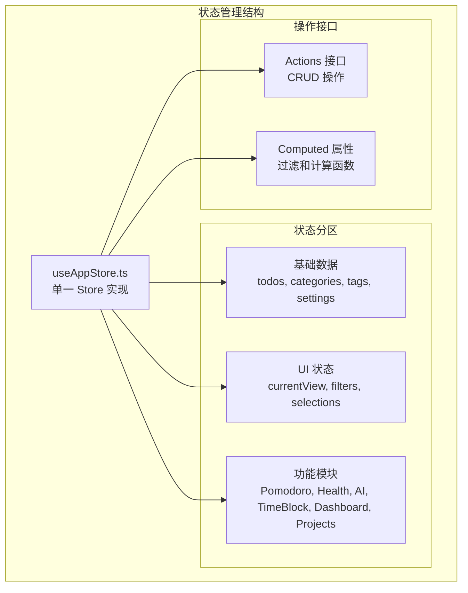

**图表来源**
- [useAppStore.ts:30-80](file://app/src/store/useAppStore.ts#L30-L80)
- [useAppStore.ts:82-176](file://app/src/store/useAppStore.ts#L82-L176)

**章节来源**
- [useAppStore.ts:1-604](file://app/src/store/useAppStore.ts#L1-L604)
- [package.json:25](file://app/package.json#L25)

## 核心组件

### Zustand Store 架构

SnowTodo 使用 Zustand 的 `create` 函数创建全局 Store，采用类型安全的设计模式：

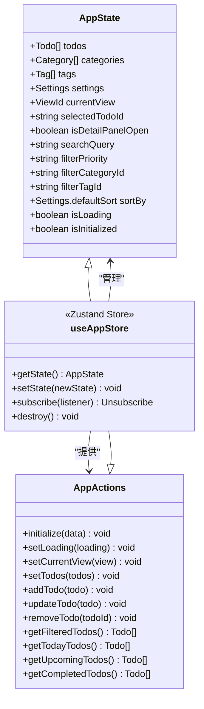

**图表来源**
- [useAppStore.ts:30-80](file://app/src/store/useAppStore.ts#L30-L80)
- [useAppStore.ts:82-176](file://app/src/store/useAppStore.ts#L82-L176)

### 状态分区设计

系统采用模块化状态分区设计，每个功能模块都有独立的状态管理：

| 状态分区 | 负责的功能 | 关键状态字段 |
|---------|-----------|-------------|
| 基础数据 | 核心业务数据 | todos, categories, tags, settings |
| UI 状态 | 用户界面状态 | currentView, filters, selections |
| Pomodoro | 番茄工作法 | pomodoroSettings, pomodoroPhase, pomodoroSessions |
| Health | 健康提醒 | healthReminders, pendingHealthReminder |
| AI | 智能助手 | aiSettings, isAISettingsLoaded |
| TimeBlock | 时间块管理 | timeBlocks, timeBlockDate |
| Dashboard | 统计数据 | dailyStats |
| Projects | 项目管理 | projectCells |

**章节来源**
- [useAppStore.ts:30-80](file://app/src/store/useAppStore.ts#L30-L80)
- [useAppStore.ts:181-508](file://app/src/store/useAppStore.ts#L181-L508)

## 架构概览

SnowTodo 的状态管理采用单向数据流架构，确保状态变更的可预测性和可追踪性。

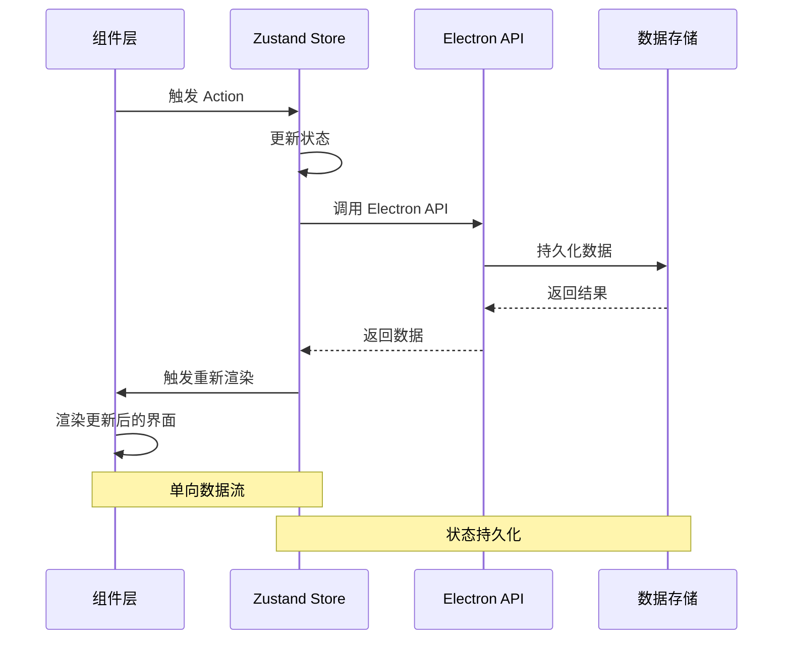

**图表来源**
- [useAppStore.ts:237-246](file://app/src/store/useAppStore.ts#L237-L246)
- [useAppStore.ts:543-601](file://app/src/store/useAppStore.ts#L543-L601)

### Zustand 选择原因

SnowTodo 选择 Zustand 的主要原因：

1. **简洁性**: 相比 Redux，Zustand 提供更少的样板代码
2. **类型安全**: 完整的 TypeScript 支持，编译时类型检查
3. **性能**: 原生支持细粒度订阅，避免不必要的重渲染
4. **易用性**: API 设计直观，学习成本低
5. **模块化**: 支持 Store 分割和组合

**章节来源**
- [package.json:25](file://app/package.json#L25)
- [useAppStore.ts:1-25](file://app/src/store/useAppStore.ts#L1-L25)

## 详细组件分析

### 全局状态设计

#### 状态结构规划

全局状态采用分层设计，确保状态的组织性和可维护性：

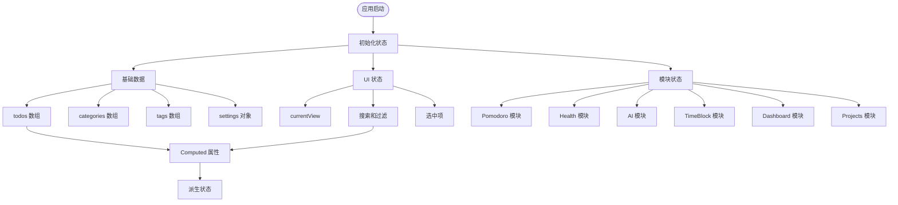

**图表来源**
- [useAppStore.ts:30-80](file://app/src/store/useAppStore.ts#L30-L80)
- [useAppStore.ts:327-390](file://app/src/store/useAppStore.ts#L327-L390)

#### Actions 实现模式

Actions 采用函数式编程模式，提供统一的状态更新接口：

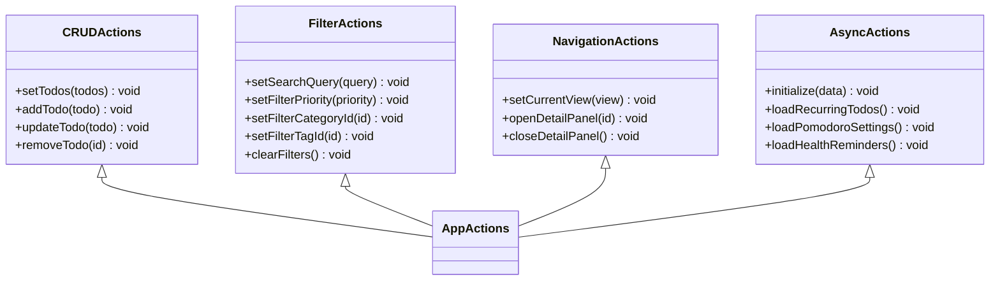

**图表来源**
- [useAppStore.ts:82-176](file://app/src/store/useAppStore.ts#L82-L176)

### Computed 属性实现

Computed 属性是 Zustand Store 的重要特性，提供高效的派生状态计算：

#### 过滤器实现

```mermaid
flowchart TD
Input[输入参数] --> FilterTodos[过滤待办事项]
FilterTodos --> SearchFilter[搜索过滤]
FilterTodos --> PriorityFilter[优先级过滤]
FilterTodos --> CategoryFilter[分类过滤]
FilterTodos --> TagFilter[标签过滤]
SearchFilter --> SortTodos[排序处理]
PriorityFilter --> SortTodos
CategoryFilter --> SortTodos
TagFilter --> SortTodos
SortTodos --> Output[返回过滤结果]
function sortTodos[todo 排序函数] --> SortTodos
```

**图表来源**
- [useAppStore.ts:327-390](file://app/src/store/useAppStore.ts#L327-L390)
- [useAppStore.ts:513-536](file://app/src/store/useAppStore.ts#L513-L536)

#### 时间相关的计算

系统实现了多种时间相关的计算逻辑：

| 计算方法 | 功能描述 | 实现逻辑 |
|---------|----------|----------|
| getTodayTodos | 获取今日待办 | 基于当前日期过滤，排除未来开始的任务 |
| getUpcomingTodos | 获取即将到期任务 | 过滤未来7天内的任务 |
| getCompletedTodos | 获取已完成任务 | 按完成时间倒序排列 |
| getPendingReminders | 获取待触发提醒 | 基于当前时间和提醒时间比较 |

**章节来源**
- [useAppStore.ts:340-390](file://app/src/store/useAppStore.ts#L340-L390)

### 状态与组件绑定机制

#### 组件订阅模式

组件通过 `useAppStore` Hook 订阅状态变化，实现响应式更新：

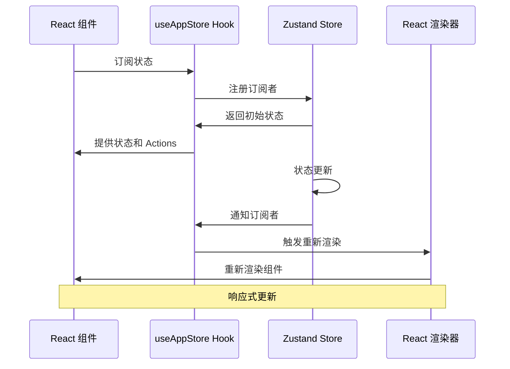

**图表来源**
- [TodoList.tsx:16-22](file://app/src/components/Content/TodoList.tsx#L16-L22)
- [DetailPanel.tsx:33-45](file://app/src/components/DetailPanel/DetailPanel.tsx#L33-L45)

#### 细粒度订阅优化

组件可以使用选择器函数实现细粒度订阅，减少不必要的重渲染：

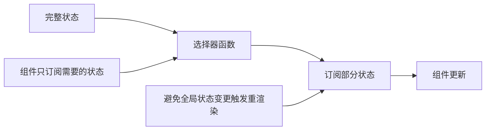

**图表来源**
- [TodoList.tsx:20-21](file://app/src/components/Content/TodoList.tsx#L20-L21)
- [DetailPanel.tsx:42-44](file://app/src/components/DetailPanel/DetailPanel.tsx#L42-L44)

**章节来源**
- [TodoList.tsx:16-75](file://app/src/components/Content/TodoList.tsx#L16-L75)
- [PomodoroView.tsx:169-178](file://app/src/components/Pomodoro/PomodoroView.tsx#L169-L178)

## 依赖关系分析

### 外部依赖

SnowTodo 的状态管理主要依赖以下外部库：

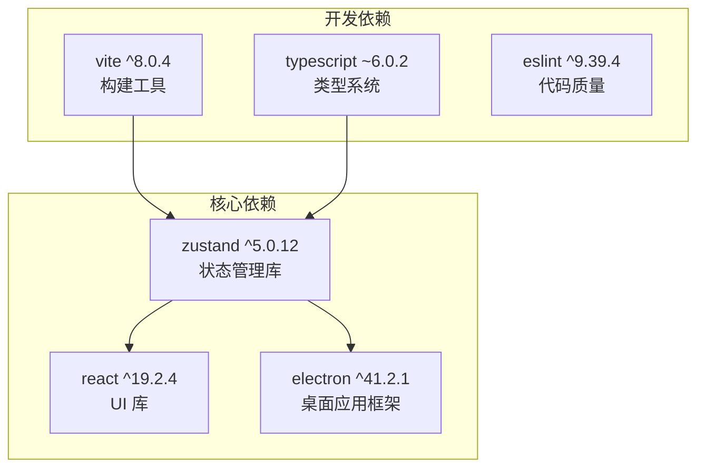

**图表来源**
- [package.json:16-48](file://app/package.json#L16-L48)

### 内部依赖关系

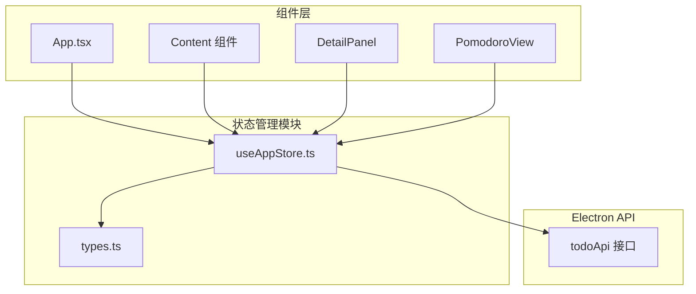

**图表来源**
- [useAppStore.ts:541-603](file://app/src/store/useAppStore.ts#L541-L603)
- [App.tsx:11-57](file://app/src/App.tsx#L11-L57)

**章节来源**
- [useAppStore.ts:541-603](file://app/src/store/useAppStore.ts#L541-L603)
- [App.tsx:11-57](file://app/src/App.tsx#L11-L57)

## 性能考虑

### 状态更新优化

Zustand 提供了多种性能优化策略：

1. **细粒度订阅**: 组件只订阅需要的状态，避免全局重渲染
2. **选择器函数**: 使用选择器函数提取特定状态片段
3. **批量更新**: 合理组织状态更新，减少不必要的重渲染

### 计算属性缓存

对于昂贵的计算操作，建议实现缓存机制：

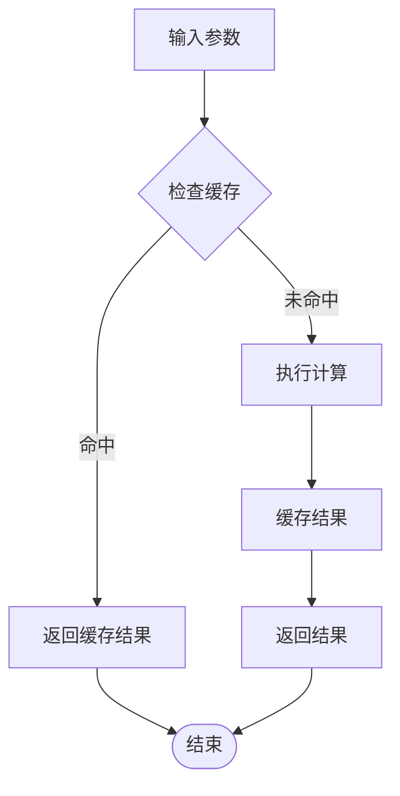

### 内存管理

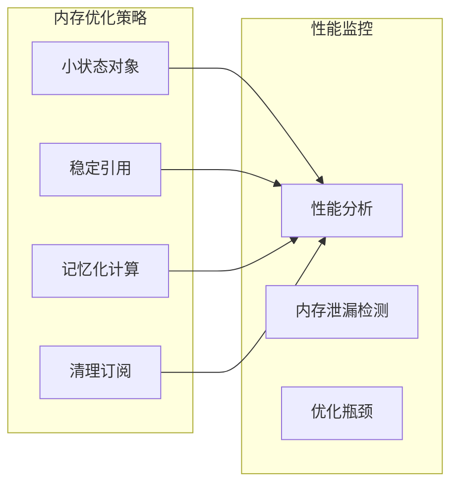

## 故障排除指南

### 常见问题及解决方案

#### 状态不同步问题

**问题描述**: 组件状态与实际状态不一致

**解决方案**:
1. 检查组件是否正确订阅状态
2. 确认 Actions 是否正确调用
3. 验证状态更新的原子性

#### 性能问题

**问题描述**: 应用响应缓慢或频繁重渲染

**解决方案**:
1. 使用选择器函数实现细粒度订阅
2. 检查是否存在不必要的状态更新
3. 优化计算属性的复杂度

#### 类型错误

**问题描述**: TypeScript 编译错误

**解决方案**:
1. 确保类型定义完整
2. 检查泛型参数的正确性
3. 验证接口的一致性

**章节来源**
- [useAppStore.ts:82-176](file://app/src/store/useAppStore.ts#L82-L176)
- [types.ts:161-213](file://app/src/types.ts#L161-L213)

## 结论

SnowTodo 的状态管理架构充分展现了 Zustand 的优势：简洁、类型安全、高性能。通过模块化设计、清晰的 Actions 和 Computed 属性实现，系统实现了良好的可维护性和扩展性。

### 主要优势

1. **简洁性**: 相比其他状态管理方案，Zustand 提供了更少的样板代码
2. **类型安全**: 完整的 TypeScript 支持确保编译时类型检查
3. **性能**: 原生支持细粒度订阅，优化渲染性能
4. **可扩展性**: 模块化设计便于功能扩展和维护

### 最佳实践总结

1. **状态分区**: 将相关状态组织在同一模块中
2. **Actions 设计**: 提供清晰的 Action 接口，保持状态更新的原子性
3. **Computed 属性**: 实现高效的派生状态计算
4. **组件绑定**: 使用细粒度订阅减少重渲染
5. **类型安全**: 充分利用 TypeScript 的类型推断能力

这个状态管理架构为 SnowTodo 提供了坚实的基础，支持应用的持续发展和功能扩展。