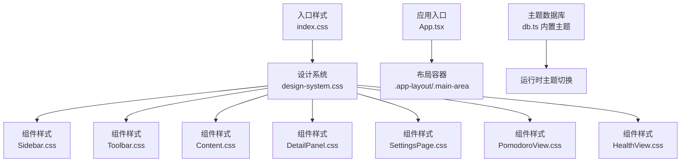
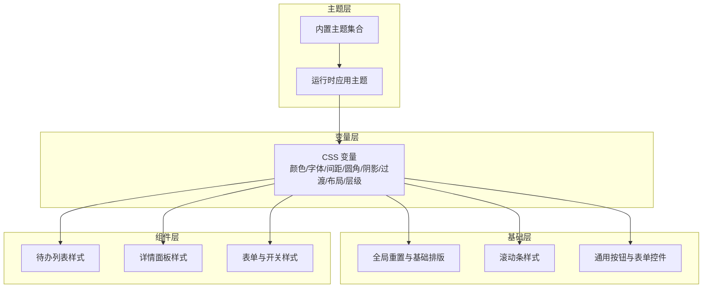
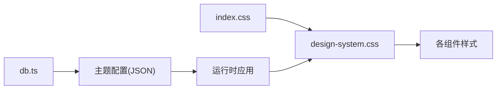

# 样式与主题

<cite>
**本文引用的文件**
- [design-system.css](file://app/src/styles/design-system.css)
- [index.css](file://app/src/index.css)
- [App.tsx](file://app/src/App.tsx)
- [db.ts](file://app/electron/db.ts)
- [useAppStore.ts](file://app/src/store/useAppStore.ts)
- [Sidebar.css](file://app/src/components/Sidebar/Sidebar.css)
- [Toolbar.css](file://app/src/components/Toolbar/Toolbar.css)
- [Content.css](file://app/src/components/Content/Content.css)
- [DetailPanel.css](file://app/src/components/DetailPanel/DetailPanel.css)
- [SettingsPage.css](file://app/src/components/Settings/SettingsPage.css)
- [PomodoroView.css](file://app/src/components/Pomodoro/PomodoroView.css)
- [HealthView.css](file://app/src/components/Health/HealthView.css)
- [vite.config.ts](file://app/vite.config.ts)
</cite>

## 目录
1. [简介](#简介)
2. [项目结构](#项目结构)
3. [核心组件](#核心组件)
4. [架构总览](#架构总览)
5. [详细组件分析](#详细组件分析)
6. [依赖关系分析](#依赖关系分析)
7. [性能考量](#性能考量)
8. [故障排查指南](#故障排查指南)
9. [结论](#结论)
10. [附录](#附录)

## 简介
本文件系统性梳理 SnowTodo 的样式系统与主题设计，覆盖以下要点：
- CSS 设计系统的实现：主题变量管理、颜色系统、字体系统、间距规范
- 响应式设计与移动端适配策略
- 组件样式组织：全局样式、组件样式与样式隔离
- 动画与过渡：内置 CSS 动画与 Framer Motion 集成现状
- 暗黑模式与动态主题切换：当前暖阳白主题与内置主题数据库
- 最佳实践：BEM 命名、样式复用、可维护性
- 自定义主题与品牌定制：变量扩展与主题注入
- 性能优化：构建产物与样式提取

## 项目结构
SnowTodo 的样式体系以“设计系统变量 + 全局基础样式 + 组件局部样式”三层组织：
- 入口：index.css 导入设计系统
- 设计系统：design-system.css 定义 CSS 变量与通用样式
- 组件样式：各功能模块的 .css 文件按需覆盖或补充
- 主题：electron/db.ts 内置多套主题配置，供运行时选择

图表来源
- [index.css:1-2](file://app/src/index.css#L1-L2)
- [design-system.css:1-120](file://app/src/styles/design-system.css#L1-L120)
- [App.tsx:40-56](file://app/src/App.tsx#L40-L56)
- [db.ts:566-611](file://app/electron/db.ts#L566-L611)

章节来源
- [index.css:1-2](file://app/src/index.css#L1-L2)
- [design-system.css:1-120](file://app/src/styles/design-system.css#L1-L120)
- [App.tsx:40-56](file://app/src/App.tsx#L40-L56)
- [db.ts:566-611](file://app/electron/db.ts#L566-L611)

## 核心组件
- 设计系统变量层：集中定义颜色、字体、间距、圆角、阴影、过渡、布局与层级，统一通过 CSS 变量驱动
- 全局基础层：重置、滚动条、基础排版、通用按钮与表单控件
- 组件层：按模块划分样式，遵循语义化命名，结合设计系统变量进行复用
- 主题层：内置多主题配置，支持运行时切换（当前为暖阳白主题）

章节来源
- [design-system.css:1-95](file://app/src/styles/design-system.css#L1-L95)
- [design-system.css:97-141](file://app/src/styles/design-system.css#L97-L141)
- [design-system.css:808-857](file://app/src/styles/design-system.css#L808-L857)
- [db.ts:566-611](file://app/electron/db.ts#L566-L611)

## 架构总览
样式系统采用“变量驱动 + 组件隔离”的架构：
- 变量驱动：所有组件样式仅消费设计系统变量，避免硬编码色值与尺寸
- 组件隔离：组件样式文件独立，通过类名限定作用域，减少冲突
- 运行时主题：通过 Electron 数据库存储主题配置，前端读取并应用

图表来源
- [design-system.css:1-95](file://app/src/styles/design-system.css#L1-L95)
- [design-system.css:97-141](file://app/src/styles/design-system.css#L97-L141)
- [design-system.css:667-798](file://app/src/styles/design-system.css#L667-L798)
- [db.ts:566-611](file://app/electron/db.ts#L566-L611)

## 详细组件分析

### 设计系统变量与全局样式
- 颜色系统：背景、表面、文本、边框、强调色、优先级色、危险色、遮罩层
- 字体系统：字体族、字号、字重、行高
- 间距系统：从 4px 到 64px 的离散步进
- 圆角与阴影：多档位半径与阴影
- 过渡与动画：统一的过渡时长与内置 keyframe
- 布局与层级：侧栏宽度、工具栏高度、面板宽度、z-index 序列
- 基础排版：重置盒模型、滚动条、基础元素样式
- 通用组件：按钮、表单输入、选择器、开关等

章节来源
- [design-system.css:1-95](file://app/src/styles/design-system.css#L1-L95)
- [design-system.css:97-141](file://app/src/styles/design-system.css#L97-L141)
- [design-system.css:667-798](file://app/src/styles/design-system.css#L667-L798)
- [design-system.css:951-980](file://app/src/styles/design-system.css#L951-L980)

### 布局与导航组件
- 布局容器：.app-layout 与 .main-area 实现主内容区
- 侧边栏：宽度、分组标题、导航项、徽标、悬停与激活态
- 工具栏：搜索框、按钮、标题、过滤条
- 通用按钮：主次按钮、危险按钮、幽灵按钮、图标按钮

章节来源
- [design-system.css:166-286](file://app/src/styles/design-system.css#L166-L286)
- [design-system.css:301-391](file://app/src/styles/design-system.css#L301-L391)
- [design-system.css:808-857](file://app/src/styles/design-system.css#L808-L857)
- [Toolbar.css:1-15](file://app/src/components/Toolbar/Toolbar.css#L1-L15)

### 内容与状态页
- 欢迎/空状态：居中布局、图标、标题、副标题、动作按钮
- 待办列表：列表项、勾选框、元信息、标签、优先级指示器
- 加载动画：旋转加载与入场动画

章节来源
- [design-system.css:404-456](file://app/src/styles/design-system.css#L404-L456)
- [design-system.css:460-582](file://app/src/styles/design-system.css#L460-L582)
- [Content.css:17-118](file://app/src/components/Content/Content.css#L17-L118)

### 详情面板与表单
- 详情面板：滑入遮罩、面板容器、头部/主体/底部
- 标签与新标签输入：交互态与选中态
- 自定义周选择：按钮组与激活态
- 图片上传与预览：拖拽高亮、网格预览、删除按钮、灯箱全屏
- 表单控件：输入、文本域、选择器、开关、栅格布局

章节来源
- [design-system.css:586-663](file://app/src/styles/design-system.css#L586-L663)
- [DetailPanel.css:1-206](file://app/src/components/DetailPanel/DetailPanel.css#L1-L206)
- [design-system.css:667-798](file://app/src/styles/design-system.css#L667-L798)

### 设置页与模块样式
- 设置页：下拉宽度约束
- 番茄钟：开关样式与共享按钮
- 健康提醒：开关样式与共享按钮

章节来源
- [SettingsPage.css:1-4](file://app/src/components/Settings/SettingsPage.css#L1-L4)
- [PomodoroView.css:354-423](file://app/src/components/Pomodoro/PomodoroView.css#L354-L423)
- [HealthView.css:370-418](file://app/src/components/Health/HealthView.css#L370-L418)

### 动画与过渡
- 内置动画：fadeIn、slideInRight、slideInUp
- 使用方式：在组件样式中引入动画类或直接使用 keyframes
- Framer Motion 集成现状：项目依赖中包含 framer-motion，但未见在现有组件中直接使用，建议在需要复杂动效的场景引入

章节来源
- [design-system.css:951-980](file://app/src/styles/design-system.css#L951-L980)
- [vite.config.ts:1-37](file://app/vite.config.ts#L1-L37)

### 暗黑模式与动态主题
- 当前主题：暖阳白（:root 默认）
- 内置主题：深空蓝、樱花粉、森林绿、极简灰、商务蓝
- 主题结构：colors 与 effects（圆角、阴影、模糊）两部分
- 切换机制：Electron 层存储主题配置，前端读取后通过 CSS 变量覆盖实现动态主题

章节来源
- [design-system.css:4-95](file://app/src/styles/design-system.css#L4-L95)
- [db.ts:566-611](file://app/electron/db.ts#L566-L611)

### 响应式与移动端适配
- 布局：Flex 布局与固定侧栏宽度，适合桌面端
- 移动端适配：当前未见媒体查询；建议在 Content.css、Sidebar.css、Toolbar.css 中增加断点，针对窄屏调整间距、字号与布局方向

章节来源
- [design-system.css:84-87](file://app/src/styles/design-system.css#L84-L87)
- [Content.css:17-118](file://app/src/components/Content/Content.css#L17-L118)

### 样式组织与隔离
- 全局导入：index.css 导入设计系统，确保变量与基础样式全局可用
- 组件样式：各模块独立 .css 文件，避免跨组件污染
- 类名约定：以模块/组件名作为命名空间前缀，配合语义化类名（如 .btn-primary），便于维护

章节来源
- [index.css:1-2](file://app/src/index.css#L1-L2)
- [Sidebar.css:1-5](file://app/src/components/Sidebar/Sidebar.css#L1-L5)
- [Toolbar.css:1-15](file://app/src/components/Toolbar/Toolbar.css#L1-L15)

## 依赖关系分析
- 入口依赖：index.css 依赖 design-system.css
- 组件依赖：各组件样式依赖设计系统变量
- 主题依赖：db.ts 提供主题配置，前端通过 store 或窗口通信读取

图表来源
- [index.css:1-2](file://app/src/index.css#L1-L2)
- [design-system.css:1-95](file://app/src/styles/design-system.css#L1-L95)
- [db.ts:566-611](file://app/electron/db.ts#L566-L611)

章节来源
- [index.css:1-2](file://app/src/index.css#L1-L2)
- [design-system.css:1-95](file://app/src/styles/design-system.css#L1-L95)
- [db.ts:566-611](file://app/electron/db.ts#L566-L611)

## 性能考量
- 构建与打包：Vite 配置输出到 dist，Electron 主进程输出到 dist-electron
- 样式体积：设计系统集中变量，组件样式按需引入，避免重复定义
- 动画性能：使用 CSS 变换与透明度动画，尽量避免触发布局与重绘
- 主题切换：通过 CSS 变量切换，避免重排与大范围样式重算

章节来源
- [vite.config.ts:1-37](file://app/vite.config.ts#L1-L37)
- [design-system.css:73-83](file://app/src/styles/design-system.css#L73-L83)

## 故障排查指南
- 样式未生效
  - 检查 index.css 是否正确导入 design-system.css
  - 确认组件是否使用了正确的类名与设计系统变量
- 主题切换无效
  - 确认 Electron 层主题配置存在且可读取
  - 检查运行时是否将主题变量写入 :root
- 动画异常
  - 确认动画类名拼写与 keyframes 定义一致
  - 在复杂场景考虑使用 Framer Motion，确保依赖已安装

章节来源
- [index.css:1-2](file://app/src/index.css#L1-L2)
- [design-system.css:951-980](file://app/src/styles/design-system.css#L951-L980)
- [vite.config.ts:1-37](file://app/vite.config.ts#L1-L37)

## 结论
SnowTodo 的样式系统以 CSS 变量为核心，实现了清晰的设计系统与组件隔离。通过内置主题数据库与运行时变量覆盖，具备良好的主题扩展能力。建议后续在移动端适配、复杂动效场景引入 Framer Motion，并完善样式最佳实践与文档化。

## 附录

### 设计系统变量速览
- 颜色：背景、表面、文本、边框、强调、优先级、危险、遮罩
- 字体：字体族、字号、字重、行高
- 间距：space-1 到 space-16
- 圆角：radius-sm 到 radius-full
- 阴影：shadow-sm 到 shadow-xl
- 过渡：transition-fast/base/slow
- 布局：sidebar-width、toolbar-height、panel-width
- 层级：z-sidebar 到 z-toast

章节来源
- [design-system.css:1-95](file://app/src/styles/design-system.css#L1-L95)

### 主题配置字段说明
- colors：primary、secondary、accent、background、surface、text、textSecondary、border、success、warning、error
- effects：blur、shadow、rounded

章节来源
- [db.ts:566-611](file://app/electron/db.ts#L566-L611)