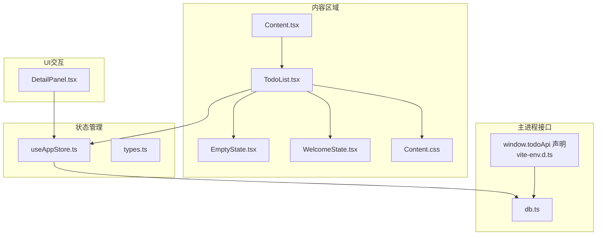
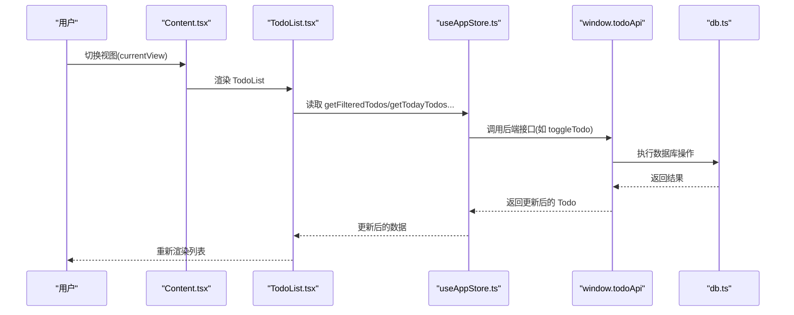
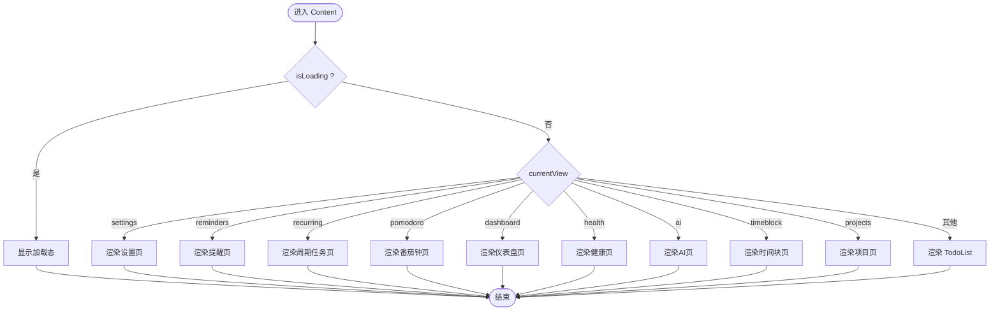
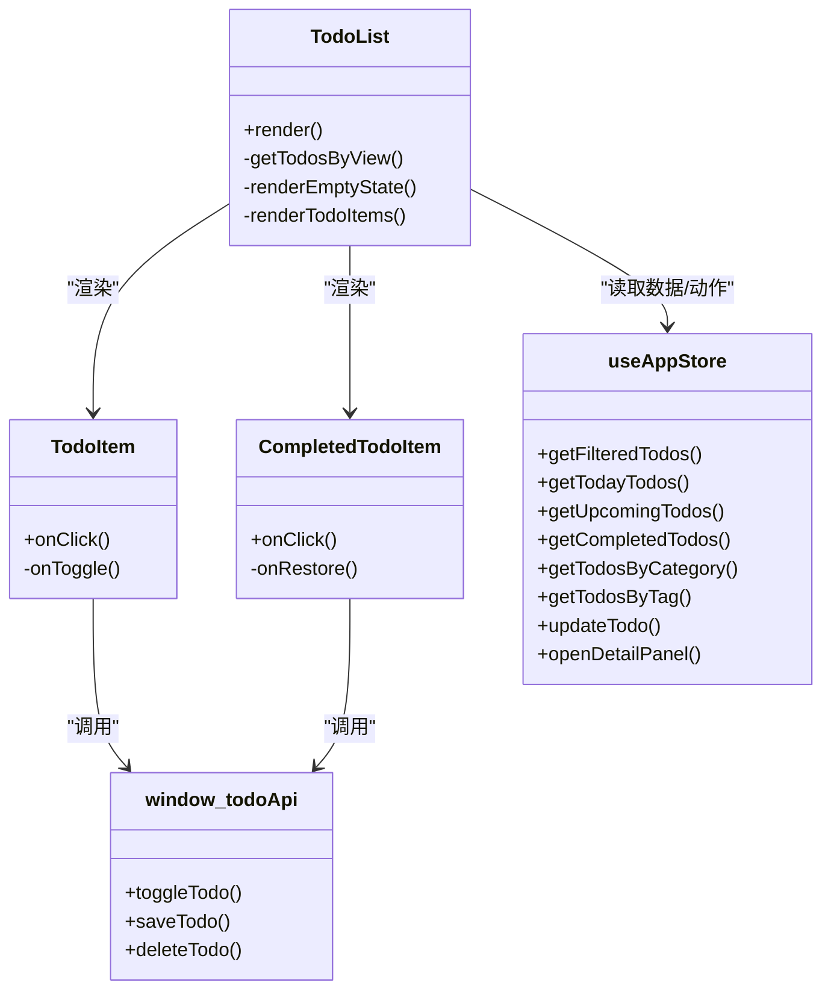
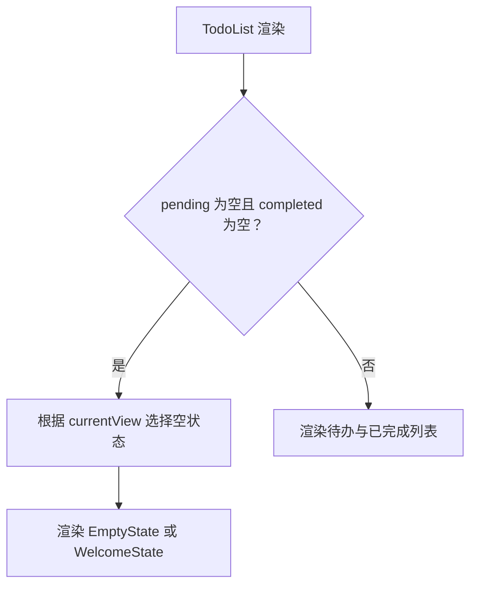
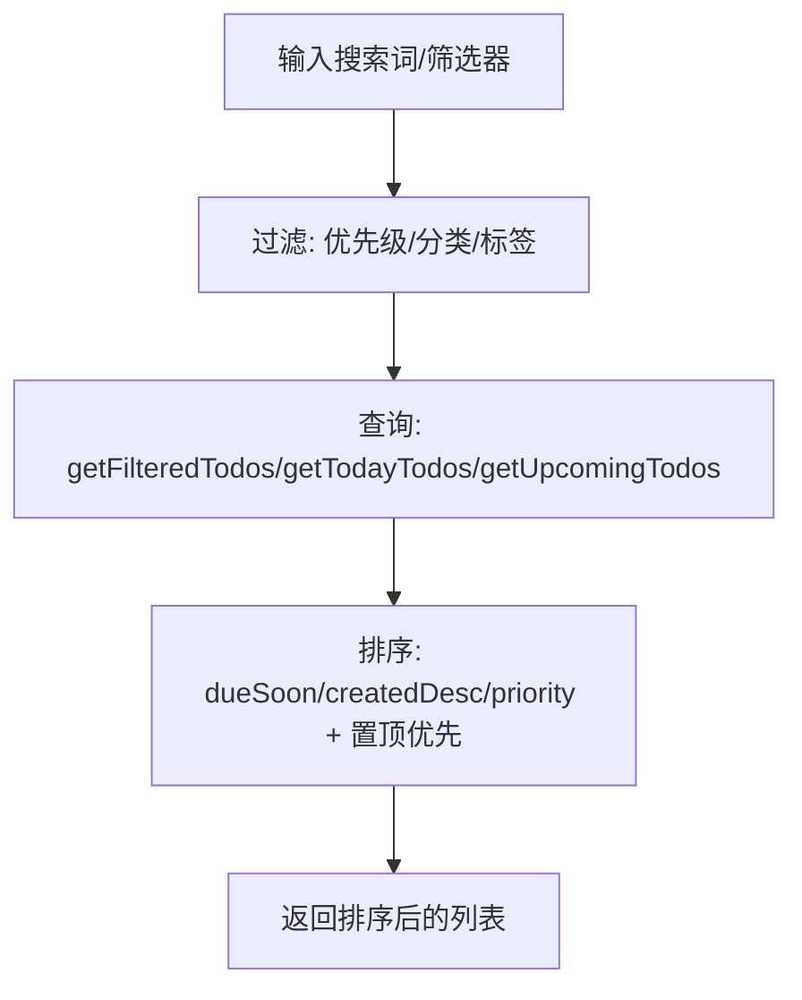
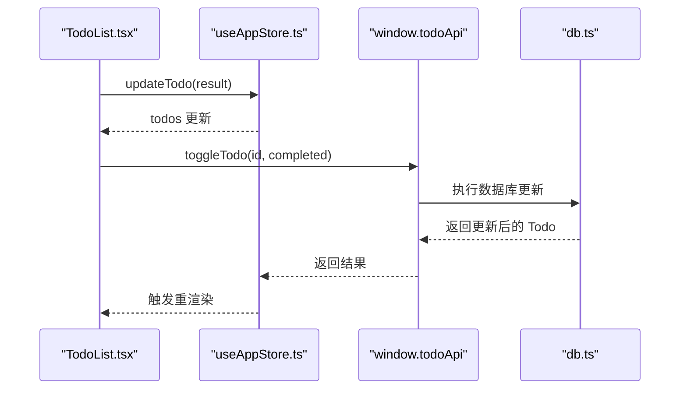
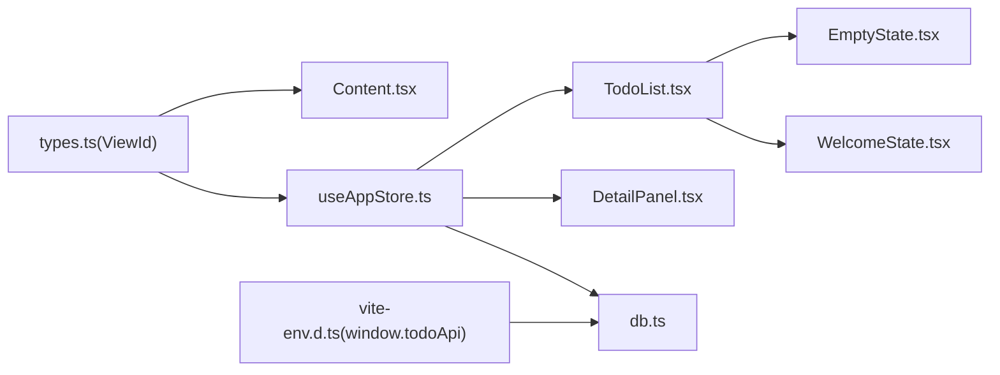

# 内容区域

<cite>
**本文引用的文件**
- [Content.tsx](file://app/src/components/Content/Content.tsx)
- [TodoList.tsx](file://app/src/components/Content/TodoList.tsx)
- [EmptyState.tsx](file://app/src/components/Content/EmptyState.tsx)
- [WelcomeState.tsx](file://app/src/components/Content/WelcomeState.tsx)
- [Content.css](file://app/src/components/Content/Content.css)
- [useAppStore.ts](file://app/src/store/useAppStore.ts)
- [types.ts](file://app/src/types.ts)
- [DetailPanel.tsx](file://app/src/components/DetailPanel/DetailPanel.tsx)
- [db.ts](file://app/electron/db.ts)
- [vite-env.d.ts](file://app/src/vite-env.d.ts)
</cite>

## 目录
1. [简介](#简介)
2. [项目结构](#项目结构)
3. [核心组件](#核心组件)
4. [架构总览](#架构总览)
5. [详细组件分析](#详细组件分析)
6. [依赖关系分析](#依赖关系分析)
7. [性能考量](#性能考量)
8. [故障排查指南](#故障排查指南)
9. [结论](#结论)
10. [附录](#附录)

## 简介
本章节面向 SnowTodo 的“内容区域”，系统性梳理其核心功能与实现细节，重点覆盖：
- 视图切换机制与条件渲染
- 空状态与欢迎状态的设计与实现
- TodoList 组件的任务渲染、搜索过滤、排序、批量操作
- 与状态管理的集成（数据绑定、事件处理、性能优化）
- 响应式设计与用户体验优化
- 扩展与定制开发指南

## 项目结构
内容区域位于 app/src/components/Content 下，包含以下关键文件：
- Content.tsx：内容区入口，负责根据当前视图进行条件渲染
- TodoList.tsx：任务列表核心组件，负责渲染、空状态、交互
- EmptyState.tsx：通用空状态组件
- WelcomeState.tsx：欢迎状态组件（用于首次引导或特定视图）
- Content.css：内容区样式与动画
- useAppStore.ts：Zustand 状态管理，提供计算属性与动作
- types.ts：类型定义，含 ViewId 枚举
- DetailPanel.tsx：详情面板，与 TodoList 的交互密切
- db.ts：Electron 主进程数据库操作，为前端 API 提供实现
- vite-env.d.ts：声明 window.todoApi 接口

图表来源
- [Content.tsx:14-63](file://app/src/components/Content/Content.tsx#L14-L63)
- [TodoList.tsx:16-75](file://app/src/components/Content/TodoList.tsx#L16-L75)
- [useAppStore.ts:181-508](file://app/src/store/useAppStore.ts#L181-L508)
- [types.ts:7-23](file://app/src/types.ts#L7-L23)
- [DetailPanel.tsx:33-45](file://app/src/components/DetailPanel/DetailPanel.tsx#L33-L45)
- [db.ts:798-825](file://app/electron/db.ts#L798-L825)
- [vite-env.d.ts:5-22](file://app/src/vite-env.d.ts#L5-L22)

章节来源
- [Content.tsx:14-63](file://app/src/components/Content/Content.tsx#L14-L63)
- [TodoList.tsx:16-75](file://app/src/components/Content/TodoList.tsx#L16-L75)
- [useAppStore.ts:181-508](file://app/src/store/useAppStore.ts#L181-L508)
- [types.ts:7-23](file://app/src/types.ts#L7-L23)

## 核心组件
- 视图切换与条件渲染：Content.tsx 基于 currentView 切换不同视图；当为 todo 相关视图时，内部由 TodoList 渲染
- TodoList：按 currentView 分支获取数据，支持空状态、待办与已完成分组渲染、点击打开详情
- 空状态与欢迎状态：EmptyState 与 WelcomeState 提供统一的视觉与交互体验
- 状态管理：useAppStore 提供 todos、filters、computed 查询方法、actions 以及 window.todoApi 的调用封装
- 样式与动画：Content.css 定义欢迎态、空态、加载态、列表项样式与过渡动画

章节来源
- [Content.tsx:14-63](file://app/src/components/Content/Content.tsx#L14-L63)
- [TodoList.tsx:16-75](file://app/src/components/Content/TodoList.tsx#L16-L75)
- [EmptyState.tsx:4-11](file://app/src/components/Content/EmptyState.tsx#L4-L11)
- [WelcomeState.tsx:5-21](file://app/src/components/Content/WelcomeState.tsx#L5-L21)
- [useAppStore.ts:181-508](file://app/src/store/useAppStore.ts#L181-L508)
- [Content.css:17-277](file://app/src/components/Content/Content.css#L17-L277)

## 架构总览
内容区域采用“视图层 + 状态层 + 数据层”的三层架构：
- 视图层：Content.tsx 条件渲染各视图；TodoList 负责任务列表渲染与交互
- 状态层：useAppStore 提供全局状态与计算属性，封装 actions 与 window.todoApi 调用
- 数据层：Electron 主进程 db.ts 实现 CRUD 与查询，通过 window.todoApi 暴露给渲染进程

图表来源
- [Content.tsx:14-63](file://app/src/components/Content/Content.tsx#L14-L63)
- [TodoList.tsx:16-75](file://app/src/components/Content/TodoList.tsx#L16-L75)
- [useAppStore.ts:267-272](file://app/src/store/useAppStore.ts#L267-L272)
- [db.ts:798-825](file://app/electron/db.ts#L798-L825)
- [vite-env.d.ts:5-22](file://app/src/vite-env.d.ts#L5-L22)

## 详细组件分析

### 视图切换与条件渲染
- Content.tsx 根据 currentView 进行分支渲染，支持 settings、reminders、recurring、pomodoro、dashboard、health、ai、timeblock、projects 等视图
- 对于 todo 相关视图（today/all/upcoming/completed/categories/tags），统一由 TodoList 渲染
- 当 isLoading 为真时，显示加载态

图表来源
- [Content.tsx:17-62](file://app/src/components/Content/Content.tsx#L17-L62)

章节来源
- [Content.tsx:14-63](file://app/src/components/Content/Content.tsx#L14-L63)

### TodoList 组件
- 数据分支：根据 currentView 选择不同的数据源（今日、全部、即将到来、已完成、按分类、按标签）
- 空状态：当 pending 与 completed 均为空时，显示欢迎状态（可选“创建待办”按钮）
- 列表渲染：待办项与已完成项分别渲染，支持点击打开详情面板
- 交互行为：
  - 待办项点击复选框触发完成/取消完成，调用 window.todoApi.toggleTodo 并更新本地状态
  - 已完成项点击复选框触发恢复，调用 window.todoApi.toggleTodo 并更新本地状态
  - 整行点击打开详情面板
- 样式与动画：使用 CSS 动画与主题变量，支持置顶、优先级指示、标签徽章、元信息展示

图表来源
- [TodoList.tsx:16-75](file://app/src/components/Content/TodoList.tsx#L16-L75)
- [TodoList.tsx:77-145](file://app/src/components/Content/TodoList.tsx#L77-L145)
- [TodoList.tsx:147-188](file://app/src/components/Content/TodoList.tsx#L147-L188)
- [useAppStore.ts:127-139](file://app/src/store/useAppStore.ts#L127-L139)
- [vite-env.d.ts:5-22](file://app/src/vite-env.d.ts#L5-L22)

章节来源
- [TodoList.tsx:16-75](file://app/src/components/Content/TodoList.tsx#L16-L75)
- [TodoList.tsx:77-145](file://app/src/components/Content/TodoList.tsx#L77-L145)
- [TodoList.tsx:147-188](file://app/src/components/Content/TodoList.tsx#L147-L188)

### 空状态与欢迎状态
- EmptyState：通用空状态，适合非 todo 视图或需要提示“暂无内容”的场景
- WelcomeState：用于 todo 视图的引导式空状态，包含标题、副标题与“创建待办”按钮
- TodoList 内部对不同 currentView 配置不同的空状态文案与是否显示“创建”按钮

图表来源
- [TodoList.tsx:47-63](file://app/src/components/Content/TodoList.tsx#L47-L63)
- [EmptyState.tsx:4-11](file://app/src/components/Content/EmptyState.tsx#L4-L11)
- [WelcomeState.tsx:5-21](file://app/src/components/Content/WelcomeState.tsx#L5-L21)

章节来源
- [TodoList.tsx:47-63](file://app/src/components/Content/TodoList.tsx#L47-L63)
- [EmptyState.tsx:4-11](file://app/src/components/Content/EmptyState.tsx#L4-L11)
- [WelcomeState.tsx:5-21](file://app/src/components/Content/WelcomeState.tsx#L5-L21)

### 搜索过滤与排序
- 搜索过滤：基于 searchQuery 对标题与备注进行大小写无关匹配
- 过滤器：支持优先级、分类、标签过滤
- 排序：支持“即将到期”、“创建时间倒序”、“优先级”三种排序方式；置顶任务始终排在前面
- 计算属性：getFilteredTodos、getTodayTodos、getUpcomingTodos、getCompletedTodos、getTodosByCategory、getTodosByTag

图表来源
- [useAppStore.ts:327-380](file://app/src/store/useAppStore.ts#L327-L380)
- [useAppStore.ts:513-536](file://app/src/store/useAppStore.ts#L513-L536)

章节来源
- [useAppStore.ts:327-380](file://app/src/store/useAppStore.ts#L327-L380)
- [useAppStore.ts:513-536](file://app/src/store/useAppStore.ts#L513-L536)

### 与状态管理的集成
- 数据绑定：TodoList 通过 useAppStore 读取 todos、currentView、filters、categories、tags 等
- 事件处理：点击复选框调用 window.todoApi.toggleTodo，再通过 updateTodo 同步到本地状态
- 详情面板：点击整行打开 DetailPanel，支持新增/编辑/删除/图片拖拽上传
- 性能优化：使用 Zustand 的局部订阅，仅在相关字段变化时重渲染；列表项使用 key 基于 id，避免不必要的重排

图表来源
- [TodoList.tsx:83-87](file://app/src/components/Content/TodoList.tsx#L83-L87)
- [useAppStore.ts:267-272](file://app/src/store/useAppStore.ts#L267-L272)
- [db.ts:798-825](file://app/electron/db.ts#L798-L825)
- [vite-env.d.ts:5-22](file://app/src/vite-env.d.ts#L5-L22)

章节来源
- [TodoList.tsx:77-145](file://app/src/components/Content/TodoList.tsx#L77-L145)
- [useAppStore.ts:267-272](file://app/src/store/useAppStore.ts#L267-L272)
- [DetailPanel.tsx:166-185](file://app/src/components/DetailPanel/DetailPanel.tsx#L166-L185)

### 响应式设计与用户体验
- 布局：内容区使用弹性布局，支持滚动与无边距模式（部分视图）
- 动画：欢迎态与列表项使用淡入/滑入动画，提升过渡体验
- 可访问性：复选框提供 aria-label，支持键盘与鼠标操作
- 交互反馈：悬停效果、点击态、图标与颜色语义化

章节来源
- [Content.css:17-277](file://app/src/components/Content/Content.css#L17-L277)
- [TodoList.tsx:96-101](file://app/src/components/Content/TodoList.tsx#L96-L101)
- [TodoList.tsx:164-168](file://app/src/components/Content/TodoList.tsx#L164-L168)

## 依赖关系分析
- 类型依赖：ViewId 在 types.ts 中定义，Content.tsx 与 useAppStore.ts 使用该枚举
- 状态依赖：TodoList 依赖 useAppStore 的计算属性与 actions
- 数据依赖：window.todoApi 在 vite-env.d.ts 中声明，db.ts 提供实现
- 组件依赖：Content.tsx 依赖 TodoList；TodoList 依赖 EmptyState/WelcomeState；DetailPanel 与 TodoList 协同

图表来源
- [types.ts:7-23](file://app/src/types.ts#L7-L23)
- [Content.tsx:14-63](file://app/src/components/Content/Content.tsx#L14-L63)
- [useAppStore.ts:181-508](file://app/src/store/useAppStore.ts#L181-L508)
- [vite-env.d.ts:5-22](file://app/src/vite-env.d.ts#L5-L22)
- [db.ts:798-825](file://app/electron/db.ts#L798-L825)

章节来源
- [types.ts:7-23](file://app/src/types.ts#L7-L23)
- [useAppStore.ts:181-508](file://app/src/store/useAppStore.ts#L181-L508)
- [vite-env.d.ts:5-22](file://app/src/vite-env.d.ts#L5-L22)

## 性能考量
- 状态粒度：Zustand 局部订阅减少重渲染范围
- 列表渲染：使用唯一 key，避免不必要的 DOM 重建
- 排序策略：先分离置顶与非置顶，再对各自集合应用排序，保证稳定性
- 异步调用：toggleTodo 等异步操作在 UI 上即时反馈，完成后同步更新状态
- 图片处理：DetailPanel 支持拖拽/粘贴上传，异步处理图片并延迟保存至数据库

章节来源
- [useAppStore.ts:513-536](file://app/src/store/useAppStore.ts#L513-L536)
- [DetailPanel.tsx:77-108](file://app/src/components/DetailPanel/DetailPanel.tsx#L77-L108)

## 故障排查指南
- 无法切换视图：检查 currentView 是否为 types.ts 中定义的 ViewId 值之一
- 列表不更新：确认 window.todoApi.toggleTodo 返回值已通过 updateTodo 同步到 store
- 空状态未显示：确认 todos 与 completed 均为空，且 currentView 在 EMPTY_MESSAGES 中配置
- 图片上传失败：检查拖拽/粘贴流程与 window.todoApi.addTodoImage 的调用链
- 加载态不消失：确认 initialize 将 isLoading 设为 false

章节来源
- [types.ts:7-23](file://app/src/types.ts#L7-L23)
- [useAppStore.ts:237-246](file://app/src/store/useAppStore.ts#L237-L246)
- [TodoList.tsx:47-63](file://app/src/components/Content/TodoList.tsx#L47-L63)
- [DetailPanel.tsx:166-185](file://app/src/components/DetailPanel/DetailPanel.tsx#L166-L185)

## 结论
内容区域以清晰的视图切换与条件渲染为基础，结合 TodoList 的高效渲染与空状态设计，提供了良好的用户体验。通过 Zustand 状态管理与 window.todoApi 的统一接口，实现了前后端解耦与可维护性。配合响应式样式与动画，整体交互流畅自然。

## 附录

### 开发指南：扩展与定制
- 新增视图：在 types.ts 的 ViewId 中添加新视图名，在 Content.tsx 的分支中添加渲染逻辑
- 新增空状态：在 TodoList 的 EMPTY_MESSAGES 中添加对应文案，或直接使用 EmptyState/WelcomeState
- 新增过滤器：在 useAppStore 的 getFilteredTodos 中增加过滤条件，并在 UI 中暴露筛选控件
- 新增排序：在 sortTodos 中扩展排序逻辑，并在 UI 中提供排序选项
- 新增交互：在 TodoItem/CompletedTodoItem 中扩展事件处理，确保通过 window.todoApi 与 updateTodo 同步状态
- 样式定制：通过 Content.css 的变量与类名进行主题化与微调

章节来源
- [types.ts:7-23](file://app/src/types.ts#L7-L23)
- [Content.tsx:14-63](file://app/src/components/Content/Content.tsx#L14-L63)
- [TodoList.tsx:6-14](file://app/src/components/Content/TodoList.tsx#L6-L14)
- [useAppStore.ts:327-380](file://app/src/store/useAppStore.ts#L327-L380)
- [useAppStore.ts:513-536](file://app/src/store/useAppStore.ts#L513-L536)
- [Content.css:17-277](file://app/src/components/Content/Content.css#L17-L277)