# 加载状态管理

<cite>
**本文档引用的文件**
- [Content.tsx](file://app/src/components/Content/Content.tsx)
- [useAppStore.ts](file://app/src/store/useAppStore.ts)
- [App.tsx](file://app/src/App.tsx)
- [types.ts](file://app/src/types.ts)
- [TodoList.tsx](file://app/src/components/Content/TodoList.tsx)
- [EmptyState.tsx](file://app/src/components/Content/EmptyState.tsx)
- [WelcomeState.tsx](file://app/src/components/Content/WelcomeState.tsx)
- [RecurringTodosView.tsx](file://app/src/components/RecurringTodos/RecurringTodosView.tsx)
- [ProjectsView.tsx](file://app/src/components/Projects/ProjectsView.tsx)
- [DetailPanel.tsx](file://app/src/components/DetailPanel/DetailPanel.tsx)
- [SettingsPage.tsx](file://app/src/components/Settings/SettingsPage.tsx)
</cite>

## 目录
1. [简介](#简介)
2. [项目结构](#项目结构)
3. [核心组件](#核心组件)
4. [架构概览](#架构概览)
5. [详细组件分析](#详细组件分析)
6. [依赖关系分析](#依赖关系分析)
7. [性能考虑](#性能考虑)
8. [故障排除指南](#故障排除指南)
9. [结论](#结论)

## 简介

本项目采用集中式状态管理的方式实现内容区域的加载状态控制。通过Zustand状态库管理全局状态，包括isLoading布尔值来控制内容区域的加载指示器显示。系统实现了多层次的加载状态管理，包括应用初始化加载、视图切换加载、异步数据加载等场景。

加载状态管理的核心目标是：
- 提供清晰的用户反馈，避免界面空白造成的困惑
- 确保数据加载的完整性和一致性
- 优化用户体验，减少不必要的等待时间
- 实现优雅的降级处理和错误恢复

## 项目结构

项目采用模块化的组件结构，加载状态管理贯穿整个应用架构：

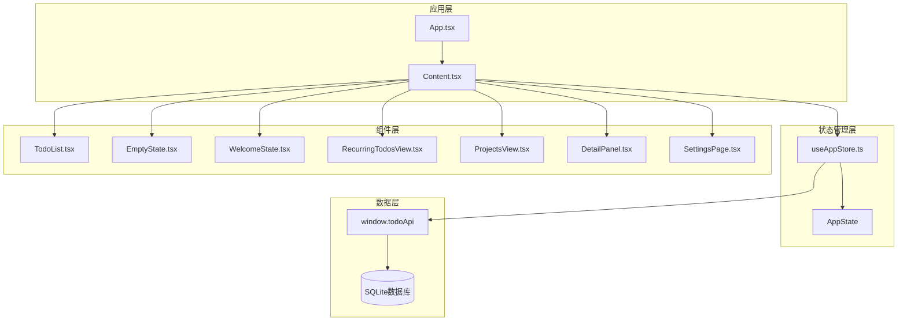

**图表来源**
- [App.tsx:11-57](file://app/src/App.tsx#L11-L57)
- [Content.tsx:14-63](file://app/src/components/Content/Content.tsx#L14-L63)
- [useAppStore.ts:181-508](file://app/src/store/useAppStore.ts#L181-L508)

**章节来源**
- [App.tsx:1-60](file://app/src/App.tsx#L1-L60)
- [Content.tsx:1-65](file://app/src/components/Content/Content.tsx#L1-L65)
- [useAppStore.ts:1-604](file://app/src/store/useAppStore.ts#L1-L604)

## 核心组件

### 应用初始化加载状态

应用启动时的加载状态管理是整个系统的关键环节。通过`useAppStore`的状态管理，实现了完整的初始化流程控制。

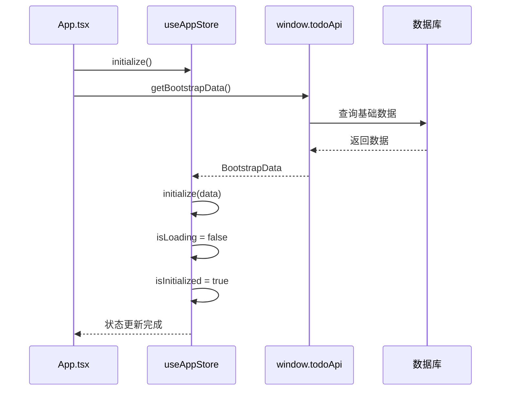

**图表来源**
- [App.tsx:24-34](file://app/src/App.tsx#L24-L34)
- [useAppStore.ts:237-246](file://app/src/store/useAppStore.ts#L237-L246)

### 内容区域加载指示器

Content组件根据isLoading状态决定显示加载指示器还是具体视图内容：

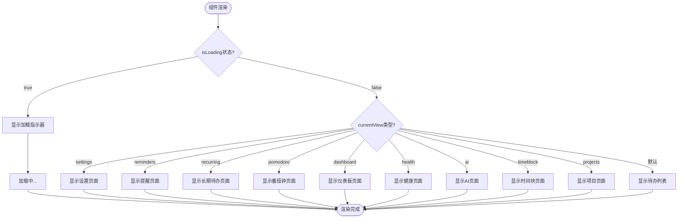

**图表来源**
- [Content.tsx:17-62](file://app/src/components/Content/Content.tsx#L17-L62)

**章节来源**
- [Content.tsx:14-63](file://app/src/components/Content/Content.tsx#L14-L63)
- [useAppStore.ts:51-52](file://app/src/store/useAppStore.ts#L51-L52)

## 架构概览

系统采用分层架构设计，加载状态管理贯穿各个层次：

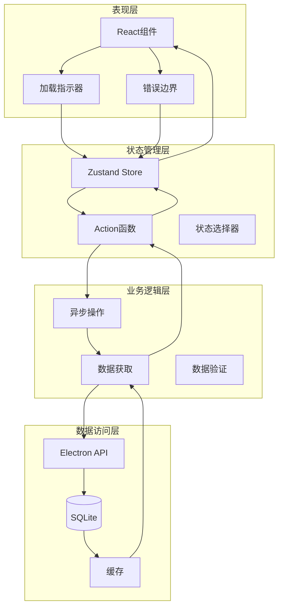

**图表来源**
- [useAppStore.ts:181-508](file://app/src/store/useAppStore.ts#L181-L508)
- [App.tsx:11-57](file://app/src/App.tsx#L11-L57)

## 详细组件分析

### 应用初始化流程

应用初始化是加载状态管理的核心环节，涉及多个异步数据的并行加载：

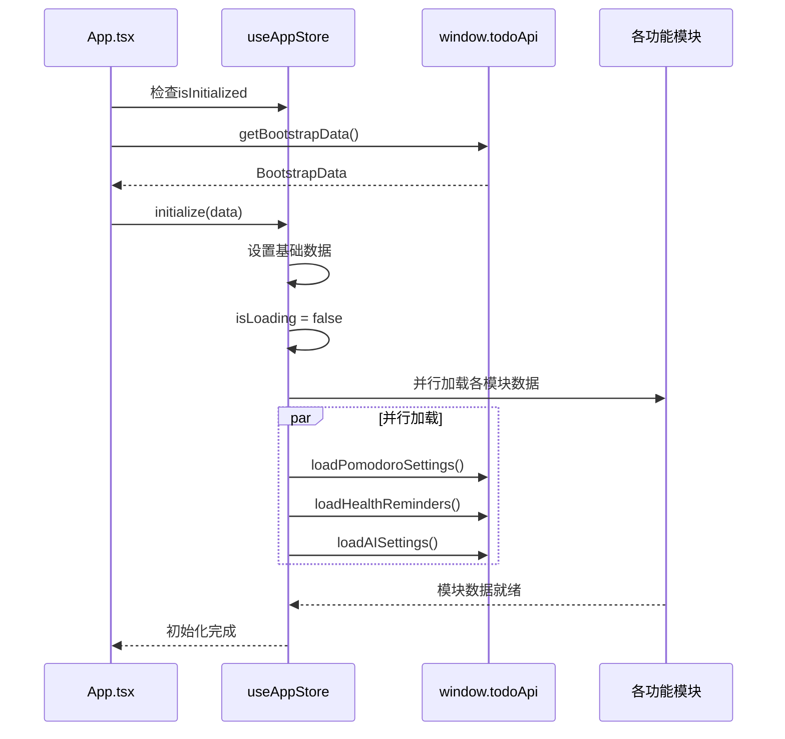

**图表来源**
- [App.tsx:24-34](file://app/src/App.tsx#L24-L34)
- [useAppStore.ts:237-246](file://app/src/store/useAppStore.ts#L237-L246)

### 视图切换加载状态

不同视图组件有不同的加载状态处理策略：

#### RecurringTodosView 加载状态

该组件实现了独立的局部加载状态管理：

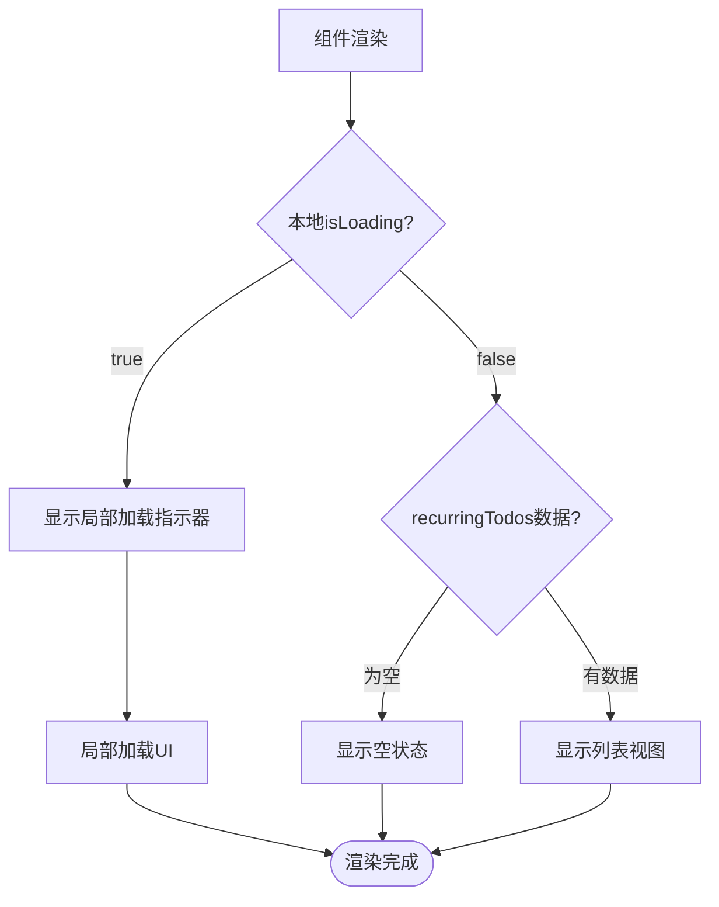

**图表来源**
- [RecurringTodosView.tsx:39-82](file://app/src/components/RecurringTodos/RecurringTodosView.tsx#L39-L82)

#### ProjectsView 批量加载优化

项目视图采用了批量加载策略来优化性能：

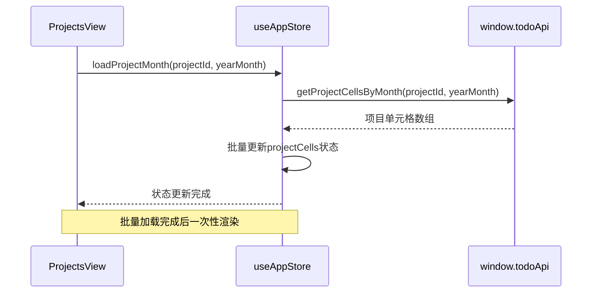

**图表来源**
- [ProjectsView.tsx:61-63](file://app/src/components/Projects/ProjectsView.tsx#L61-L63)
- [useAppStore.ts:474-486](file://app/src/store/useAppStore.ts#L474-L486)

**章节来源**
- [RecurringTodosView.tsx:28-82](file://app/src/components/RecurringTodos/RecurringTodosView.tsx#L28-L82)
- [ProjectsView.tsx:45-63](file://app/src/components/Projects/ProjectsView.tsx#L45-L63)

### 空状态处理机制

系统实现了多层次的空状态处理，确保用户始终有明确的反馈：

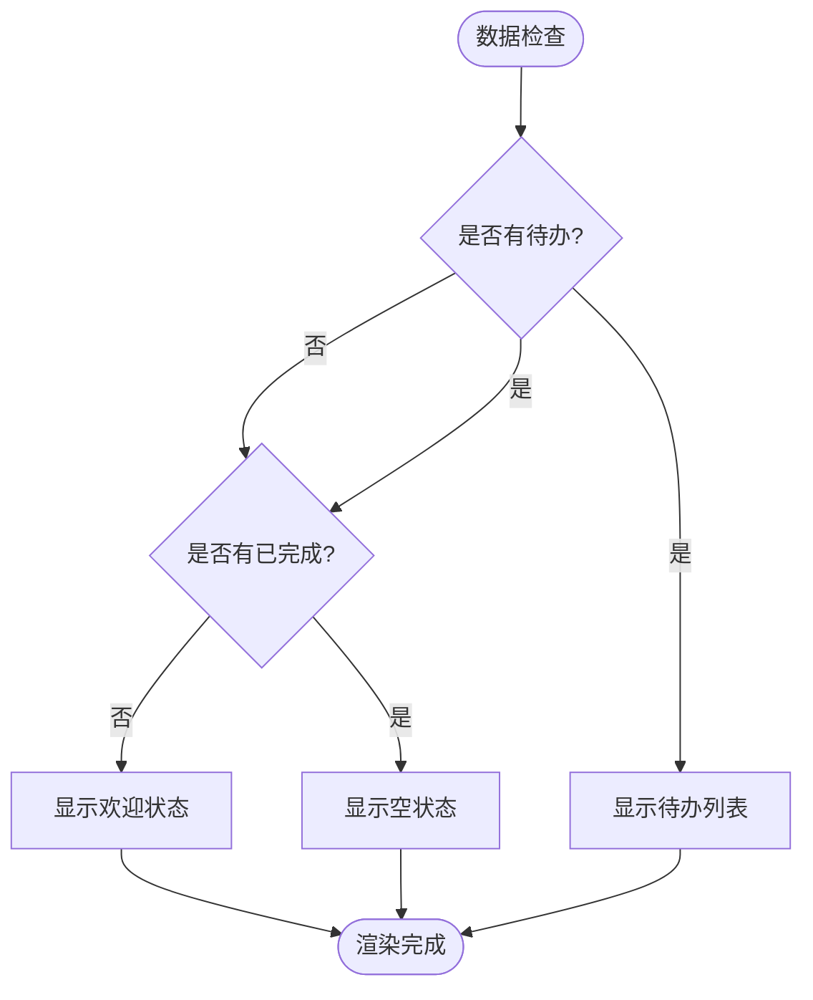

**图表来源**
- [TodoList.tsx:48-63](file://app/src/components/Content/TodoList.tsx#L48-L63)
- [WelcomeState.tsx:5-21](file://app/src/components/Content/WelcomeState.tsx#L5-L21)
- [EmptyState.tsx:4-11](file://app/src/components/Content/EmptyState.tsx#L4-L11)

**章节来源**
- [TodoList.tsx:16-75](file://app/src/components/Content/TodoList.tsx#L16-L75)
- [WelcomeState.tsx:5-21](file://app/src/components/Content/WelcomeState.tsx#L5-L21)
- [EmptyState.tsx:4-11](file://app/src/components/Content/EmptyState.tsx#L4-L11)

### 错误处理与降级策略

系统实现了多层级的错误处理机制：

#### 组件级错误处理

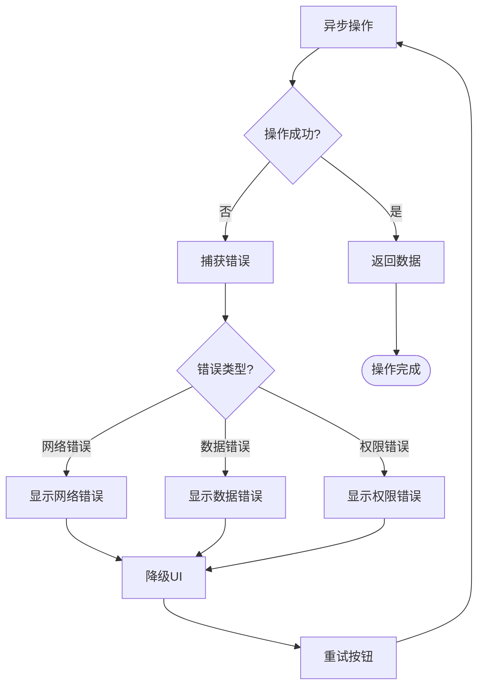

#### 全局错误边界

虽然代码中未显式实现React错误边界，但系统通过以下方式实现类似功能：

- 组件内部的try-catch处理
- 状态回滚机制
- 用户友好的错误提示
- 自动重试机制

**章节来源**
- [DetailPanel.tsx:166-185](file://app/src/components/DetailPanel/DetailPanel.tsx#L166-L185)
- [RecurringTodosView.tsx:45-57](file://app/src/components/RecurringTodos/RecurringTodosView.tsx#L45-L57)

## 依赖关系分析

加载状态管理系统涉及多个层面的依赖关系：

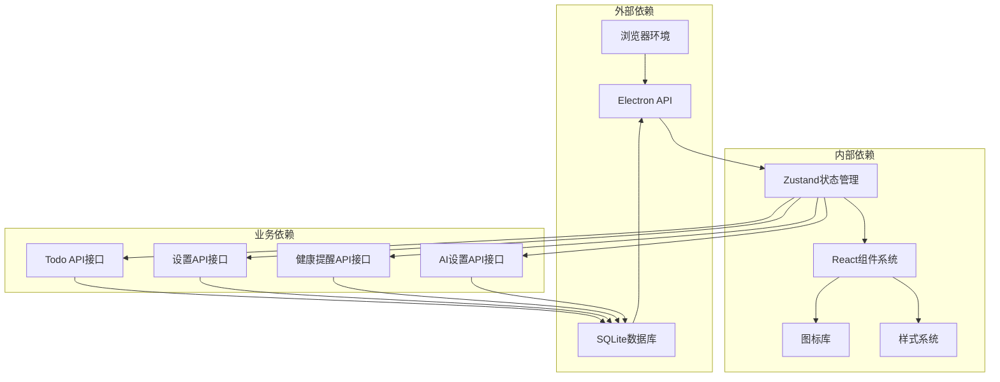

**图表来源**
- [useAppStore.ts:541-603](file://app/src/store/useAppStore.ts#L541-L603)
- [types.ts:7-23](file://app/src/types.ts#L7-L23)

**章节来源**
- [useAppStore.ts:1-604](file://app/src/store/useAppStore.ts#L1-L604)
- [types.ts:1-278](file://app/src/types.ts#L1-L278)

## 性能考虑

### 防抖和节流优化

系统在多个方面实现了性能优化：

#### 批量数据加载
- 项目视图采用批量加载策略，避免频繁的状态更新
- 使用Promise.all并行加载多个数据源
- 合理的数据缓存机制

#### 渲染优化
- 条件渲染避免不必要的DOM更新
- 空状态组件的懒加载
- 图片和媒体资源的延迟加载

#### 内存管理
- 组件卸载时清理事件监听器
- 及时释放大对象引用
- 避免内存泄漏的闭包陷阱

### 状态同步机制

系统通过以下机制确保状态的一致性：

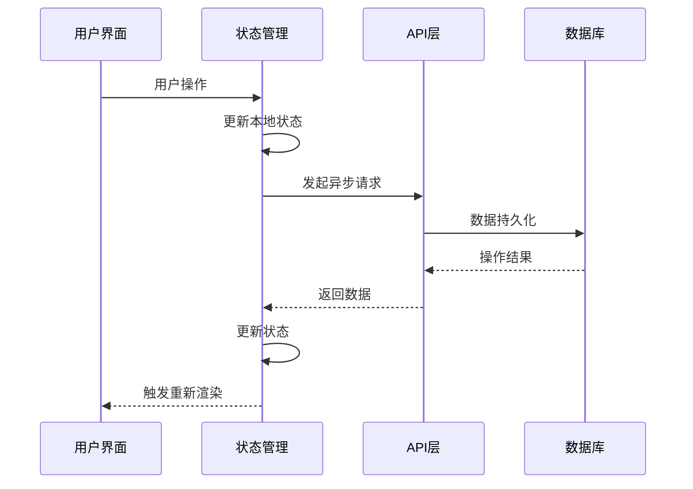

**图表来源**
- [useAppStore.ts:265-272](file://app/src/store/useAppStore.ts#L265-L272)

## 故障排除指南

### 常见加载问题

#### 初始化失败
- 检查数据库连接状态
- 验证Bootstrap数据完整性
- 确认Electron API可用性

#### 视图切换卡顿
- 检查是否存在过多的同步操作
- 优化组件的shouldComponentUpdate逻辑
- 考虑实现虚拟滚动

#### 数据加载超时
- 实现合理的超时机制
- 提供重试策略
- 显示网络状态指示器

### 调试技巧

1. **状态监控**：使用React DevTools观察状态变化
2. **网络调试**：检查API响应时间和错误码
3. **性能分析**：使用Chrome DevTools分析渲染性能
4. **内存泄漏检测**：定期检查组件生命周期

**章节来源**
- [useAppStore.ts:237-246](file://app/src/store/useAppStore.ts#L237-L246)
- [App.tsx:24-34](file://app/src/App.tsx#L24-L34)

## 结论

本项目的加载状态管理实现了以下关键特性：

1. **统一的状态管理**：通过Zustand实现全局状态的一致性控制
2. **多层次的加载指示**：从应用初始化到组件级别的细粒度控制
3. **优雅的降级处理**：在网络异常或数据错误时提供友好的用户体验
4. **性能优化策略**：批量加载、条件渲染、内存管理等技术手段
5. **可扩展的架构**：模块化的组件设计便于功能扩展和维护

系统的加载状态管理为用户提供了清晰的反馈和流畅的交互体验，同时保证了数据的完整性和应用的稳定性。通过合理的设计模式和最佳实践，系统能够在各种使用场景下保持良好的性能表现。