# 待办事项列表

<cite>
**本文档引用的文件**
- [TodoList.tsx](file://app/src/components/Content/TodoList.tsx)
- [EmptyState.tsx](file://app/src/components/Content/EmptyState.tsx)
- [WelcomeState.tsx](file://app/src/components/Content/WelcomeState.tsx)
- [useAppStore.ts](file://app/src/store/useAppStore.ts)
- [types.ts](file://app/src/types.ts)
- [Content.tsx](file://app/src/components/Content/Content.tsx)
- [Content.css](file://app/src/components/Content/Content.css)
- [DetailPanel.tsx](file://app/src/components/DetailPanel/DetailPanel.tsx)
- [main.ts](file://app/electron/main.ts)
- [design-system.css](file://app/src/styles/design-system.css)
</cite>

## 目录
1. [简介](#简介)
2. [项目结构](#项目结构)
3. [核心组件](#核心组件)
4. [架构概览](#架构概览)
5. [详细组件分析](#详细组件分析)
6. [依赖关系分析](#依赖关系分析)
7. [性能考虑](#性能考虑)
8. [故障排除指南](#故障排除指南)
9. [结论](#结论)
10. [附录](#附录)

## 简介

SnowTodo 是一个基于 Electron 的桌面待办事项管理应用，采用 React + TypeScript + Zustand 架构构建。本项目专注于提供高效、直观的待办事项管理体验，支持多视图模式、智能搜索过滤、优先级管理和丰富的交互功能。

本文档深入解析待办事项列表组件的设计与实现，涵盖任务数据渲染、搜索过滤、排序算法、批量操作等核心功能，并详细说明空状态和欢迎状态的设计理念与实现方式。

## 项目结构

项目采用模块化架构，主要分为以下层次：

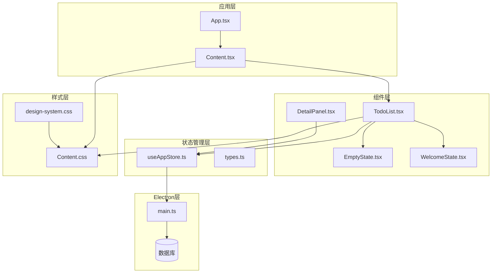

**图表来源**
- [App.tsx:11-60](file://app/src/App.tsx#L11-L60)
- [Content.tsx:14-65](file://app/src/components/Content/Content.tsx#L14-L65)
- [useAppStore.ts:181-508](file://app/src/store/useAppStore.ts#L181-L508)

**章节来源**
- [App.tsx:1-60](file://app/src/App.tsx#L1-L60)
- [Content.tsx:1-65](file://app/src/components/Content/Content.tsx#L1-L65)

## 核心组件

### TodoList 组件

TodoList 是待办事项列表的核心组件，负责根据当前视图模式渲染相应的任务数据。组件支持多种视图模式，包括今日、全部、即将到来、已完成、分类和标签视图。

#### 主要功能特性

1. **多视图支持**：根据 `currentView` 状态动态切换不同的任务展示模式
2. **智能空状态检测**：当任务列表为空时自动显示相应的空状态组件
3. **任务渲染优化**：使用高效的条件渲染避免不必要的组件创建
4. **交互响应**：支持任务点击、完成状态切换等用户交互

#### 数据流控制

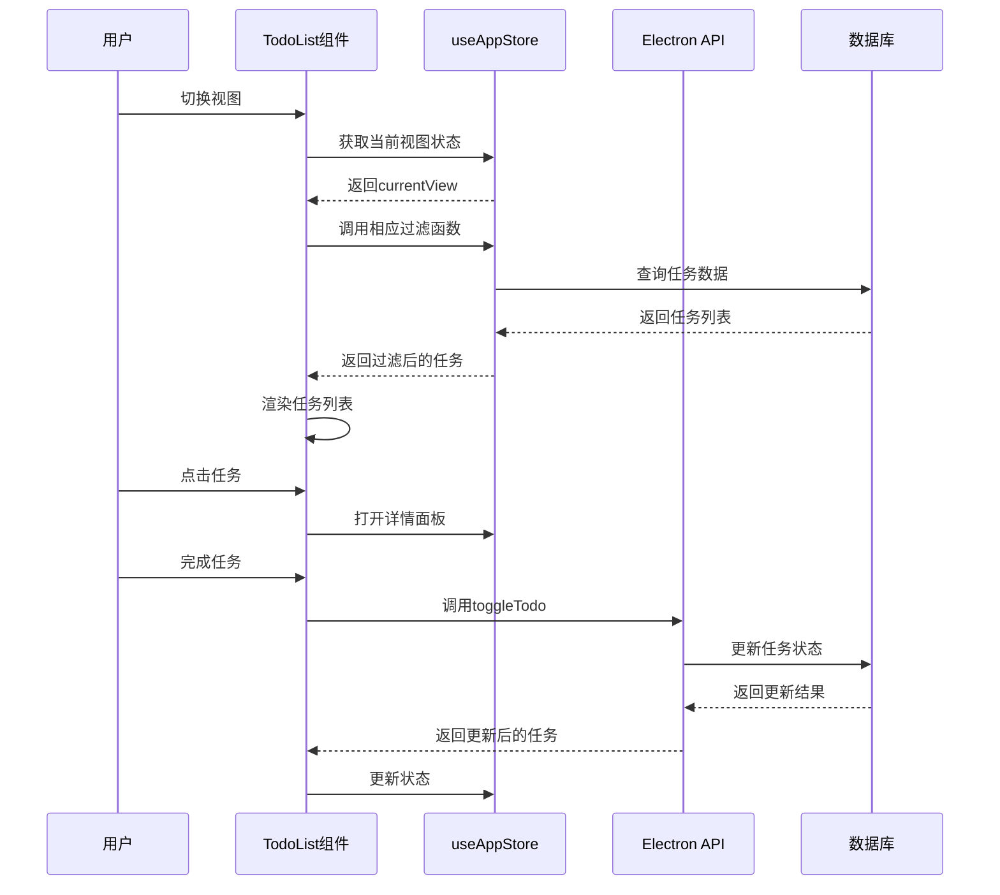

**图表来源**
- [TodoList.tsx:16-75](file://app/src/components/Content/TodoList.tsx#L16-L75)
- [useAppStore.ts:327-380](file://app/src/store/useAppStore.ts#L327-L380)

**章节来源**
- [TodoList.tsx:1-189](file://app/src/components/Content/TodoList.tsx#L1-L189)

### 空状态和欢迎状态组件

项目提供了两种专门的状态组件来处理空列表场景：

#### EmptyState 组件
用于通用的空状态显示，适用于各种场景下的空列表情况。

#### WelcomeState 组件  
专门为新用户设计的欢迎界面，提供创建第一个待办任务的引导。

**章节来源**
- [EmptyState.tsx:1-12](file://app/src/components/Content/EmptyState.tsx#L1-L12)
- [WelcomeState.tsx:1-22](file://app/src/components/Content/WelcomeState.tsx#L1-L22)

## 架构概览

### 状态管理系统

应用采用 Zustand 作为状态管理解决方案，实现了集中化的状态存储和计算属性：

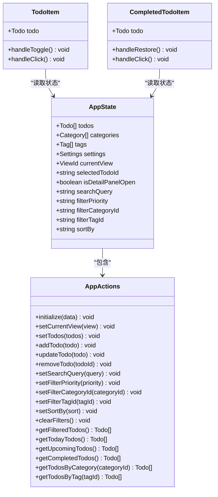

**图表来源**
- [useAppStore.ts:30-176](file://app/src/store/useAppStore.ts#L30-L176)
- [TodoList.tsx:77-188](file://app/src/components/Content/TodoList.tsx#L77-L188)

### 数据模型

应用使用强类型的数据模型来确保数据的一致性和完整性：

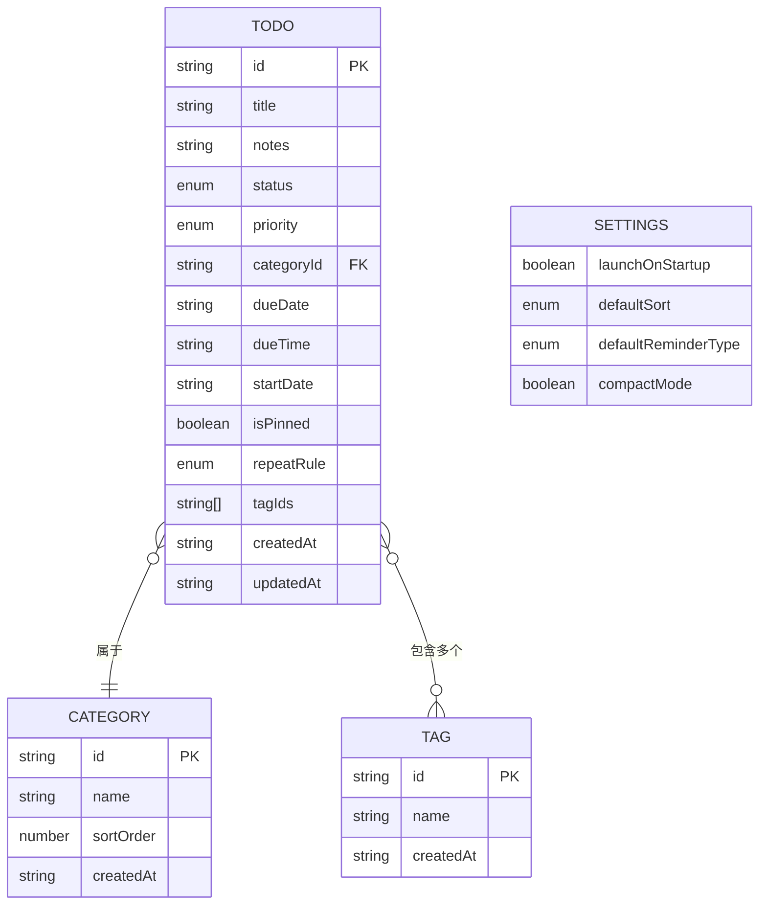

**图表来源**
- [types.ts:168-188](file://app/src/types.ts#L168-L188)
- [types.ts:148-159](file://app/src/types.ts#L148-L159)
- [types.ts:155-159](file://app/src/types.ts#L155-L159)

**章节来源**
- [useAppStore.ts:1-604](file://app/src/store/useAppStore.ts#L1-L604)
- [types.ts:1-278](file://app/src/types.ts#L1-L278)

## 详细组件分析

### TodoList 组件深度解析

#### 视图模式切换逻辑

TodoList 组件通过 `currentView` 状态控制不同的渲染模式：

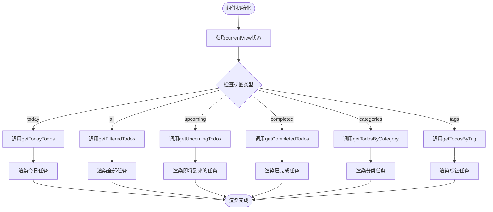

**图表来源**
- [TodoList.tsx:27-45](file://app/src/components/Content/TodoList.tsx#L27-L45)

#### 空状态检测机制

组件实现了智能的空状态检测逻辑，确保只有在所有相关任务都为空时才显示空状态：

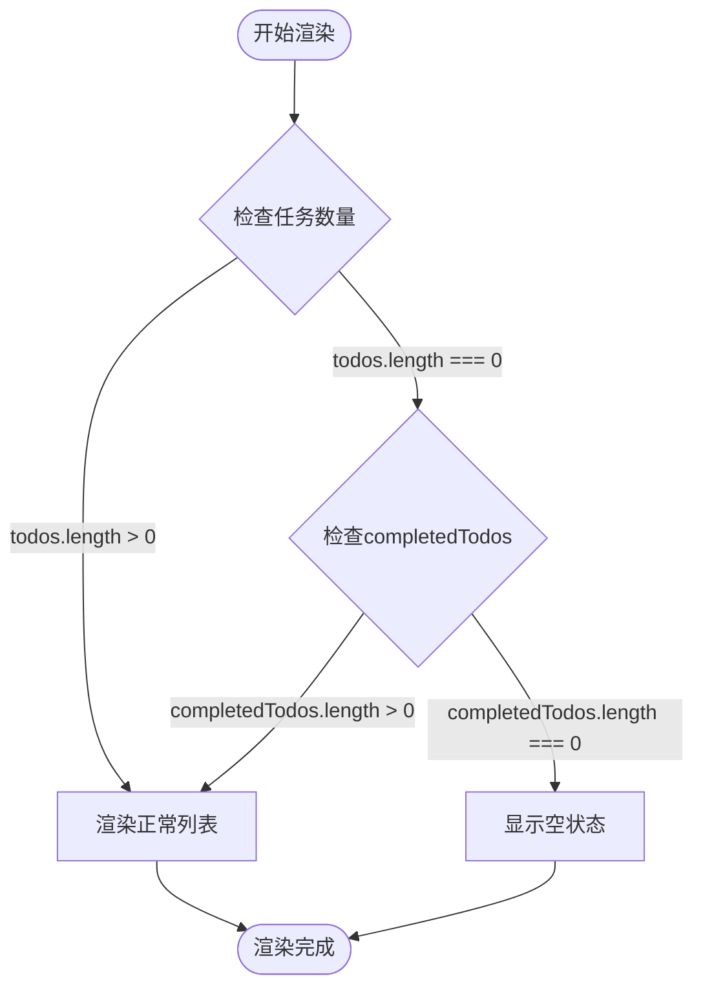

**图表来源**
- [TodoList.tsx:47-63](file://app/src/components/Content/TodoList.tsx#L47-L63)

#### 任务项组件设计

每个任务项都包含完整的交互功能：

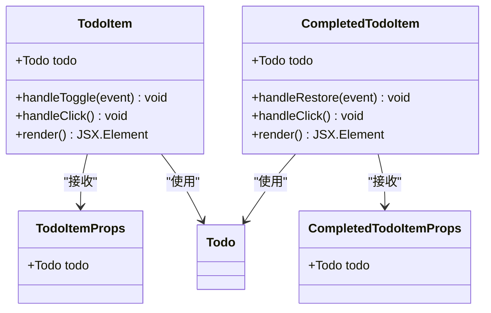

**图表来源**
- [TodoList.tsx:77-145](file://app/src/components/Content/TodoList.tsx#L77-L145)
- [TodoList.tsx:147-188](file://app/src/components/Content/TodoList.tsx#L147-L188)

**章节来源**
- [TodoList.tsx:16-189](file://app/src/components/Content/TodoList.tsx#L16-L189)

### 排序算法实现

应用实现了灵活的排序算法，支持多种排序策略：

#### 排序策略

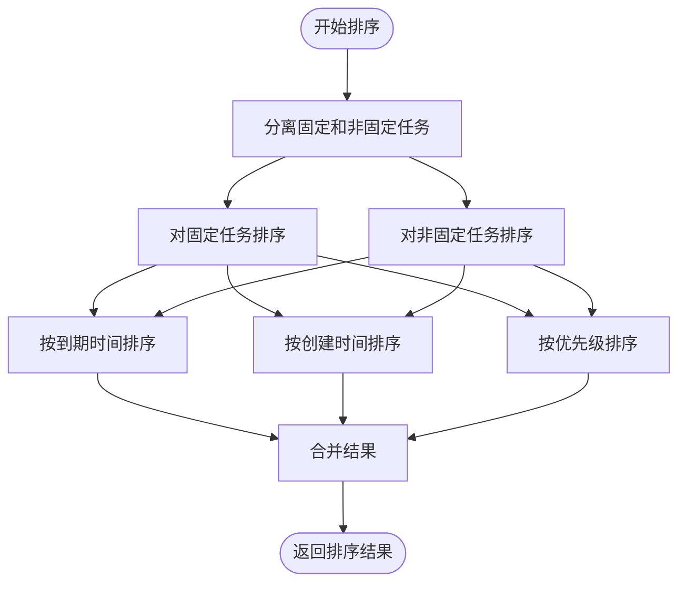

**图表来源**
- [useAppStore.ts:513-536](file://app/src/store/useAppStore.ts#L513-L536)

#### 排序规则详解

1. **固定任务优先**：所有固定任务始终排在最前面
2. **到期时间排序**：对于到期时间相同的任务，按到期时间升序排列
3. **创建时间排序**：当到期时间为空时，按创建时间降序排列
4. **优先级排序**：高优先级 > 中优先级 > 低优先级

**章节来源**
- [useAppStore.ts:513-536](file://app/src/store/useAppStore.ts#L513-L536)

### 状态管理集成

#### 计算属性设计

应用使用计算属性来实现高效的数据筛选和转换：

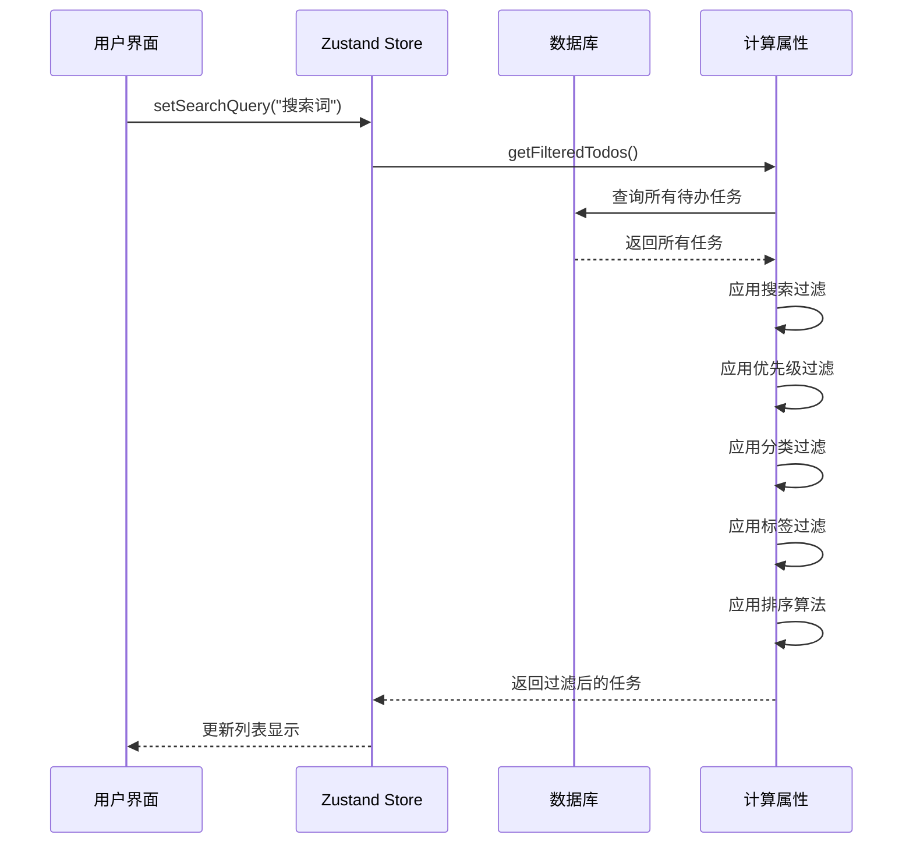

**图表来源**
- [useAppStore.ts:327-338](file://app/src/store/useAppStore.ts#L327-L338)

#### 事件处理机制

组件通过事件处理器实现用户交互：

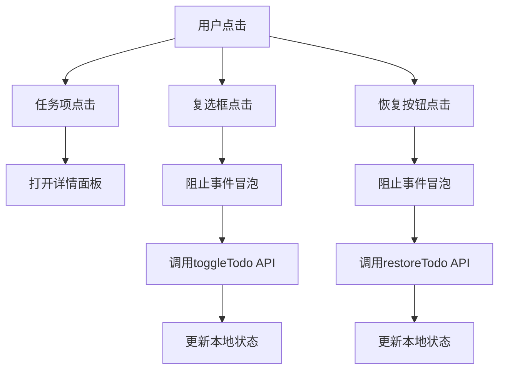

**图表来源**
- [TodoList.tsx:83-87](file://app/src/components/Content/TodoList.tsx#L83-L87)
- [TodoList.tsx:152-156](file://app/src/components/Content/TodoList.tsx#L152-L156)

**章节来源**
- [useAppStore.ts:327-380](file://app/src/store/useAppStore.ts#L327-L380)
- [TodoList.tsx:77-188](file://app/src/components/Content/TodoList.tsx#L77-L188)

## 依赖关系分析

### 组件间依赖关系

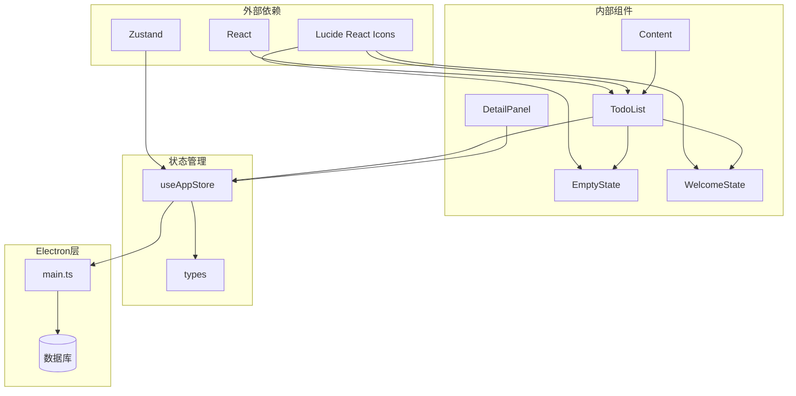

**图表来源**
- [TodoList.tsx:1-4](file://app/src/components/Content/TodoList.tsx#L1-L4)
- [useAppStore.ts:1-22](file://app/src/store/useAppStore.ts#L1-L22)

### 数据流依赖

应用的数据流遵循单向数据流原则：

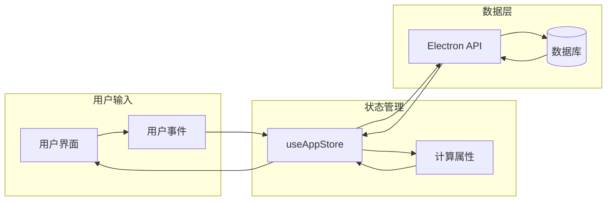

**图表来源**
- [useAppStore.ts:181-508](file://app/src/store/useAppStore.ts#L181-L508)
- [main.ts:227-358](file://app/src/electron/main.ts#L227-L358)

**章节来源**
- [TodoList.tsx:1-189](file://app/src/components/Content/TodoList.tsx#L1-L189)
- [useAppStore.ts:1-604](file://app/src/store/useAppStore.ts#L1-L604)

## 性能考虑

### 渲染优化策略

#### 虚拟滚动实现

虽然当前版本未实现虚拟滚动，但应用已经为未来的虚拟滚动优化做好了准备：

1. **稳定的键值**：每个任务项使用 `todo.id` 作为 React key，确保列表更新时的稳定性
2. **条件渲染**：空状态检测避免了不必要的组件渲染
3. **分组渲染**：将待办和已完成任务分别渲染，提高可读性

#### 增量渲染优化

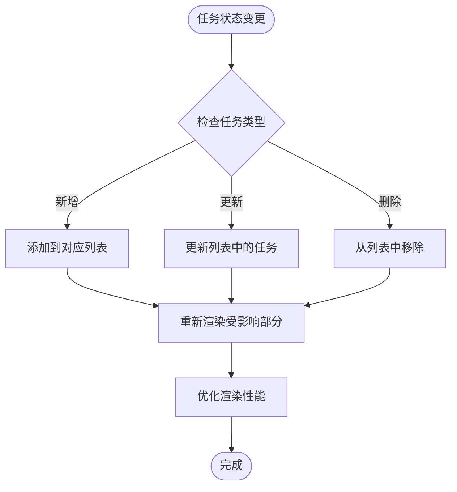

#### 数据分页策略

应用目前支持以下分页策略：

1. **视图分页**：不同视图模式下的数据分页
2. **搜索分页**：搜索结果的分页显示
3. **过滤分页**：多条件过滤后的数据分页

### 状态管理性能

#### 计算属性缓存

应用使用计算属性来避免重复计算：

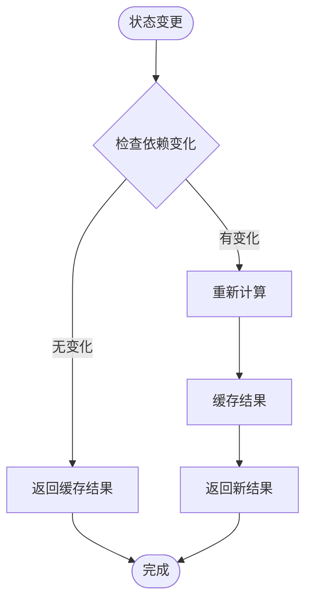

**图表来源**
- [useAppStore.ts:327-380](file://app/src/store/useAppStore.ts#L327-L380)

**章节来源**
- [useAppStore.ts:513-536](file://app/src/store/useAppStore.ts#L513-L536)

## 故障排除指南

### 常见问题诊断

#### 空状态显示异常

**症状**：即使有任务也显示空状态

**可能原因**：
1. 视图模式配置错误
2. 任务状态过滤不当
3. 数据同步问题

**解决方法**：
1. 检查 `currentView` 状态是否正确
2. 验证任务状态过滤逻辑
3. 确认数据源连接正常

#### 任务渲染性能问题

**症状**：大量任务时渲染缓慢

**可能原因**：
1. 缺少虚拟滚动
2. 不必要的重渲染
3. 大量 DOM 操作

**解决方法**：
1. 实现虚拟滚动
2. 优化条件渲染
3. 减少 DOM 层级

#### 状态同步问题

**症状**：UI 与实际数据不一致

**可能原因**：
1. 异步操作未正确处理
2. 状态更新时机不当
3. 事件处理冲突

**解决方法**：
1. 使用异步状态更新
2. 确保正确的更新顺序
3. 避免事件处理冲突

**章节来源**
- [TodoList.tsx:47-63](file://app/src/components/Content/TodoList.tsx#L47-L63)
- [useAppStore.ts:267-272](file://app/src/store/useAppStore.ts#L267-L272)

## 结论

SnowTodo 的待办事项列表组件展现了现代前端应用的最佳实践：

1. **清晰的架构设计**：模块化组件结构，职责分离明确
2. **高效的状态管理**：Zustand 提供了简洁而强大的状态管理方案
3. **优秀的用户体验**：智能的空状态处理和流畅的交互反馈
4. **可扩展的代码结构**：为未来的功能扩展预留了良好的基础

该组件体系为开发者提供了坚实的基础，可以在此基础上继续增强功能，如实现虚拟滚动、批量操作、高级搜索等功能。

## 附录

### 开发指南

#### 扩展开发建议

1. **虚拟滚动实现**：考虑引入 react-window 或 react-virtualized
2. **批量操作**：添加任务选择、批量删除、批量完成等功能
3. **高级搜索**：实现更复杂的搜索条件和过滤器
4. **性能监控**：添加性能指标监控和优化建议

#### 最佳实践

1. **组件设计**：保持单一职责，避免过度耦合
2. **状态管理**：合理划分状态，避免全局状态污染
3. **错误处理**：完善的错误边界和降级处理
4. **测试覆盖**：编写单元测试和集成测试