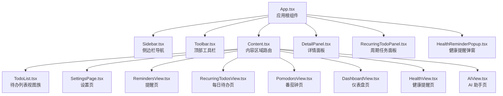
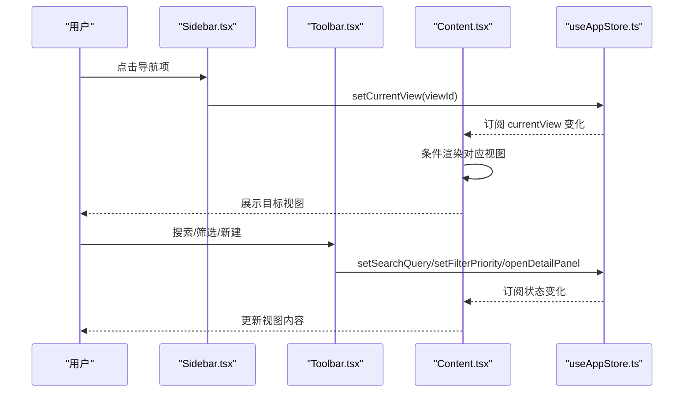
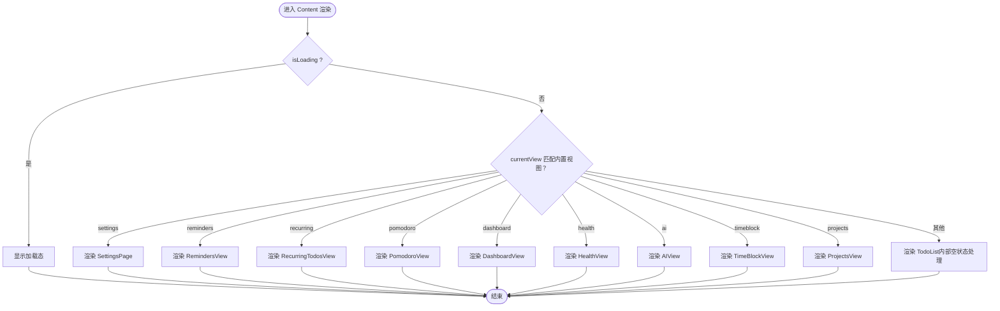
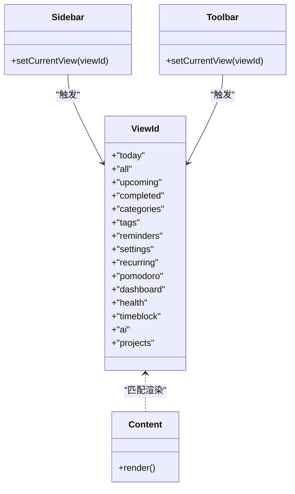
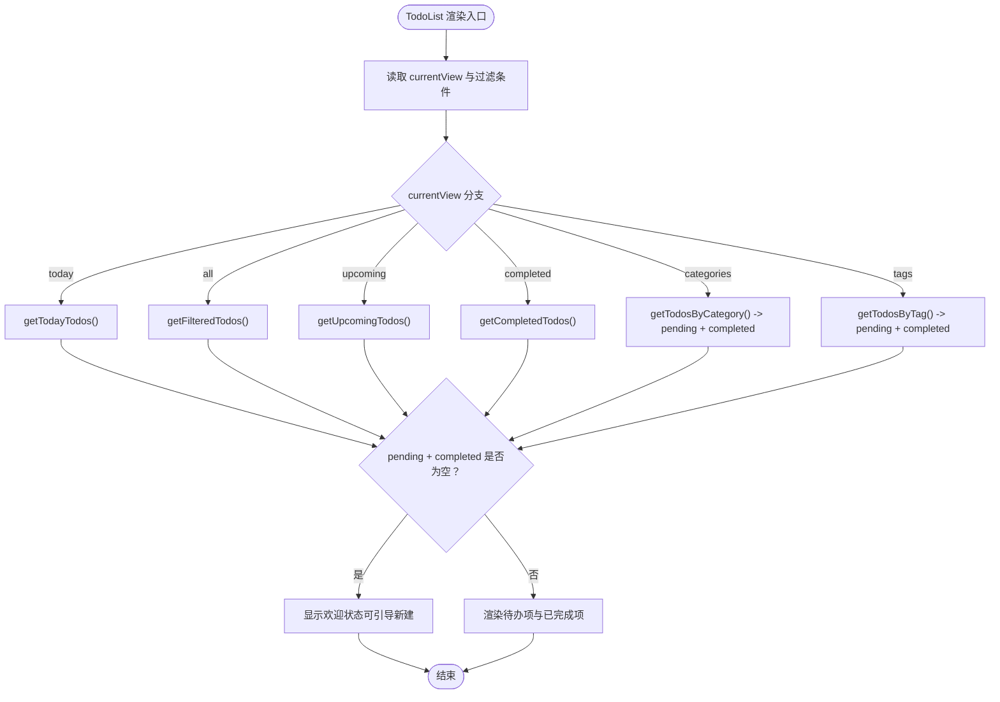
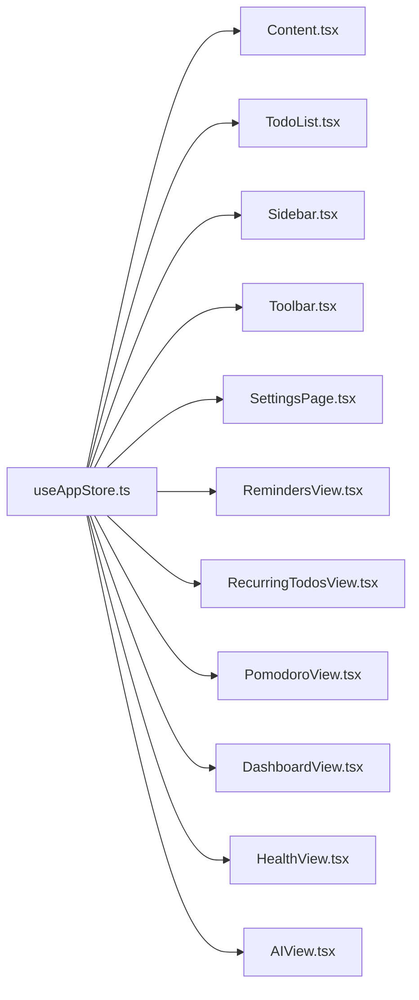

# 视图路由与切换

<cite>
**本文引用的文件**
- [Content.tsx](file://app/src/components/Content/Content.tsx)
- [index.ts（Content 导出）](file://app/src/components/Content/index.ts)
- [useAppStore.ts](file://app/src/store/useAppStore.ts)
- [types.ts](file://app/src/types.ts)
- [App.tsx](file://app/src/App.tsx)
- [Sidebar.tsx](file://app/src/components/Sidebar/Sidebar.tsx)
- [Toolbar.tsx](file://app/src/components/Toolbar/Toolbar.tsx)
- [TodoList.tsx](file://app/src/components/Content/TodoList.tsx)
- [SettingsPage.tsx](file://app/src/components/Settings/SettingsPage.tsx)
- [RemindersView.tsx](file://app/src/components/Reminders/RemindersView.tsx)
- [RecurringTodosView.tsx](file://app/src/components/RecurringTodos/RecurringTodosView.tsx)
- [PomodoroView.tsx](file://app/src/components/Pomodoro/PomodoroView.tsx)
- [DashboardView.tsx](file://app/src/components/Dashboard/DashboardView.tsx)
- [HealthView.tsx](file://app/src/components/Health/HealthView.tsx)
- [AIView.tsx](file://app/src/components/AI/AIView.tsx)
</cite>

## 目录
1. [简介](#简介)
2. [项目结构](#项目结构)
3. [核心组件](#核心组件)
4. [架构总览](#架构总览)
5. [详细组件分析](#详细组件分析)
6. [依赖分析](#依赖分析)
7. [性能考虑](#性能考虑)
8. [故障排查指南](#故障排查指南)
9. [结论](#结论)
10. [附录](#附录)

## 简介
本文件聚焦于内容区域视图路由系统，围绕 Content 组件的视图切换逻辑展开，系统性说明：
- currentView 状态管理与条件渲染机制
- 视图映射关系与路由配置
- 各视图类型（settings、reminders、recurring、pomodoro、dashboard、health、ai、timeblock、projects、以及 Todo 列表视图族）的切换流程
- 性能优化策略（懒加载、内存管理、渲染优化）
- 视图状态保持与数据缓存机制
- 新视图扩展与自定义接入指南

## 项目结构
内容区域视图路由位于前端组件层，通过全局状态驱动视图切换：
- App 作为根组件，负责初始化与挂载 Content 区域
- Content 依据 currentView 条件渲染对应视图
- Sidebar/Toolbar 等侧边栏与工具条通过 setCurrentView 改变 currentView
- useAppStore 统一管理 currentView 与各类业务数据

**图表来源**
- [App.tsx:11-57](file://app/src/App.tsx#L11-L57)
- [Sidebar.tsx:30-202](file://app/src/components/Sidebar/Sidebar.tsx#L30-L202)
- [Toolbar.tsx:16-77](file://app/src/components/Toolbar/Toolbar.tsx#L16-L77)
- [Content.tsx:14-63](file://app/src/components/Content/Content.tsx#L14-L63)

**章节来源**
- [App.tsx:11-57](file://app/src/App.tsx#L11-L57)
- [Sidebar.tsx:30-202](file://app/src/components/Sidebar/Sidebar.tsx#L30-L202)
- [Toolbar.tsx:16-77](file://app/src/components/Toolbar/Toolbar.tsx#L16-L77)
- [Content.tsx:14-63](file://app/src/components/Content/Content.tsx#L14-L63)

## 核心组件
- Content 组件：基于 currentView 的条件渲染，承担“视图路由器”职责；包含加载态与默认 Todo 视图族回退
- useAppStore：集中管理 currentView、UI 状态、业务数据与动作；setCurrentView 是路由入口
- Sidebar/Toolbar：提供导航与标题文案，触发 setCurrentView
- TodoList：根据 currentView 与过滤条件动态渲染不同视图族（today/all/upcoming/completed/categories/tags）

关键要点
- currentView 类型由 ViewId 定义，覆盖所有内置视图
- Content 在 currentView 未命中内置视图时，回退到 TodoList（内部处理空状态）
- setCurrentView 会清理部分与视图无关的状态，避免跨视图污染

**章节来源**
- [Content.tsx:14-63](file://app/src/components/Content/Content.tsx#L14-L63)
- [useAppStore.ts:30-260](file://app/src/store/useAppStore.ts#L30-L260)
- [types.ts:7-23](file://app/src/types.ts#L7-L23)
- [TodoList.tsx:16-75](file://app/src/components/Content/TodoList.tsx#L16-L75)

## 架构总览
Content 的视图切换遵循“状态驱动 + 条件渲染”的模式，Sidebar/Toolbar 通过调用 setCurrentView 改变 currentView，从而触发 Content 重新渲染并呈现对应视图。

**图表来源**
- [Sidebar.tsx:30-202](file://app/src/components/Sidebar/Sidebar.tsx#L30-L202)
- [Toolbar.tsx:16-77](file://app/src/components/Toolbar/Toolbar.tsx#L16-L77)
- [Content.tsx:14-63](file://app/src/components/Content/Content.tsx#L14-L63)
- [useAppStore.ts:253-260](file://app/src/store/useAppStore.ts#L253-L260)

## 详细组件分析

### Content 组件：视图路由与切换
- 状态来源：useAppStore.currentView
- 渲染策略：
  - isLoading 时显示加载态
  - 根据 currentView 匹配内置视图（settings/reminders/recurring/pomodoro/dashboard/health/ai/timeblock/projects）
  - 默认回退到 TodoList（内部处理空状态）
- 视图映射关系：
  - settings → SettingsPage
  - reminders → RemindersView
  - recurring → RecurringTodosView
  - pomodoro → PomodoroView
  - dashboard → DashboardView
  - health → HealthView
  - ai → AIView
  - timeblock → TimeBlockView
  - projects → ProjectsView
  - 其他（today/all/upcoming/completed/categories/tags）→ TodoList

**图表来源**
- [Content.tsx:14-63](file://app/src/components/Content/Content.tsx#L14-L63)

**章节来源**
- [Content.tsx:14-63](file://app/src/components/Content/Content.tsx#L14-L63)

### 视图映射与路由配置
- 视图类型定义：ViewId 覆盖 today/all/upcoming/completed/categories/tags/settings/reminders/recurring/pomodoro/dashboard/health/timeblock/ai/projects
- 路由入口：Sidebar/Toolbar 调用 setCurrentView(viewId)
- 路由出口：Content 基于 currentView 条件渲染

**图表来源**
- [types.ts:7-23](file://app/src/types.ts#L7-L23)
- [Content.tsx:14-63](file://app/src/components/Content/Content.tsx#L14-L63)
- [Sidebar.tsx:30-202](file://app/src/components/Sidebar/Sidebar.tsx#L30-L202)
- [Toolbar.tsx:16-77](file://app/src/components/Toolbar/Toolbar.tsx#L16-L77)

**章节来源**
- [types.ts:7-23](file://app/src/types.ts#L7-L23)
- [Sidebar.tsx:30-202](file://app/src/components/Sidebar/Sidebar.tsx#L30-L202)
- [Toolbar.tsx:16-77](file://app/src/components/Toolbar/Toolbar.tsx#L16-L77)

### Todo 视图族：条件渲染与空状态
- TodoList 根据 currentView 与过滤条件（filterCategoryId/filterTagId）决定渲染 pending 与 completed 两类列表
- 空状态：当 pending 与 completed 均为空时，显示欢迎状态（含引导按钮）
- 与其他视图的关系：当 currentView 为 today/all/upcoming/completed/categories/tags 时，由 TodoList 承载

**图表来源**
- [TodoList.tsx:16-75](file://app/src/components/Content/TodoList.tsx#L16-L75)
- [useAppStore.ts:327-380](file://app/src/store/useAppStore.ts#L327-L380)

**章节来源**
- [TodoList.tsx:16-75](file://app/src/components/Content/TodoList.tsx#L16-L75)
- [useAppStore.ts:327-380](file://app/src/store/useAppStore.ts#L327-L380)

### 设置页（settings）
- 通过 SettingsPage 渲染设置界面
- 与 currentView 的交互：在设置页不显示搜索/筛选/新建按钮

**章节来源**
- [SettingsPage.tsx:5-147](file://app/src/components/Settings/SettingsPage.tsx#L5-L147)
- [Toolbar.tsx:16-77](file://app/src/components/Toolbar/Toolbar.tsx#L16-L77)

### 提醒页（reminders）
- 通过 RemindersView 渲染“即将提醒/已错过”两类提醒卡片
- 无特殊状态保持，每次进入重新计算

**章节来源**
- [RemindersView.tsx:5-103](file://app/src/components/Reminders/RemindersView.tsx#L5-L103)

### 每日待办页（recurring）
- 通过 RecurringTodosView 渲染周期性任务列表，支持启用/禁用、编辑、删除
- 首次进入加载数据，显示加载态

**章节来源**
- [RecurringTodosView.tsx:28-218](file://app/src/components/RecurringTodos/RecurringTodosView.tsx#L28-L218)

### 番茄钟页（pomodoro）
- 通过 PomodoroView 渲染计时器、设置面板、今日统计与历史记录
- 状态：pomodoroSettings/pomodoroPhase/pomodoroSecondsLeft/pomodoroSession/todayPomodoroSessions
- 交互：全局快捷键监听、计时器 tick、阶段切换、中断记录

**章节来源**
- [PomodoroView.tsx:160-499](file://app/src/components/Pomodoro/PomodoroView.tsx#L160-L499)
- [useAppStore.ts:394-420](file://app/src/store/useAppStore.ts#L394-L420)

### 仪表盘页（dashboard）
- 通过 DashboardView 渲染趋势图表与汇总统计
- 状态：dailyStats（按日期填充缺失），支持 7/14/30 天范围切换

**章节来源**
- [DashboardView.tsx:125-272](file://app/src/components/Dashboard/DashboardView.tsx#L125-L272)
- [useAppStore.ts:467-471](file://app/src/store/useAppStore.ts#L467-L471)

### 健康提醒页（health）
- 通过 HealthView 渲染健康提醒卡片与编辑面板
- 弹窗：HealthReminderPopup 监听提醒事件并展示

**章节来源**
- [HealthView.tsx:300-385](file://app/src/components/Health/HealthView.tsx#L300-L385)
- [useAppStore.ts:425-438](file://app/src/store/useAppStore.ts#L425-L438)

### AI 助手页（ai）
- 通过 AIView 渲染聊天界面与设置面板
- 系统提示构建：基于当前待办列表生成上下文
- 交互：发送消息、清空对话、快捷指令

**章节来源**
- [AIView.tsx:125-331](file://app/src/components/AI/AIView.tsx#L125-L331)
- [useAppStore.ts:443-447](file://app/src/store/useAppStore.ts#L443-L447)

### 时间块页（timeblock）与项目页（projects）
- 通过 TimeBlockView 与 ProjectsView 承载各自功能
- 与 Content 的集成方式同内置视图一致

**章节来源**
- [Content.tsx:49-54](file://app/src/components/Content/Content.tsx#L49-L54)

## 依赖分析
- Content 依赖 useAppStore.currentView 与 isLoading
- Sidebar/Toolbar 依赖 useAppStore.setCurrentView 与当前视图状态
- TodoList 依赖 useAppStore 的计算属性与过滤条件
- 各视图组件依赖 useAppStore 的相应模块数据与动作

**图表来源**
- [useAppStore.ts:30-260](file://app/src/store/useAppStore.ts#L30-L260)
- [Content.tsx:14-63](file://app/src/components/Content/Content.tsx#L14-L63)
- [TodoList.tsx:16-75](file://app/src/components/Content/TodoList.tsx#L16-L75)
- [Sidebar.tsx:30-202](file://app/src/components/Sidebar/Sidebar.tsx#L30-L202)
- [Toolbar.tsx:16-77](file://app/src/components/Toolbar/Toolbar.tsx#L16-L77)

**章节来源**
- [useAppStore.ts:30-260](file://app/src/store/useAppStore.ts#L30-L260)

## 性能考虑
- 懒加载与按需渲染
  - Content 采用条件渲染，仅在 currentView 匹配时渲染对应视图，避免一次性加载所有视图
  - TodoList 在空状态时渲染欢迎状态，减少不必要的列表渲染
- 内存管理
  - setCurrentView 会在切换时清理与视图无关的状态（如过滤器与详情面板），降低跨视图状态累积
- 渲染优化
  - TodoList 使用分支选择渲染 pending 与 completed，避免重复渲染
  - 各视图组件内部自行控制加载态与空状态，减少无效 DOM 更新
- 数据缓存
  - 各模块通过 useAppStore 的动作异步加载数据（如 pomodoro、health、ai、dashboard），并在 store 中缓存，避免重复请求
- 建议
  - 对大型视图（如 Dashboard、AI）可引入虚拟滚动或分页以进一步优化长列表渲染
  - 对频繁切换的视图（如 Todo 视图族）可考虑使用 memo 化或稳定引用以减少重渲染

**章节来源**
- [Content.tsx:14-63](file://app/src/components/Content/Content.tsx#L14-L63)
- [useAppStore.ts:253-260](file://app/src/store/useAppStore.ts#L253-L260)
- [DashboardView.tsx:125-272](file://app/src/components/Dashboard/DashboardView.tsx#L125-L272)
- [AIView.tsx:125-331](file://app/src/components/AI/AIView.tsx#L125-L331)

## 故障排查指南
- 切换后视图未更新
  - 检查 Sidebar/Toolbar 是否正确调用 setCurrentView
  - 确认 currentView 是否在 ViewId 范围内
- Todo 视图族不显示内容
  - 检查 getFilteredTodos/getTodayTodos/getUpcomingTodos/getCompletedTodos 的过滤条件
  - 确认 todos 数据是否已初始化
- 加载态不消失
  - 确认 App 初始化流程中 initialize 是否被调用，isLoading 是否被置为 false
- 番茄钟计时异常
  - 检查全局快捷键订阅与定时器生命周期
  - 确认 pomodoroSettings 与 pomodoroSecondsLeft 的同步
- 健康提醒弹窗不出现
  - 检查 onHealthReminderTriggered 订阅与 pendingHealthReminder 状态

**章节来源**
- [Sidebar.tsx:30-202](file://app/src/components/Sidebar/Sidebar.tsx#L30-L202)
- [Toolbar.tsx:16-77](file://app/src/components/Toolbar/Toolbar.tsx#L16-L77)
- [useAppStore.ts:237-246](file://app/src/store/useAppStore.ts#L237-L246)
- [PomodoroView.tsx:200-232](file://app/src/components/Pomodoro/PomodoroView.tsx#L200-L232)
- [HealthView.tsx:259-297](file://app/src/components/Health/HealthView.tsx#L259-L297)

## 结论
Content 组件通过 currentView 驱动的条件渲染，实现了清晰、可维护的视图路由系统。配合 Sidebar/Toolbar 的导航与 useAppStore 的状态管理，形成了“状态驱动 + 模块化视图”的架构。Todo 视图族由 TodoList 统一承载，内置视图通过 Content 映射到对应组件，整体具备良好的扩展性与可维护性。

## 附录

### 新视图扩展与自定义接入指南
- 步骤
  1) 在 ViewId 中新增视图标识
     - 参考路径：[types.ts:7-23](file://app/src/types.ts#L7-L23)
  2) 在 Content 中添加条件渲染分支
     - 参考路径：[Content.tsx:28-54](file://app/src/components/Content/Content.tsx#L28-L54)
  3) 在 Sidebar/Toolbar 中添加导航项并调用 setCurrentView
     - 参考路径：[Sidebar.tsx:23-132](file://app/src/components/Sidebar/Sidebar.tsx#L23-L132)
  4) 创建视图组件并实现功能
     - 参考现有组件：[SettingsPage.tsx:5-147](file://app/src/components/Settings/SettingsPage.tsx#L5-L147)、[RemindersView.tsx:5-103](file://app/src/components/Reminders/RemindersView.tsx#L5-L103) 等
  5) 如需持久化数据，通过 useAppStore 的动作与 window.todoApi 接口进行加载与保存
     - 参考路径：[useAppStore.ts:541-601](file://app/src/store/useAppStore.ts#L541-L601)
  6) 如需空状态或加载态，参考 TodoList 的空状态处理与 RecurringTodosView 的加载态
     - 参考路径：[TodoList.tsx:47-63](file://app/src/components/Content/TodoList.tsx#L47-L63)、[RecurringTodosView.tsx:70-82](file://app/src/components/RecurringTodos/RecurringTodosView.tsx#L70-L82)
- 注意事项
  - 切换视图时，确保清理与当前视图无关的状态，避免状态泄漏
  - 对大视图引入懒加载与分页策略，提升性能
  - 为新视图提供合适的标题文案与图标，保持 UI 一致性

**章节来源**
- [types.ts:7-23](file://app/src/types.ts#L7-L23)
- [Content.tsx:28-54](file://app/src/components/Content/Content.tsx#L28-L54)
- [Sidebar.tsx:23-132](file://app/src/components/Sidebar/Sidebar.tsx#L23-L132)
- [useAppStore.ts:541-601](file://app/src/store/useAppStore.ts#L541-L601)
- [TodoList.tsx:47-63](file://app/src/components/Content/TodoList.tsx#L47-L63)
- [RecurringTodosView.tsx:70-82](file://app/src/components/RecurringTodos/RecurringTodosView.tsx#L70-L82)