# 导航系统

<cite>
**本文档引用的文件**
- [Sidebar.tsx](file://app/src/components/Sidebar/Sidebar.tsx)
- [Sidebar.css](file://app/src/components/Sidebar/Sidebar.css)
- [useAppStore.ts](file://app/src/store/useAppStore.ts)
- [types.ts](file://app/src/types.ts)
- [App.tsx](file://app/src/App.tsx)
- [design-system.css](file://app/src/styles/design-system.css)
- [Toolbar.tsx](file://app/src/components/Toolbar/Toolbar.tsx)
- [Content.tsx](file://app/src/components/Content/Content.tsx)
</cite>

## 目录
1. [简介](#简介)
2. [项目结构](#项目结构)
3. [核心组件](#核心组件)
4. [架构概览](#架构概览)
5. [详细组件分析](#详细组件分析)
6. [依赖关系分析](#依赖关系分析)
7. [性能考虑](#性能考虑)
8. [故障排除指南](#故障排除指南)
9. [结论](#结论)
10. [附录](#附录)

## 简介

SnowTodo 的导航系统是一个高度模块化和可扩展的侧边栏导航组件，为用户提供了一致且直观的界面导航体验。该系统采用现代 React 架构，结合 Zustand 状态管理库，实现了响应式的导航状态管理和动态徽章计数功能。

导航系统的主要特点包括：
- 基于 ViewId 的统一导航状态管理
- 智能的徽章计数逻辑，实时反映未完成任务数量
- 组件化的导航项结构，支持动态扩展
- 完整的响应式设计和动画效果
- 支持分类和标签过滤的导航模式

## 项目结构

导航系统位于应用的组件层次结构中，与主应用布局紧密集成：

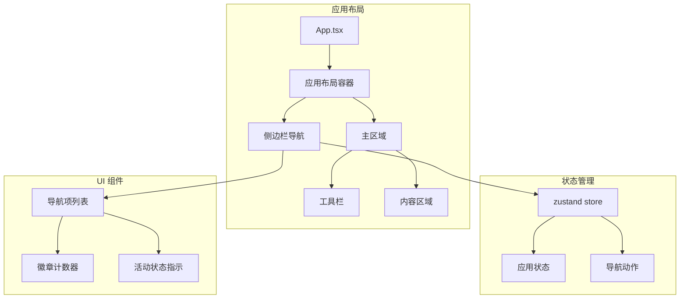

**图表来源**
- [App.tsx:11-57](file://app/src/App.tsx#L11-L57)
- [Sidebar.tsx:30-202](file://app/src/components/Sidebar/Sidebar.tsx#L30-L202)

**章节来源**
- [App.tsx:11-57](file://app/src/App.tsx#L11-L57)
- [design-system.css:166-286](file://app/src/styles/design-system.css#L166-L286)

## 核心组件

### 导航项数据结构

导航系统使用统一的导航项数据结构来描述所有可用的导航选项：

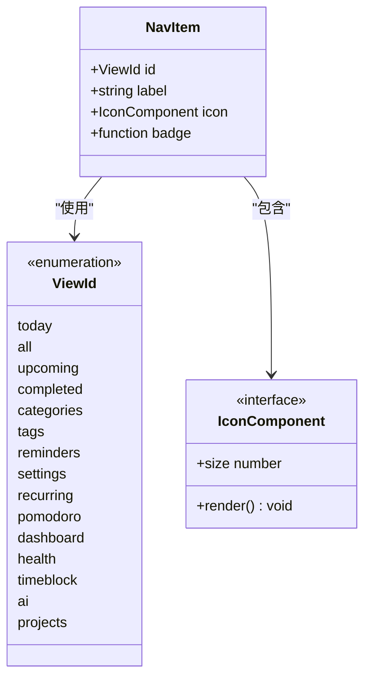

**图表来源**
- [Sidebar.tsx:23-28](file://app/src/components/Sidebar/Sidebar.tsx#L23-L28)
- [types.ts:7-23](file://app/src/types.ts#L7-L23)

导航项结构包含以下关键属性：
- **id**: 唯一的视图标识符，类型为 ViewId 枚举
- **label**: 显示给用户的导航项标签文本
- **icon**: 对应的 Lucide 图标组件
- **badge**: 可选的徽章计算函数，用于显示未完成任务数量

**章节来源**
- [Sidebar.tsx:23-28](file://app/src/components/Sidebar/Sidebar.tsx#L23-L28)
- [types.ts:7-23](file://app/src/types.ts#L7-L23)

### 状态管理架构

导航状态通过 zustand store 进行集中管理，实现了高效的响应式更新：

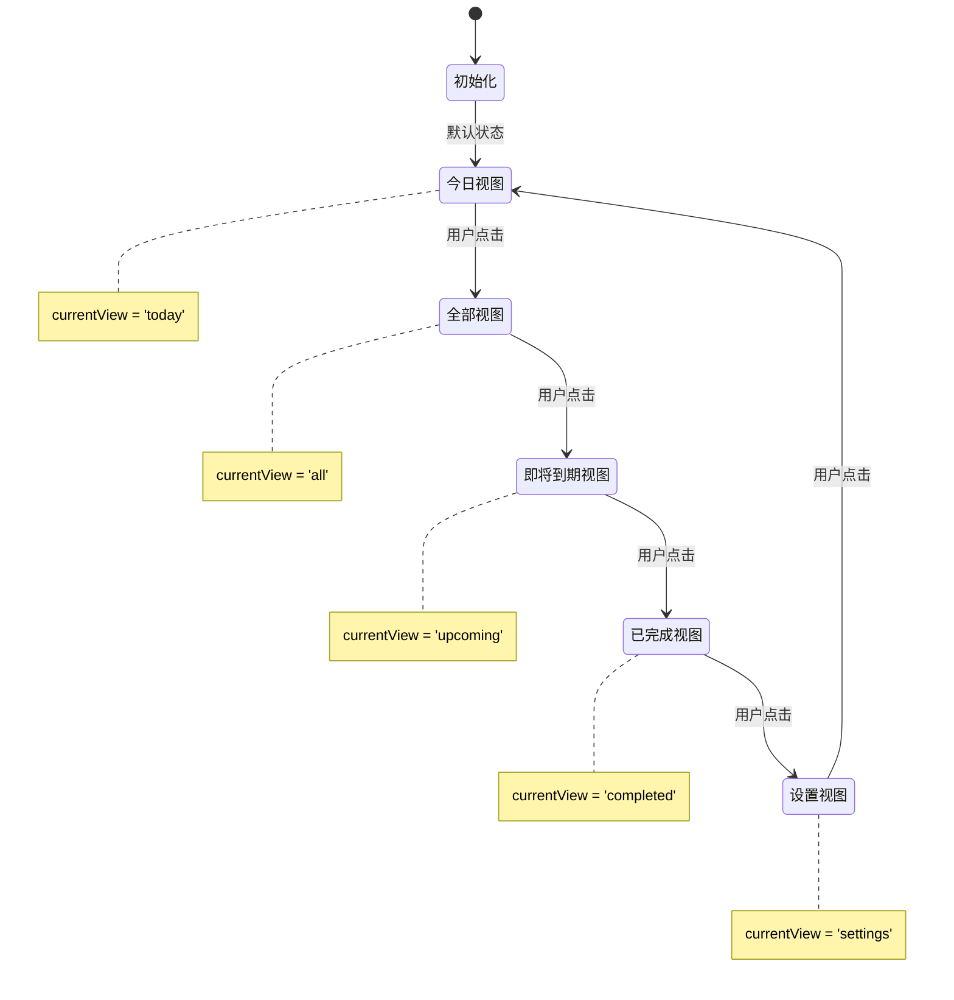

**图表来源**
- [useAppStore.ts:194](file://app/src/store/useAppStore.ts#L194)
- [useAppStore.ts:253-260](file://app/src/store/useAppStore.ts#L253-L260)

**章节来源**
- [useAppStore.ts:194](file://app/src/store/useAppStore.ts#L194)
- [useAppStore.ts:253-260](file://app/src/store/useAppStore.ts#L253-L260)

## 架构概览

导航系统采用分层架构设计，确保了良好的可维护性和扩展性：

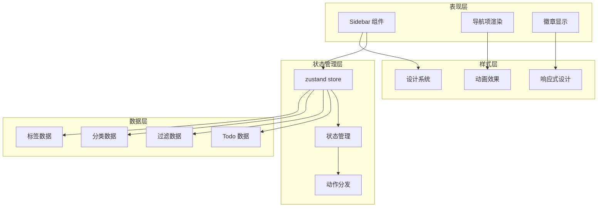

**图表来源**
- [Sidebar.tsx:30-202](file://app/src/components/Sidebar/Sidebar.tsx#L30-L202)
- [useAppStore.ts:181-508](file://app/src/store/useAppStore.ts#L181-L508)
- [design-system.css:175-286](file://app/src/styles/design-system.css#L175-L286)

## 详细组件分析

### Sidebar 组件实现

Sidebar 组件是导航系统的核心，负责渲染所有导航项并处理用户交互：

#### 组件结构分析

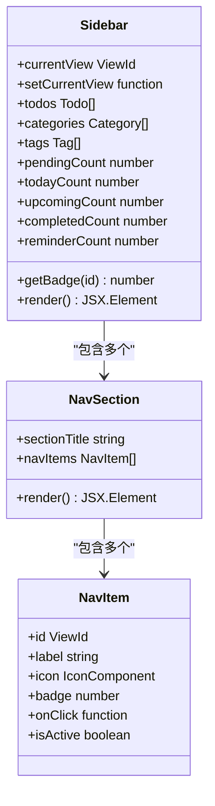

**图表来源**
- [Sidebar.tsx:30-202](file://app/src/components/Sidebar/Sidebar.tsx#L30-L202)

#### 徽章计数逻辑

徽章计数系统根据不同的视图类型计算相应的未完成任务数量：

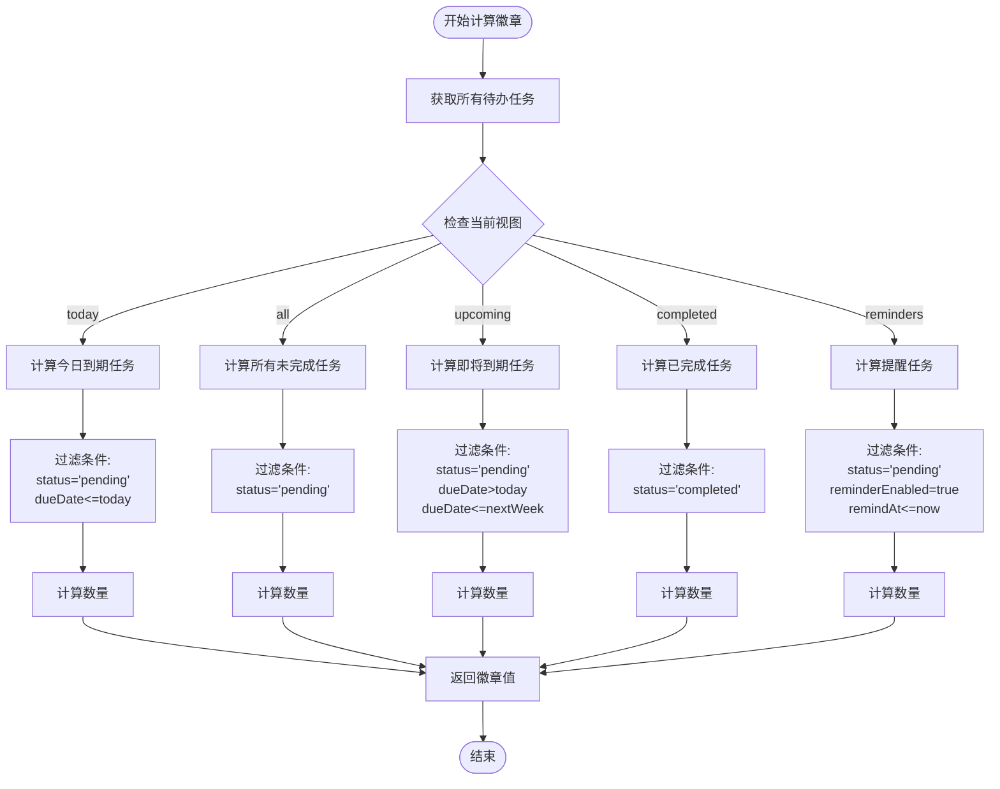

**图表来源**
- [Sidebar.tsx:33-48](file://app/src/components/Sidebar/Sidebar.tsx#L33-L48)
- [Sidebar.tsx:50-58](file://app/src/components/Sidebar/Sidebar.tsx#L50-L58)

#### 活动状态管理

活动状态通过 CSS 类名动态切换来指示当前选中的导航项：

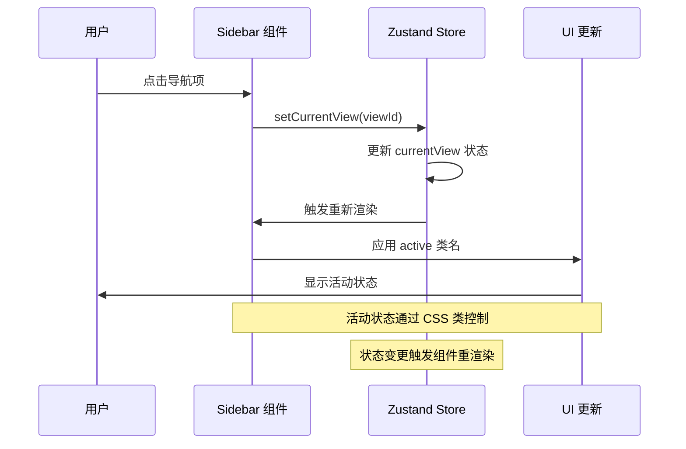

**图表来源**
- [Sidebar.tsx:76](file://app/src/components/Sidebar/Sidebar.tsx#L76)
- [useAppStore.ts:253-260](file://app/src/store/useAppStore.ts#L253-L260)

**章节来源**
- [Sidebar.tsx:30-202](file://app/src/components/Sidebar/Sidebar.tsx#L30-L202)
- [Sidebar.tsx:33-58](file://app/src/components/Sidebar/Sidebar.tsx#L33-L58)
- [useAppStore.ts:253-260](file://app/src/store/useAppStore.ts#L253-L260)

### 导航项组织结构

导航系统按照功能分组组织导航项，形成清晰的层次结构：

#### 导航项分组策略

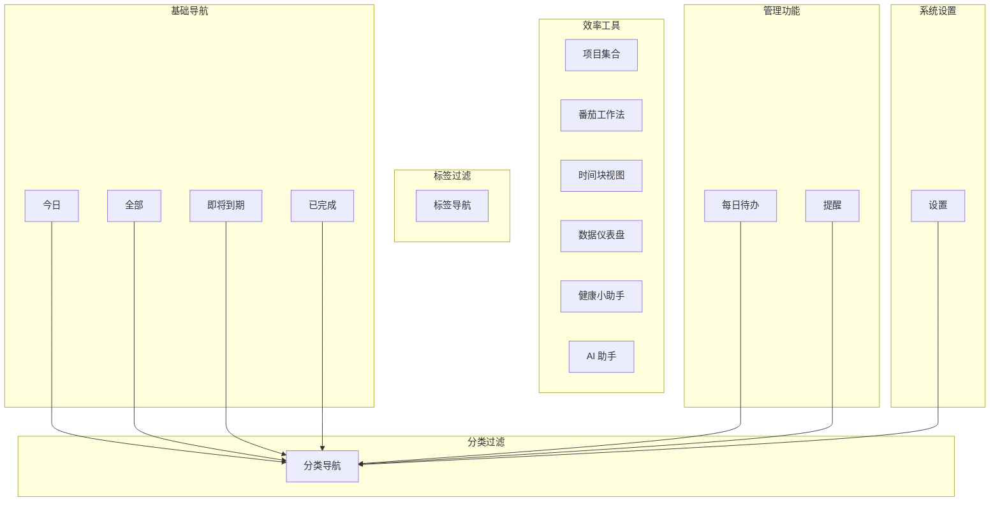

**图表来源**
- [Sidebar.tsx:23-28](file://app/src/components/Sidebar/Sidebar.tsx#L23-L28)
- [Sidebar.tsx:88-153](file://app/src/components/Sidebar/Sidebar.tsx#L88-L153)
- [Sidebar.tsx:155-188](file://app/src/components/Sidebar/Sidebar.tsx#L155-L188)

#### 分类和标签导航

分类和标签导航支持动态生成，基于实际数据进行渲染：

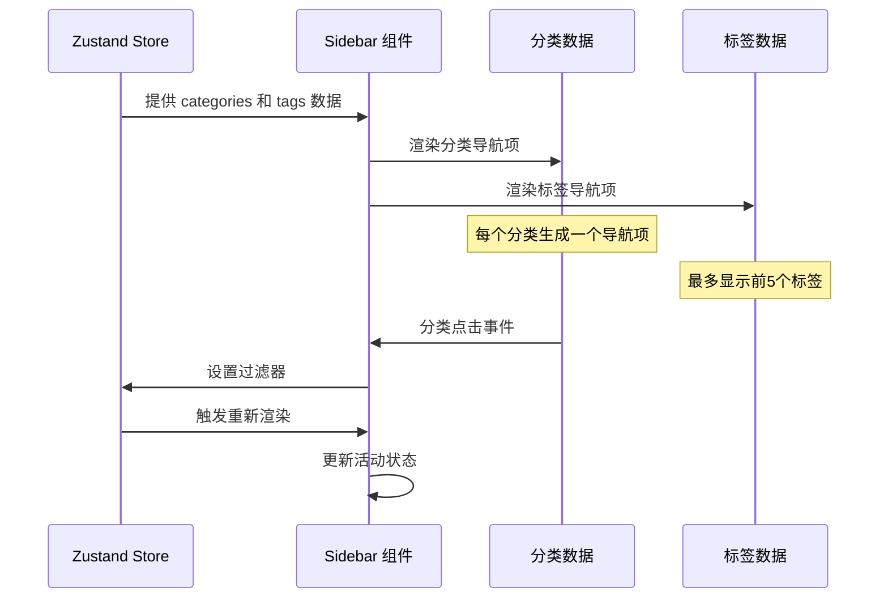

**图表来源**
- [Sidebar.tsx:157-170](file://app/src/components/Sidebar/Sidebar.tsx#L157-L170)
- [Sidebar.tsx:175-187](file://app/src/components/Sidebar/Sidebar.tsx#L175-L187)

**章节来源**
- [Sidebar.tsx:88-188](file://app/src/components/Sidebar/Sidebar.tsx#L88-L188)

### 样式系统和动画效果

导航系统采用统一的设计系统，提供了丰富的视觉反馈和动画效果：

#### 设计系统变量

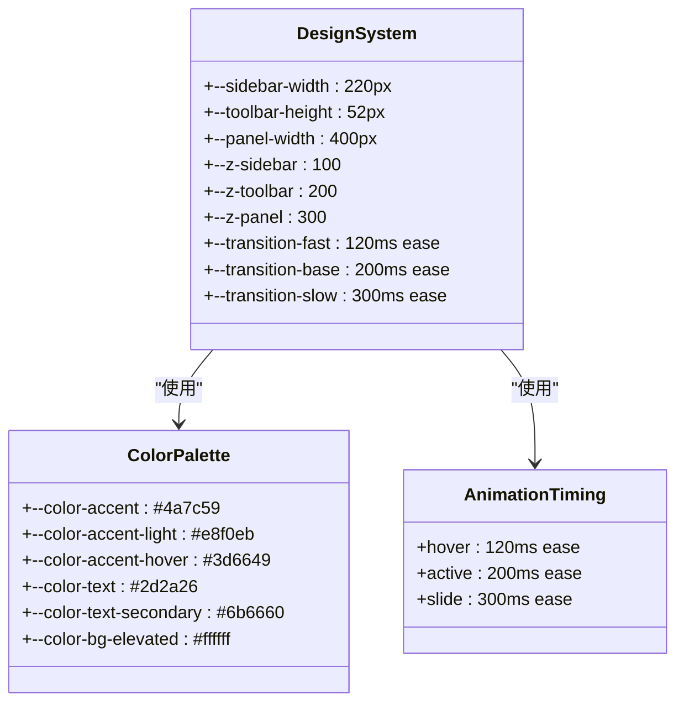

**图表来源**
- [design-system.css:4-95](file://app/src/styles/design-system.css#L4-L95)
- [design-system.css:175-286](file://app/src/styles/design-system.css#L175-L286)

#### 导航项交互效果

导航项具有丰富的交互状态和动画效果：

```mermaid
stateDiagram-v2
[*] --> Normal : 默认状态
Normal --> Hover : 鼠标悬停
Hover --> Active : 点击激活
Active --> Normal : 状态切换
note right of Normal :
背景 : var(--color-bg-elevated)
文本 : var(--color-text-secondary)
图标 : 0.8 透明度
note right of Hover :
背景 : var(--color-bg-hover)
文本 : var(--color-text)
过渡 : 120ms ease
note right of Active :
背景 : var(--color-accent-light)
文本 : var(--color-accent)
字体 : 500 字重
图标 : 1.0 透明度
```

**图表来源**
- [design-system.css:246-280](file://app/src/styles/design-system.css#L246-L280)

**章节来源**
- [design-system.css:175-286](file://app/src/styles/design-system.css#L175-L286)
- [Sidebar.css:1-5](file://app/src/components/Sidebar/Sidebar.css#L1-L5)

## 依赖关系分析

导航系统的依赖关系体现了清晰的分层架构：

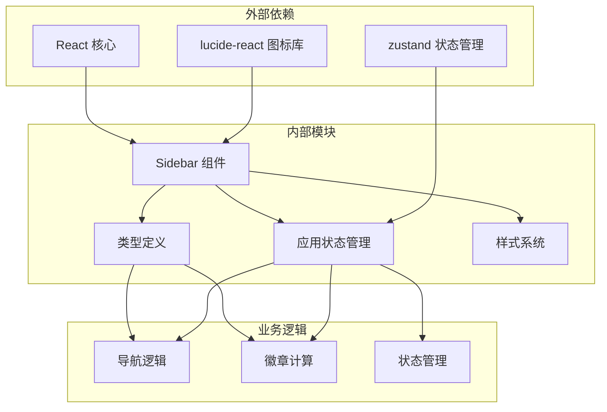

**图表来源**
- [Sidebar.tsx:1-21](file://app/src/components/Sidebar/Sidebar.tsx#L1-L21)
- [useAppStore.ts:1-21](file://app/src/store/useAppStore.ts#L1-L21)
- [types.ts:1-278](file://app/src/types.ts#L1-L278)

### 关键依赖关系

1. **图标依赖**: 使用 lucide-react 提供的图标组件
2. **状态管理依赖**: 依赖 zustand 实现全局状态管理
3. **类型安全**: 通过 TypeScript 枚举确保 ViewId 的类型安全
4. **样式系统**: 依赖设计系统变量实现一致的视觉风格

**章节来源**
- [Sidebar.tsx:1-21](file://app/src/components/Sidebar/Sidebar.tsx#L1-L21)
- [useAppStore.ts:1-21](file://app/src/store/useAppStore.ts#L1-L21)
- [types.ts:1-278](file://app/src/types.ts#L1-L278)

## 性能考虑

导航系统在设计时充分考虑了性能优化：

### 渲染优化策略

1. **条件渲染**: 只渲染必要的导航项和徽章
2. **状态缓存**: 使用 useMemo 缓存计算结果
3. **事件委托**: 合理使用事件处理器避免重复绑定
4. **虚拟滚动**: 对大量分类和标签项使用虚拟滚动

### 计算复杂度分析

徽章计算的时间复杂度为 O(n)，其中 n 是待办任务数量：
- **今日视图**: O(n) - 过滤到期任务
- **全部视图**: O(n) - 过滤未完成任务  
- **即将到期**: O(n) - 过滤一周内到期任务
- **已完成**: O(n) - 过滤已完成任务
- **提醒**: O(n) - 过滤待触发提醒

空间复杂度为 O(1)，只存储少量中间计算结果。

### 性能优化建议

1. **批量更新**: 使用批量状态更新减少重渲染次数
2. **防抖处理**: 对频繁触发的状态更新添加防抖
3. **懒加载**: 对大型分类和标签数据实现懒加载
4. **内存管理**: 及时清理不再使用的事件监听器

## 故障排除指南

### 常见问题及解决方案

#### 导航项不显示徽章

**问题症状**: 导航项右侧没有显示数字徽章

**可能原因**:
1. 待办任务数据为空或格式不正确
2. 徽章计算函数返回 undefined
3. CSS 样式被覆盖

**解决步骤**:
1. 检查 todos 数据结构是否正确
2. 验证 getBadge 函数的计算逻辑
3. 确认 .sidebar-item-badge 样式未被覆盖

#### 活动状态不正确

**问题症状**: 当前选中的导航项没有显示活动状态

**可能原因**:
1. currentView 状态未正确更新
2. 条件渲染逻辑错误
3. CSS 类名拼写错误

**解决步骤**:
1. 检查 setCurrentView 动作是否正常执行
2. 验证 currentView 与导航项 id 的匹配逻辑
3. 确认 active 类名应用正确

#### 性能问题

**问题症状**: 导航切换时出现卡顿

**可能原因**:
1. 大量待办任务导致计算开销过大
2. 频繁的状态更新触发过多重渲染
3. 样式计算复杂度过高

**解决步骤**:
1. 实施数据分页或虚拟滚动
2. 添加计算结果缓存
3. 优化 CSS 动画性能

**章节来源**
- [Sidebar.tsx:50-58](file://app/src/components/Sidebar/Sidebar.tsx#L50-L58)
- [useAppStore.ts:253-260](file://app/src/store/useAppStore.ts#L253-L260)

## 结论

SnowTodo 的导航系统展现了现代前端开发的最佳实践，通过精心设计的架构实现了高度的可维护性和扩展性。系统的核心优势包括：

1. **类型安全**: 完整的 TypeScript 类型系统确保了代码质量
2. **状态管理**: 基于 zustand 的轻量级状态管理方案
3. **响应式设计**: 流畅的动画效果和交互反馈
4. **可扩展性**: 模块化的组件设计支持功能扩展
5. **性能优化**: 合理的渲染策略和计算优化

该导航系统为开发者提供了一个优秀的参考实现，展示了如何构建既美观又实用的用户界面导航组件。

## 附录

### 导航系统扩展指南

#### 添加新的导航项

要添加新的导航项，需要修改以下文件：

1. **更新 ViewId 类型定义**:
   ```typescript
   // 在 types.ts 中添加新的视图 ID
   export type ViewId = 
     | 'today'
     | 'all'
     | 'upcoming'
     | 'completed'
     | 'newFeature'  // 新增的导航项
   ```

2. **更新导航项数组**:
   ```typescript
   // 在 Sidebar.tsx 中添加新的导航项
   const NAV_ITEMS = [
     { id: 'today', label: '今天', icon: Calendar },
     { id: 'all', label: '全部', icon: ListTodo },
     { id: 'upcoming', label: '即将到期', icon: Timer },
     { id: 'completed', label: '已完成', icon: CheckCircle2 },
     { id: 'newFeature', label: '新功能', icon: Zap },  // 新增导航项
   ]
   ```

3. **更新徽章计算逻辑**:
   ```typescript
   // 在 getBadge 函数中添加新视图的计算逻辑
   const getBadge = (id: ViewId): number | undefined => {
     switch (id) {
       case 'today': return todayCount || undefined
       case 'all': return pendingCount || undefined
       case 'upcoming': return upcomingCount || undefined
       case 'completed': return completedCount || undefined
       case 'newFeature': return newFeatureCount || undefined  // 新增计算
       default: return undefined
     }
   }
   ```

#### 自定义导航行为

要自定义导航行为，可以：

1. **修改状态切换逻辑**:
   ```typescript
   // 在 setCurrentView 中添加自定义逻辑
   const setCurrentView = (view: ViewId) => {
     set({
       currentView: view,
       // 添加自定义状态重置逻辑
       selectedTodoId: null,
       isDetailPanelOpen: false,
     })
   }
   ```

2. **添加导航项特定的处理**:
   ```typescript
   // 为特定导航项添加自定义处理
   <div
     className={`sidebar-item ${currentView === 'specialView' ? 'active' : ''}`}
     onClick={() => {
       // 特定视图的自定义逻辑
       handleSpecialViewLogic()
       setCurrentView('specialView')
     }}
   >
   ```

#### 样式定制

要定制导航系统的样式，可以：

1. **修改设计系统变量**:
   ```css
   :root {
     --color-accent: #your-custom-color;
     --sidebar-width: 250px;  // 调整侧边栏宽度
   }
   ```

2. **添加自定义动画效果**:
   ```css
   .sidebar-item {
     transition: all 300ms cubic-bezier(0.4, 0, 0.2, 1);
   }
   ```

通过这些扩展点，开发者可以根据具体需求灵活地定制和扩展导航系统功能。