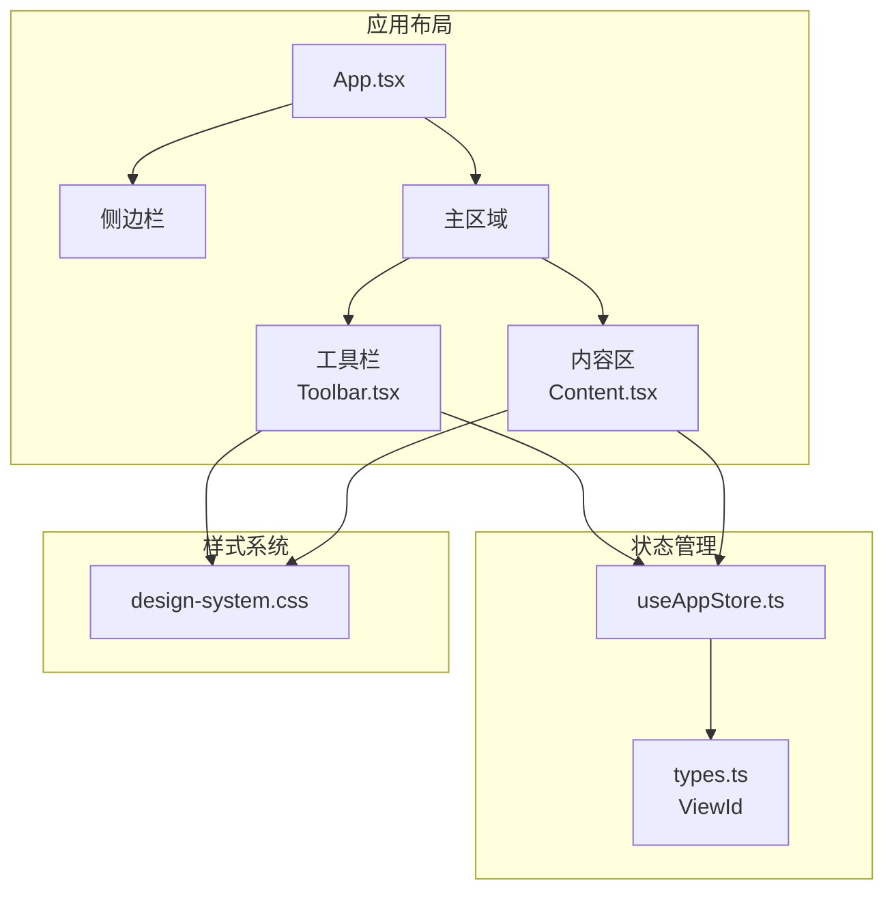
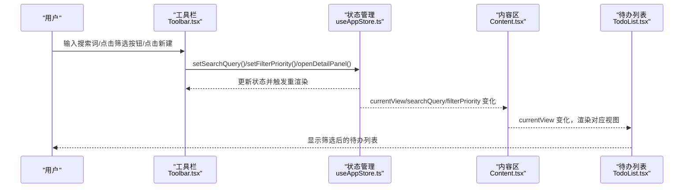
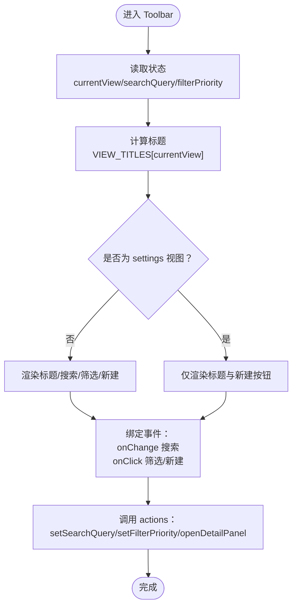
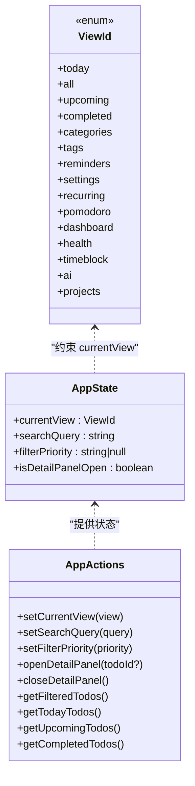
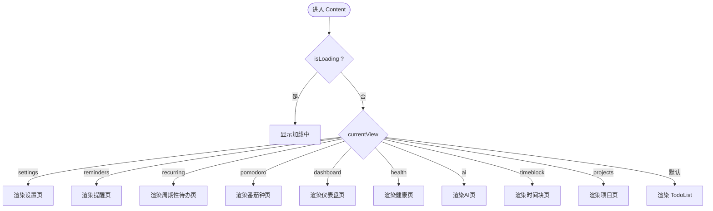
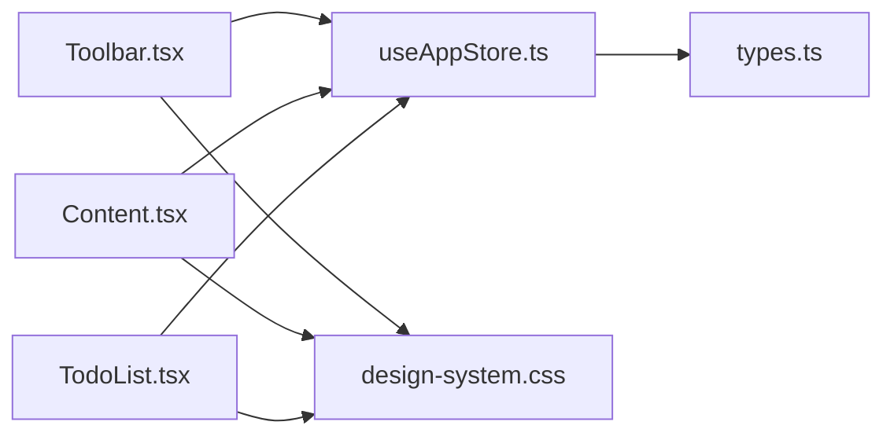

# 工具栏

<cite>
**本文引用的文件列表**
- [Toolbar.tsx](file://app/src/components/Toolbar/Toolbar.tsx)
- [Toolbar.css](file://app/src/components/Toolbar/Toolbar.css)
- [index.ts](file://app/src/components/Toolbar/index.ts)
- [Content.tsx](file://app/src/components/Content/Content.tsx)
- [useAppStore.ts](file://app/src/store/useAppStore.ts)
- [App.tsx](file://app/src/App.tsx)
- [types.ts](file://app/src/types.ts)
- [design-system.css](file://app/src/styles/design-system.css)
- [TodoList.tsx](file://app/src/components/Content/TodoList.tsx)
</cite>

## 目录
1. [简介](#简介)
2. [项目结构](#项目结构)
3. [核心组件](#核心组件)
4. [架构总览](#架构总览)
5. [组件详解](#组件详解)
6. [依赖关系分析](#依赖关系分析)
7. [性能考量](#性能考量)
8. [故障排查指南](#故障排查指南)
9. [结论](#结论)
10. [附录](#附录)

## 简介
本章节概述 SnowTodo 工具栏的功能定位与整体设计理念。工具栏位于应用主界面顶部，负责：
- 展示当前视图标题与上下文信息
- 提供搜索与筛选能力（按优先级）
- 提供“新建待办”入口
- 在不同视图中动态显示/隐藏相关控件，确保界面简洁一致

工具栏通过全局状态管理器与内容区域进行解耦协作，实现状态同步与用户交互响应。

## 项目结构
工具栏相关文件组织如下：
- 组件层：app/src/components/Toolbar
  - Toolbar.tsx：工具栏主体组件
  - Toolbar.css：工具栏专用样式覆盖
  - index.ts：导出工具栏组件
- 应用层：app/src/App.tsx
  - 将工具栏与内容区域组合到主布局中
- 状态层：app/src/store/useAppStore.ts
  - 提供视图切换、搜索查询、筛选状态、详情面板开关等状态与动作
- 类型层：app/src/types.ts
  - 定义 ViewId 枚举，约束可用视图集合
- 样式层：app/src/styles/design-system.css
  - 提供设计系统变量、过滤器芯片样式、工具栏高度等基础样式
- 内容层：app/src/components/Content/Content.tsx
  - 根据当前视图渲染对应内容视图（含 TodoList）

图表来源
- [App.tsx:40-56](file://app/src/App.tsx#L40-L56)
- [Toolbar.tsx:16-77](file://app/src/components/Toolbar/Toolbar.tsx#L16-L77)
- [Content.tsx:14-63](file://app/src/components/Content/Content.tsx#L14-L63)
- [useAppStore.ts:39-48](file://app/src/store/useAppStore.ts#L39-L48)
- [types.ts:7-23](file://app/src/types.ts#L7-L23)
- [design-system.css:84-95](file://app/src/styles/design-system.css#L84-L95)

章节来源
- [App.tsx:40-56](file://app/src/App.tsx#L40-L56)
- [Toolbar.tsx:16-77](file://app/src/components/Toolbar/Toolbar.tsx#L16-L77)
- [Content.tsx:14-63](file://app/src/components/Content/Content.tsx#L14-L63)
- [useAppStore.ts:39-48](file://app/src/store/useAppStore.ts#L39-L48)
- [types.ts:7-23](file://app/src/types.ts#L7-L23)
- [design-system.css:84-95](file://app/src/styles/design-system.css#L84-L95)

## 核心组件
- 工具栏组件：负责渲染标题、搜索框、优先级筛选、新建按钮，并根据当前视图动态控制显示逻辑
- 状态管理：集中维护 currentView、searchQuery、filterPriority、isDetailPanelOpen 等状态
- 内容区域：根据 currentView 渲染不同视图，其中 TodoList 负责待办列表的展示与空状态处理
- 设计系统：提供统一的变量、尺寸、颜色与动画，保证工具栏与内容区风格一致

章节来源
- [Toolbar.tsx:16-77](file://app/src/components/Toolbar/Toolbar.tsx#L16-L77)
- [useAppStore.ts:39-48](file://app/src/store/useAppStore.ts#L39-L48)
- [Content.tsx:14-63](file://app/src/components/Content/Content.tsx#L14-L63)
- [design-system.css:918-949](file://app/src/styles/design-system.css#L918-L949)

## 架构总览
工具栏采用“组件-状态-视图”的分层架构：
- 组件层：Toolbar.tsx 仅负责 UI 渲染与事件绑定
- 状态层：useAppStore.ts 提供全局状态与动作，包括 setCurrentView、setSearchQuery、setFilterPriority、openDetailPanel 等
- 视图层：Content.tsx 根据 currentView 切换渲染内容；TodoList.tsx 根据筛选条件渲染待办列表
- 样式层：design-system.css 提供统一变量与组件样式基线

图表来源
- [Toolbar.tsx:17-72](file://app/src/components/Toolbar/Toolbar.tsx#L17-L72)
- [useAppStore.ts:120-124](file://app/src/store/useAppStore.ts#L120-L124)
- [Content.tsx:14-63](file://app/src/components/Content/Content.tsx#L14-L63)
- [TodoList.tsx:16-45](file://app/src/components/Content/TodoList.tsx#L16-L45)

## 组件详解

### 工具栏组件（Toolbar）
- 功能定位
  - 标题显示：根据 currentView 映射中文标题
  - 搜索输入：双向绑定 searchQuery，实时影响 TodoList 的过滤结果
  - 优先级筛选：提供“全部/高/中/低”四个筛选按钮，支持激活态样式
  - 新建按钮：打开详情面板，用于创建新待办
  - 动态显示：在 settings 视图隐藏搜索与筛选，仅保留标题与新建按钮
- 数据流
  - 从 useAppStore 读取 currentView、searchQuery、filterPriority
  - 通过 setSearchQuery、setFilterPriority、openDetailPanel 更新状态
- 样式要点
  - 使用设计系统变量控制间距与尺寸
  - filter-bar 使用 flex-wrap 实现响应式换行
  - 主要按钮使用统一的间距变量

图表来源
- [Toolbar.tsx:16-77](file://app/src/components/Toolbar/Toolbar.tsx#L16-L77)
- [useAppStore.ts:120-124](file://app/src/store/useAppStore.ts#L120-L124)

章节来源
- [Toolbar.tsx:16-77](file://app/src/components/Toolbar/Toolbar.tsx#L16-L77)
- [Toolbar.css:1-15](file://app/src/components/Toolbar/Toolbar.css#L1-L15)
- [design-system.css:918-949](file://app/src/styles/design-system.css#L918-L949)

### 状态管理（useAppStore）
- 关键状态
  - currentView：当前视图标识，受 ViewId 约束
  - searchQuery：搜索关键词
  - filterPriority：优先级筛选值（null/low/medium/high）
  - isDetailPanelOpen：详情面板开关
- 关键动作
  - setSearchQuery：更新搜索词
  - setFilterPriority：更新优先级筛选
  - openDetailPanel/closeDetailPanel：打开/关闭详情面板
  - setCurrentView：切换视图（包含视图特定的状态清理）
- 计算属性
  - getFilteredTodos：综合搜索词、优先级、分类、标签等条件过滤待办
  - getTodayTodos/getUpcomingTodos/getCompletedTodos：按视图维度派生数据
- 与工具栏协作
  - 工具栏通过 actions 更新状态，内容区与列表组件基于计算属性重新渲染

图表来源
- [useAppStore.ts:30-176](file://app/src/store/useAppStore.ts#L30-L176)
- [types.ts:7-23](file://app/src/types.ts#L7-L23)

章节来源
- [useAppStore.ts:30-176](file://app/src/store/useAppStore.ts#L30-L176)
- [types.ts:7-23](file://app/src/types.ts#L7-L23)

### 内容区域（Content）
- 视图路由
  - 根据 currentView 渲染不同视图：settings、reminders、recurring、pomodoro、dashboard、health、ai、timeblock、projects
  - 默认视图（today/all/upcoming/completed/categories/tags）渲染 TodoList
- 加载态
  - isLoading 为真时显示加载中状态
- 与工具栏协作
  - 通过 useAppStore 获取 currentView，决定渲染内容
  - 工具栏的搜索与筛选通过状态变化影响 TodoList 的渲染结果

图表来源
- [Content.tsx:14-63](file://app/src/components/Content/Content.tsx#L14-L63)

章节来源
- [Content.tsx:14-63](file://app/src/components/Content/Content.tsx#L14-L63)

### 待办列表（TodoList）
- 视图适配
  - 根据 currentView 与筛选条件（filterCategoryId/filterTagId）计算待办集合
  - 支持 pending 与 completed 两套列表分别渲染
- 空状态
  - 当 pending 与 completed 均为空时，根据视图映射显示不同的空状态文案与引导按钮
- 与工具栏联动
  - 工具栏的搜索与筛选直接影响 getFilteredTodos 等计算结果
  - 新建按钮与详情面板在工具栏与空状态中均可触发

章节来源
- [TodoList.tsx:16-75](file://app/src/components/Content/TodoList.tsx#L16-L75)

### 样式与响应式设计
- 设计系统变量
  - 提供 toolbar 高度、间距、颜色、圆角等变量，确保工具栏与内容区风格一致
- 过滤器芯片样式
  - filter-chip 提供 hover 与 active 态，配合 flex-wrap 实现响应式换行
- 工具栏专用样式
  - toolbar.css 对工具栏容器与按钮间距进行微调

章节来源
- [design-system.css:84-95](file://app/src/styles/design-system.css#L84-L95)
- [design-system.css:918-949](file://app/src/styles/design-system.css#L918-L949)
- [Toolbar.css:1-15](file://app/src/components/Toolbar/Toolbar.css#L1-L15)

## 依赖关系分析
- 组件依赖
  - Toolbar 依赖 useAppStore 的状态与动作
  - Content 依赖 useAppStore 的 currentView 与计算属性
  - TodoList 依赖 useAppStore 的计算属性与 actions
- 类型约束
  - ViewId 枚举限制了 currentView 的取值范围，避免运行时错误
- 样式依赖
  - 工具栏与内容区共享设计系统变量，保证视觉一致性

图表来源
- [Toolbar.tsx:17](file://app/src/components/Toolbar/Toolbar.tsx#L17)
- [Content.tsx:15](file://app/src/components/Content/Content.tsx#L15)
- [TodoList.tsx:17-22](file://app/src/components/Content/TodoList.tsx#L17-L22)
- [useAppStore.ts:39-48](file://app/src/store/useAppStore.ts#L39-L48)
- [types.ts:7-23](file://app/src/types.ts#L7-L23)
- [design-system.css:84-95](file://app/src/styles/design-system.css#L84-L95)

章节来源
- [Toolbar.tsx:17](file://app/src/components/Toolbar/Toolbar.tsx#L17)
- [Content.tsx:15](file://app/src/components/Content/Content.tsx#L15)
- [TodoList.tsx:17-22](file://app/src/components/Content/TodoList.tsx#L17-L22)
- [useAppStore.ts:39-48](file://app/src/store/useAppStore.ts#L39-L48)
- [types.ts:7-23](file://app/src/types.ts#L7-L23)
- [design-system.css:84-95](file://app/src/styles/design-system.css#L84-L95)

## 性能考量
- 状态粒度
  - 将 currentView、searchQuery、filterPriority 等拆分为独立状态，减少不必要的重渲染
- 计算属性
  - getFilteredTodos 等计算属性在渲染时按需计算，避免在组件内部重复过滤
- 事件绑定
  - 搜索与筛选使用受控组件与一次性动作，降低事件处理开销
- 响应式布局
  - 使用 flex-wrap 实现筛选器的自适应换行，避免复杂媒体查询

## 故障排查指南
- 工具栏不显示搜索/筛选
  - 检查 currentView 是否为 settings；在 settings 视图中工具栏会隐藏搜索与筛选
  - 确认 useAppStore 的 currentView 是否正确更新
- 搜索无效
  - 确认 setSearchQuery 是否被调用且状态已更新
  - 检查 TodoList 的 getFilteredTodos 是否包含搜索逻辑
- 筛选不生效
  - 确认 setFilterPriority 是否被调用
  - 检查 filterPriority 的值是否与按钮绑定一致（null/low/medium/high）
- 新建按钮无响应
  - 确认 openDetailPanel 是否被调用
  - 检查 DetailPanel 的可见性逻辑

章节来源
- [Toolbar.tsx:26-74](file://app/src/components/Toolbar/Toolbar.tsx#L26-L74)
- [useAppStore.ts:120-124](file://app/src/store/useAppStore.ts#L120-L124)
- [Content.tsx:28-30](file://app/src/components/Content/Content.tsx#L28-L30)

## 结论
SnowTodo 工具栏以简洁清晰的方式实现了视图标题、搜索与筛选、新建入口等功能，通过全局状态管理与内容区域解耦协作，确保了良好的用户体验与可维护性。其响应式布局与统一设计系统变量使其在不同视图中保持一致的视觉与交互体验。

## 附录

### 扩展机制与二次开发指南
- 添加新的工具按钮
  - 在 Toolbar.tsx 中新增按钮与事件绑定
  - 在 useAppStore.ts 中新增对应 action 与状态字段
  - 在 Content.tsx 或相应视图中处理新按钮的行为
- 新增视图
  - 在 types.ts 的 ViewId 中添加新视图枚举值
  - 在 Content.tsx 的视图路由中添加新分支
  - 在 Toolbar.tsx 的 VIEW_TITLES 中添加标题映射
- 自定义样式
  - 在 Toolbar.css 中添加或调整样式
  - 使用 design-system.css 的变量确保一致性
- 状态同步
  - 通过 useAppStore 的 actions 更新状态，确保工具栏与内容区同步
  - 如需跨组件共享状态，建议通过状态管理器集中维护

章节来源
- [Toolbar.tsx:5-14](file://app/src/components/Toolbar/Toolbar.tsx#L5-L14)
- [Toolbar.tsx:66-72](file://app/src/components/Toolbar/Toolbar.tsx#L66-L72)
- [useAppStore.ts:115-125](file://app/src/store/useAppStore.ts#L115-L125)
- [Content.tsx:28-54](file://app/src/components/Content/Content.tsx#L28-L54)
- [types.ts:7-23](file://app/src/types.ts#L7-L23)
- [Toolbar.css:12-14](file://app/src/components/Toolbar/Toolbar.css#L12-L14)
- [design-system.css:918-949](file://app/src/styles/design-system.css#L918-L949)