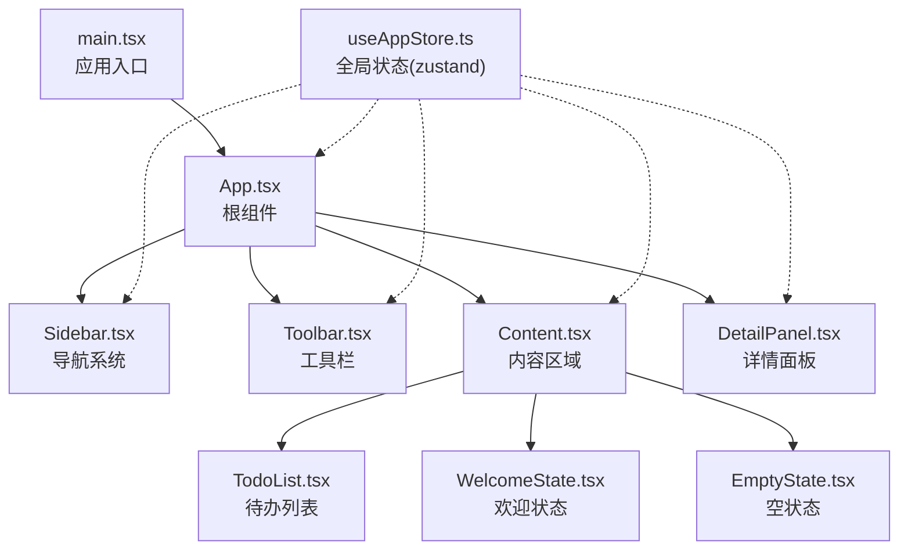
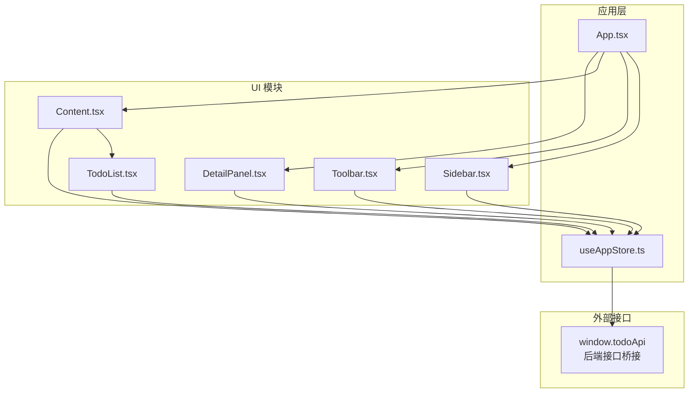
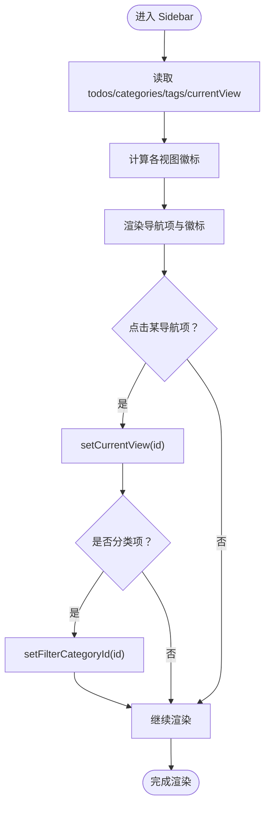
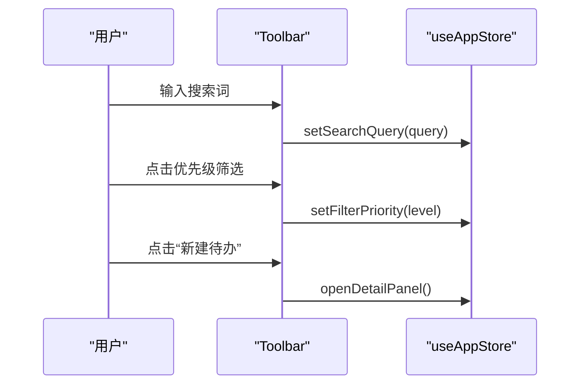
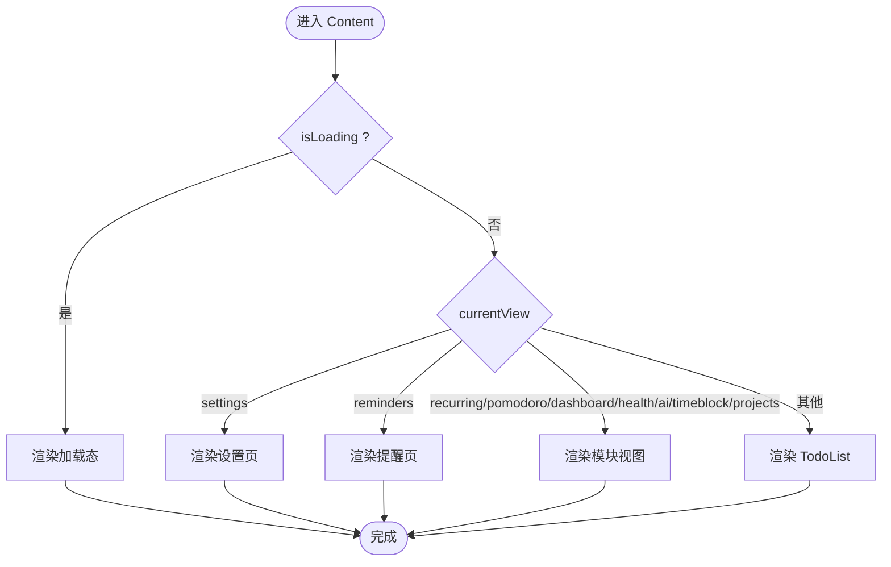
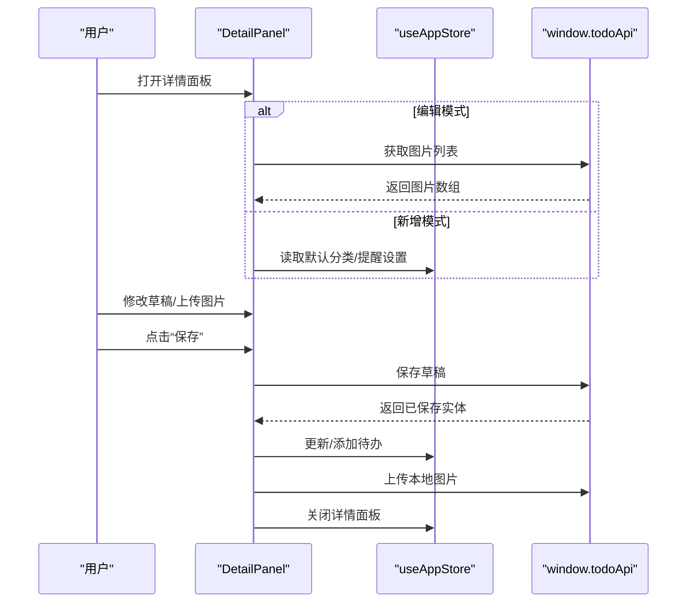
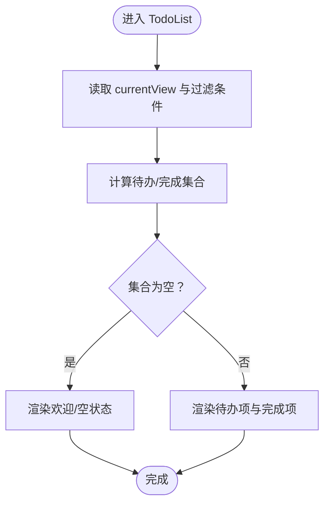
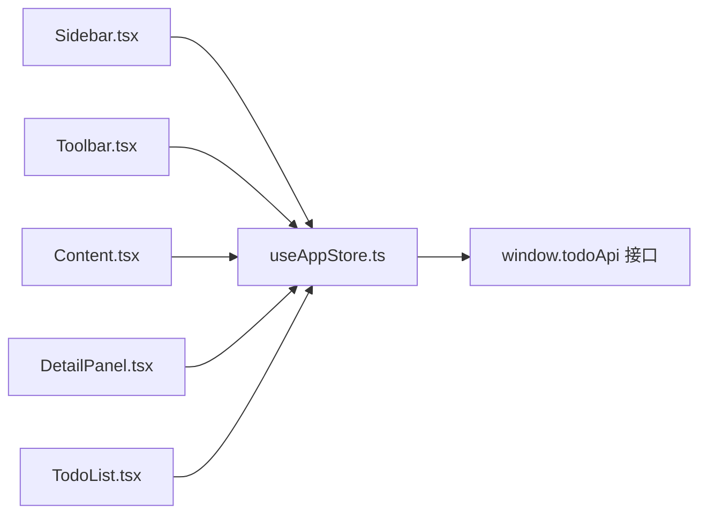

# 核心模块

<cite>
**本文引用的文件**
- [App.tsx](file://app/src/App.tsx)
- [components/index.ts](file://app/src/components/index.ts)
- [useAppStore.ts](file://app/src/store/useAppStore.ts)
- [types.ts](file://app/src/types.ts)
- [Sidebar.tsx](file://app/src/components/Sidebar/Sidebar.tsx)
- [Toolbar.tsx](file://app/src/components/Toolbar/Toolbar.tsx)
- [Content.tsx](file://app/src/components/Content/Content.tsx)
- [DetailPanel.tsx](file://app/src/components/DetailPanel/DetailPanel.tsx)
- [TodoList.tsx](file://app/src/components/Content/TodoList.tsx)
- [EmptyState.tsx](file://app/src/components/Content/EmptyState.tsx)
- [WelcomeState.tsx](file://app/src/components/Content/WelcomeState.tsx)
- [Sidebar.css](file://app/src/components/Sidebar/Sidebar.css)
- [Toolbar.css](file://app/src/components/Toolbar/Toolbar.css)
- [DetailPanel.css](file://app/src/components/DetailPanel/DetailPanel.css)
- [Content.css](file://app/src/components/Content/Content.css)
- [main.tsx](file://app/src/main.tsx)
</cite>

## 目录
1. [简介](#简介)
2. [项目结构](#项目结构)
3. [核心组件](#核心组件)
4. [架构总览](#架构总览)
5. [详细组件分析](#详细组件分析)
6. [依赖分析](#依赖分析)
7. [性能考量](#性能考量)
8. [故障排查指南](#故障排查指南)
9. [结论](#结论)
10. [附录](#附录)

## 简介
本文件为 SnowTodo 核心模块的综合技术文档，聚焦应用的主要功能模块：导航系统（Sidebar）、内容区域（Content）、详情面板（DetailPanel）、工具栏（Toolbar）。文档从架构与数据流角度解析各模块职责、组件结构与交互关系，阐述模块间通信机制与数据传递方式；总结模块化设计优势与扩展性考虑；给出生命周期管理、状态管理与错误处理策略；并提供模块开发最佳实践与二次开发指导。

## 项目结构
应用采用基于功能域的组件组织方式，核心入口位于应用根组件，通过全局状态驱动多个功能模块协同工作。主要目录与文件如下：
- 应用入口与根组件：main.tsx、App.tsx
- 全局状态：store/useAppStore.ts
- 类型定义：types.ts
- 核心模块：
  - 导航系统：components/Sidebar/Sidebar.tsx
  - 工具栏：components/Toolbar/Toolbar.tsx
  - 内容区域：components/Content/Content.tsx
  - 详情面板：components/DetailPanel/DetailPanel.tsx
  - 列表与空状态：components/Content/TodoList.tsx、WelcomeState.tsx、EmptyState.tsx
- 组件导出聚合：components/index.ts

图表来源
- [main.tsx:1-11](file://app/src/main.tsx#L1-L11)
- [App.tsx:11-60](file://app/src/App.tsx#L11-L60)
- [useAppStore.ts:181-508](file://app/src/store/useAppStore.ts#L181-L508)
- [Sidebar.tsx:30-203](file://app/src/components/Sidebar/Sidebar.tsx#L30-L203)
- [Toolbar.tsx:16-78](file://app/src/components/Toolbar/Toolbar.tsx#L16-L78)
- [Content.tsx:14-65](file://app/src/components/Content/Content.tsx#L14-L65)
- [DetailPanel.tsx:33-507](file://app/src/components/DetailPanel/DetailPanel.tsx#L33-L507)
- [TodoList.tsx:16-189](file://app/src/components/Content/TodoList.tsx#L16-L189)
- [WelcomeState.tsx:5-22](file://app/src/components/Content/WelcomeState.tsx#L5-L22)
- [EmptyState.tsx:4-12](file://app/src/components/Content/EmptyState.tsx#L4-L12)

章节来源
- [main.tsx:1-11](file://app/src/main.tsx#L1-L11)
- [App.tsx:11-60](file://app/src/App.tsx#L11-L60)
- [components/index.ts:1-10](file://app/src/components/index.ts#L1-L10)

## 核心组件
- 导航系统（Sidebar）
  - 职责：提供视图切换、分类/标签过滤入口、模块导航与徽标计数。
  - 关键交互：点击项调用状态动作切换 currentView，并对分类/标签设置过滤条件。
  - 数据来源：todos、categories、tags、currentView。
- 工具栏（Toolbar）
  - 职责：显示当前视图标题、搜索输入、优先级筛选器、新建待办按钮。
  - 关键交互：绑定搜索查询与优先级过滤，触发打开详情面板。
  - 数据来源：currentView、searchQuery、filterPriority。
- 内容区域（Content）
  - 职责：根据 currentView 渲染不同视图（待办列表、设置、提醒、模块视图等），统一承载主内容。
  - 关键逻辑：加载态渲染、路由式视图分发、容器样式控制。
- 详情面板（DetailPanel）
  - 职责：待办的增删改查、图片拖拽/粘贴上传、重复规则与提醒配置、标签与分类选择。
  - 关键交互：本地草稿编辑、保存至后端、更新全局状态、图片本地临时存储与持久化。
- 列表与空状态（TodoList、WelcomeState、EmptyState）
  - 职责：按视图类型渲染待办项、完成/恢复操作、空状态提示与引导。
  - 关键逻辑：根据 currentView 与过滤条件计算渲染集合，空状态文案差异化。

章节来源
- [Sidebar.tsx:30-203](file://app/src/components/Sidebar/Sidebar.tsx#L30-L203)
- [Toolbar.tsx:16-78](file://app/src/components/Toolbar/Toolbar.tsx#L16-L78)
- [Content.tsx:14-65](file://app/src/components/Content/Content.tsx#L14-L65)
- [DetailPanel.tsx:33-507](file://app/src/components/DetailPanel/DetailPanel.tsx#L33-L507)
- [TodoList.tsx:16-189](file://app/src/components/Content/TodoList.tsx#L16-L189)
- [WelcomeState.tsx:5-22](file://app/src/components/Content/WelcomeState.tsx#L5-L22)
- [EmptyState.tsx:4-12](file://app/src/components/Content/EmptyState.tsx#L4-L12)

## 架构总览
应用采用“根组件 + 全局状态 + 功能模块”的分层架构：
- 根组件负责布局与初始化，拉取启动数据并初始化各模块设置。
- 全局状态（Zustand）集中管理业务数据、UI 状态与模块化功能状态（如 Pomodoro、Health、AI、TimeBlock、Dashboard、Projects）。
- 功能模块通过状态钩子访问与更新状态，通过 window.todoApi 与后端交互，实现数据持久化与事件订阅。

图表来源
- [App.tsx:11-60](file://app/src/App.tsx#L11-L60)
- [useAppStore.ts:181-508](file://app/src/store/useAppStore.ts#L181-L508)
- [Sidebar.tsx:30-203](file://app/src/components/Sidebar/Sidebar.tsx#L30-L203)
- [Toolbar.tsx:16-78](file://app/src/components/Toolbar/Toolbar.tsx#L16-L78)
- [Content.tsx:14-65](file://app/src/components/Content/Content.tsx#L14-L65)
- [DetailPanel.tsx:33-507](file://app/src/components/DetailPanel/DetailPanel.tsx#L33-L507)
- [TodoList.tsx:16-189](file://app/src/components/Content/TodoList.tsx#L16-L189)

## 详细组件分析

### 导航系统（Sidebar）分析
- 结构与职责
  - 固定导航项：今日/全部/即将到期/已完成
  - 效率工具：项目集合、番茄工作法、时间块视图、仪表盘、健康小助手、AI 助手
  - 管理：每日待办、提醒
  - 分类/标签：动态渲染并支持过滤
  - 徽标：基于 todos 计算各类数量
- 交互与状态
  - 点击切换 currentView，部分项同时设置 filterCategoryId/filterTagId
  - 通过 useAppStore 访问 todos/categories/tags/currentView 并计算徽标
- 错误处理与边界
  - 未匹配视图时不显示徽标
  - 分类/标签列表为空时安全渲染

图表来源
- [Sidebar.tsx:30-203](file://app/src/components/Sidebar/Sidebar.tsx#L30-L203)
- [useAppStore.ts:300-323](file://app/src/store/useAppStore.ts#L300-L323)

章节来源
- [Sidebar.tsx:30-203](file://app/src/components/Sidebar/Sidebar.tsx#L30-L203)
- [Sidebar.css:1-5](file://app/src/components/Sidebar/Sidebar.css#L1-L5)

### 工具栏（Toolbar）分析
- 结构与职责
  - 标题：根据 currentView 显示对应标题
  - 搜索：双向绑定 searchQuery
  - 筛选：优先级全/高/中/低
  - 操作：新建待办按钮
- 交互与状态
  - 搜索与筛选直接写入状态
  - 新建按钮触发打开详情面板
- 错误处理与边界
  - 设置页隐藏搜索与筛选区

图表来源
- [Toolbar.tsx:16-78](file://app/src/components/Toolbar/Toolbar.tsx#L16-L78)
- [useAppStore.ts:115-125](file://app/src/store/useAppStore.ts#L115-L125)

章节来源
- [Toolbar.tsx:16-78](file://app/src/components/Toolbar/Toolbar.tsx#L16-L78)
- [Toolbar.css:1-15](file://app/src/components/Toolbar/Toolbar.css#L1-L15)

### 内容区域（Content）分析
- 结构与职责
  - 加载态：isLoading 时显示加载动画
  - 视图分发：根据 currentView 渲染不同视图（设置、提醒、模块视图、待办列表）
  - 容器样式：模块视图使用无边距布局
- 交互与状态
  - 仅依赖 currentView 与 isLoading
- 错误处理与边界
  - 未知视图回退到待办列表渲染

图表来源
- [Content.tsx:14-65](file://app/src/components/Content/Content.tsx#L14-L65)

章节来源
- [Content.tsx:14-65](file://app/src/components/Content/Content.tsx#L14-L65)
- [Content.css:1-277](file://app/src/components/Content/Content.css#L1-L277)

### 详情面板（DetailPanel）分析
- 结构与职责
  - 表单：标题、备注、优先级、截止/开始日期、分类、标签、重复规则、提醒配置、置顶
  - 图片：拖拽/粘贴/文件选择上传，本地临时存储与数据库持久化
  - 操作：保存（新增/编辑）、删除、取消
- 交互与状态
  - 草稿 draft：本地编辑，保存时合并 customDays 等字段
  - 编辑模式：从 todos 读取现有数据填充
  - 新增模式：填充默认分类、默认提醒类型、默认日期时间
  - 图片：新增时本地缓存，保存后批量上传
- 生命周期
  - 面板关闭时清理图片预览，避免残留
- 错误处理与边界
  - 标题为空禁止保存
  - 自定义重复必须至少选择一天
  - 删除时调用后端并更新状态

图表来源
- [DetailPanel.tsx:33-507](file://app/src/components/DetailPanel/DetailPanel.tsx#L33-L507)
- [useAppStore.ts:300-323](file://app/src/store/useAppStore.ts#L300-L323)

章节来源
- [DetailPanel.tsx:33-507](file://app/src/components/DetailPanel/DetailPanel.tsx#L33-L507)
- [DetailPanel.css:1-206](file://app/src/components/DetailPanel/DetailPanel.css#L1-L206)

### 列表与空状态（TodoList、WelcomeState、EmptyState）分析
- 结构与职责
  - TodoList：根据 currentView 与过滤条件渲染待办项与已完成项，空状态时显示欢迎/空提示
  - WelcomeState：引导创建第一条待办
  - EmptyState：通用空状态提示
- 交互与状态
  - 点击待办项打开详情面板
  - 完成/恢复通过后端接口与状态同步
- 错误处理与边界
  - 空状态文案按视图差异化

图表来源
- [TodoList.tsx:16-189](file://app/src/components/Content/TodoList.tsx#L16-L189)
- [WelcomeState.tsx:5-22](file://app/src/components/Content/WelcomeState.tsx#L5-L22)
- [EmptyState.tsx:4-12](file://app/src/components/Content/EmptyState.tsx#L4-L12)

章节来源
- [TodoList.tsx:16-189](file://app/src/components/Content/TodoList.tsx#L16-L189)
- [WelcomeState.tsx:5-22](file://app/src/components/Content/WelcomeState.tsx#L5-L22)
- [EmptyState.tsx:4-12](file://app/src/components/Content/EmptyState.tsx#L4-L12)

## 依赖分析
- 组件耦合
  - Sidebar/Toolbar/Content/DetailPanel 均依赖 useAppStore，形成弱耦合的单向数据流
  - Content 对各模块视图进行条件渲染，降低跨模块耦合
- 外部依赖
  - window.todoApi 作为统一后端桥接，封装 CRUD、设置加载、事件订阅等
- 状态依赖
  - useAppStore 聚合基础数据（todos、categories、tags、settings）与 UI 状态（currentView、selectedTodoId、isDetailPanelOpen、filters、sort）
  - 模块化功能状态（Pomodoro、Health、AI、TimeBlock、Dashboard、Projects）独立维护，通过 store 动作访问

图表来源
- [useAppStore.ts:541-604](file://app/src/store/useAppStore.ts#L541-L604)
- [Sidebar.tsx:30-203](file://app/src/components/Sidebar/Sidebar.tsx#L30-L203)
- [Toolbar.tsx:16-78](file://app/src/components/Toolbar/Toolbar.tsx#L16-L78)
- [Content.tsx:14-65](file://app/src/components/Content/Content.tsx#L14-L65)
- [DetailPanel.tsx:33-507](file://app/src/components/DetailPanel/DetailPanel.tsx#L33-L507)
- [TodoList.tsx:16-189](file://app/src/components/Content/TodoList.tsx#L16-L189)

章节来源
- [useAppStore.ts:181-508](file://app/src/store/useAppStore.ts#L181-L508)
- [types.ts:1-278](file://app/src/types.ts#L1-L278)

## 性能考量
- 渲染优化
  - TodoList 使用按需渲染与空状态分流，减少不必要的 DOM
  - DetailPanel 仅在打开时挂载，避免常驻内存
- 状态粒度
  - 将模块化功能状态（Pomodoro、Health、AI、TimeBlock、Dashboard、Projects）拆分，避免全局状态抖动
- 异步加载
  - App 在初始化时一次性拉取启动数据并加载各模块设置，减少多次请求
- 图片处理
  - 新增场景先本地缓存图片，保存后再批量上传，降低首屏压力

## 故障排查指南
- 初始化失败
  - 现象：界面空白或长时间加载
  - 排查：检查 App 初始化逻辑与 window.todoApi.getBootstrapData 是否返回有效数据
- 详情面板无法保存
  - 现象：点击保存无响应或报错
  - 排查：确认草稿标题非空；若为自定义重复，确保至少选择一天；检查图片上传流程是否异常
- 导航徽标不更新
  - 现象：点击后徽标未变化
  - 排查：确认 todos 数据已更新且计算逻辑正确；检查 setCurrentView 与过滤动作是否执行
- 列表为空但未显示空状态
  - 现象：空白页面
  - 排查：确认 currentView 与过滤条件组合是否导致集合为空；检查 TodoList 的空状态判断逻辑

章节来源
- [App.tsx:24-34](file://app/src/App.tsx#L24-L34)
- [DetailPanel.tsx:166-185](file://app/src/components/DetailPanel/DetailPanel.tsx#L166-L185)
- [TodoList.tsx:47-63](file://app/src/components/Content/TodoList.tsx#L47-L63)

## 结论
SnowTodo 的核心模块以清晰的职责划分与稳定的全局状态驱动实现了高内聚、低耦合的前端架构。Sidebar/Toolbar/Content/DetailPanel 形成完整的任务管理闭环，配合模块化功能状态与统一的后端桥接，具备良好的可扩展性与可维护性。建议在新增模块时遵循现有命名与状态组织方式，复用窗口接口桥接与状态动作模式，确保一致性与可测试性。

## 附录

### 模块化设计优势与扩展性
- 优势
  - 单一职责：各模块只关注自身领域，便于维护与测试
  - 状态隔离：模块化功能状态减少全局状态变更范围
  - 渐进增强：通过 window.todoApi 逐步接入新能力
- 扩展性
  - 新增模块：在 App 中注册并加入 Content 的视图分发，按需引入组件与样式
  - 新增状态：在 useAppStore 中新增状态字段与动作，保持类型安全
  - 新增接口：在 types.ts 中补充类型定义，在 window.todoApi 中声明方法签名

章节来源
- [App.tsx:40-56](file://app/src/App.tsx#L40-L56)
- [Content.tsx:28-54](file://app/src/components/Content/Content.tsx#L28-L54)
- [useAppStore.ts:25-80](file://app/src/store/useAppStore.ts#L25-L80)
- [types.ts:161-278](file://app/src/types.ts#L161-L278)

### 生命周期管理与状态管理
- 生命周期
  - App：首次渲染时拉取启动数据并初始化，随后加载各模块设置
  - DetailPanel：打开时加载图片与草稿，关闭时清理预览
- 状态管理
  - 通过 Zustand 动作集中管理 CRUD、过滤、排序、模块化功能状态
  - computed 方法用于派生状态，保证渲染一致性

章节来源
- [App.tsx:24-34](file://app/src/App.tsx#L24-L34)
- [DetailPanel.tsx:62-75](file://app/src/components/DetailPanel/DetailPanel.tsx#L62-L75)
- [useAppStore.ts:327-389](file://app/src/store/useAppStore.ts#L327-L389)

### 错误处理策略
- 输入校验：标题必填、自定义重复至少选择一天
- 异步容错：图片上传与保存采用 Promise.all 并发处理，失败不影响主流程
- UI 反馈：加载态、空状态、错误提示明确区分

章节来源
- [DetailPanel.tsx:166-185](file://app/src/components/DetailPanel/DetailPanel.tsx#L166-L185)
- [DetailPanel.tsx:86-101](file://app/src/components/DetailPanel/DetailPanel.tsx#L86-L101)

### 最佳实践与代码规范
- 组件命名：采用语义化文件名与导出名（如 Sidebar.tsx、Toolbar.tsx）
- 状态组织：按功能域拆分状态，动作函数职责单一
- 类型安全：在 types.ts 中集中定义接口与枚举，贯穿前后端
- UI 一致性：复用设计系统变量与公共样式类名
- 可测试性：将副作用（API 调用）集中在 store 动作中，便于 mock

章节来源
- [types.ts:1-278](file://app/src/types.ts#L1-L278)
- [Content.css:1-277](file://app/src/components/Content/Content.css#L1-L277)
- [DetailPanel.css:1-206](file://app/src/components/DetailPanel/DetailPanel.css#L1-L206)