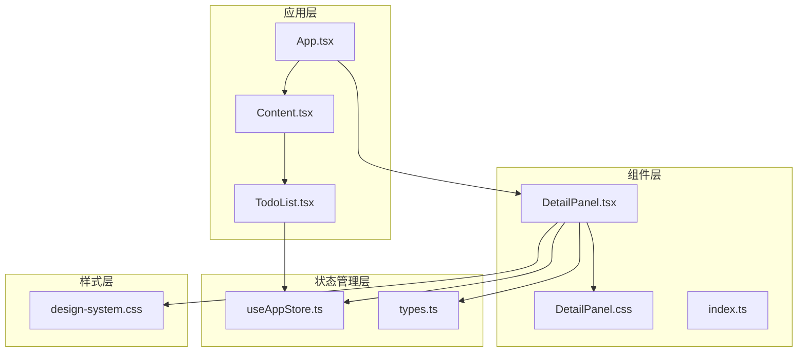
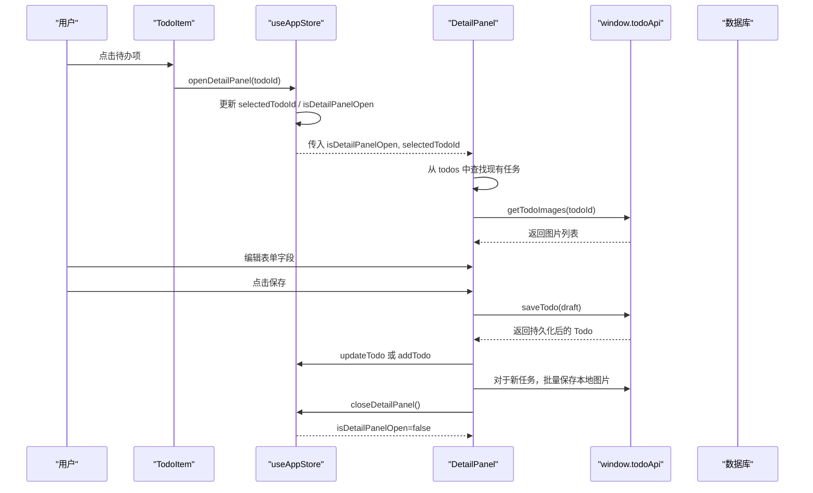
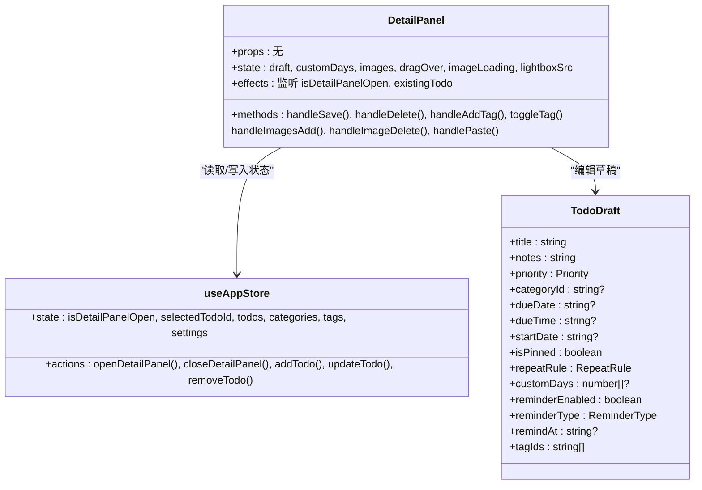
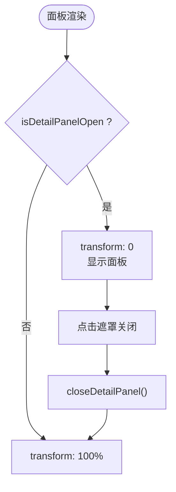
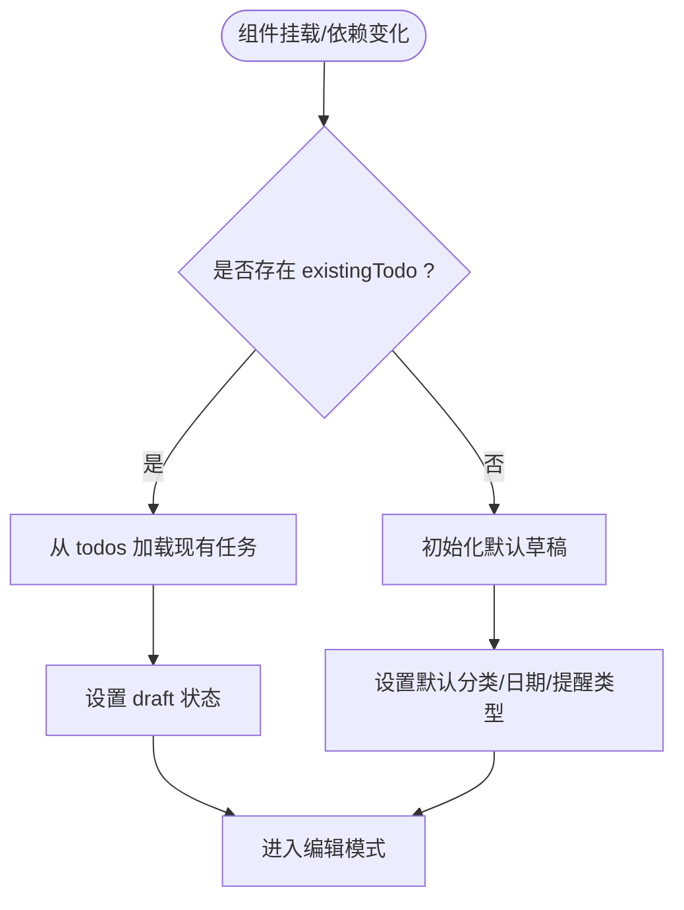
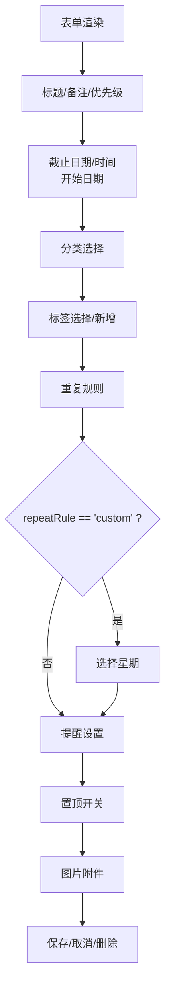
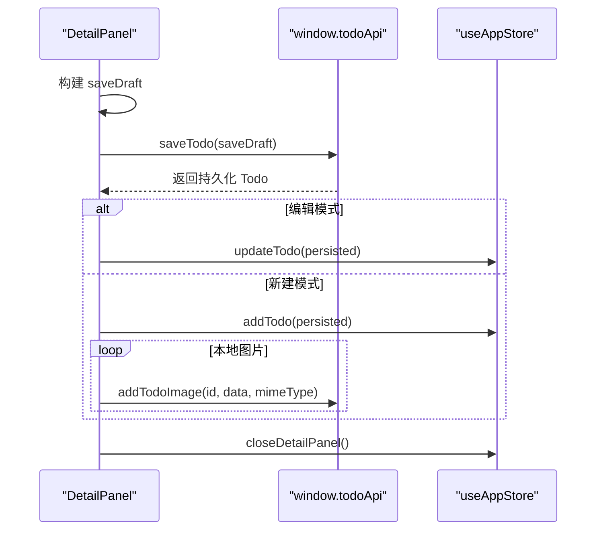
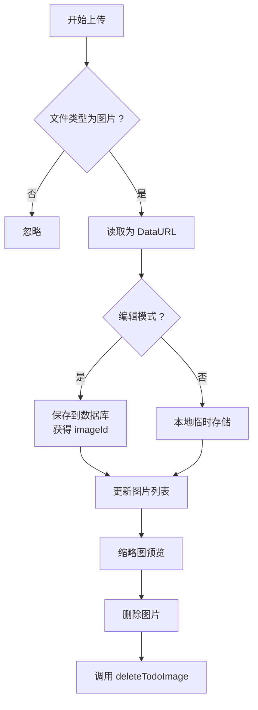
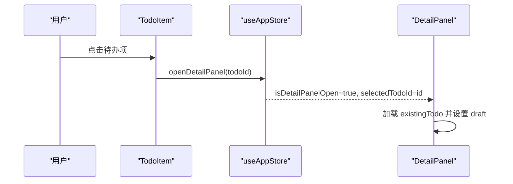
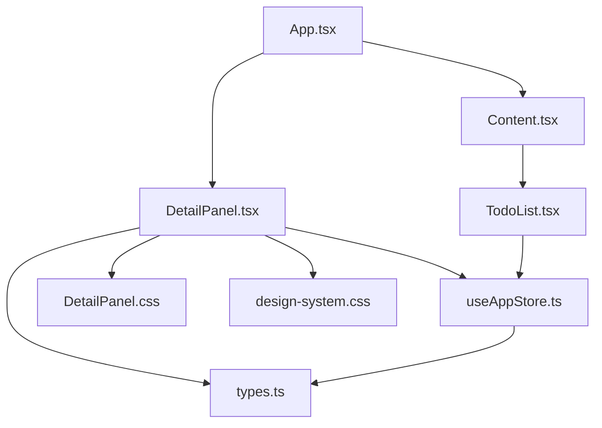

# 详情面板

<cite>
**本文档引用的文件**
- [DetailPanel.tsx](file://app/src/components/DetailPanel/DetailPanel.tsx)
- [DetailPanel.css](file://app/src/components/DetailPanel/DetailPanel.css)
- [index.ts](file://app/src/components/DetailPanel/index.ts)
- [useAppStore.ts](file://app/src/store/useAppStore.ts)
- [types.ts](file://app/src/types.ts)
- [Content.tsx](file://app/src/components/Content/Content.tsx)
- [TodoList.tsx](file://app/src/components/Content/TodoList.tsx)
- [App.tsx](file://app/src/App.tsx)
- [design-system.css](file://app/src/styles/design-system.css)
</cite>

## 目录
1. [简介](#简介)
2. [项目结构](#项目结构)
3. [核心组件](#核心组件)
4. [架构总览](#架构总览)
5. [详细组件分析](#详细组件分析)
6. [依赖关系分析](#依赖关系分析)
7. [性能考虑](#性能考虑)
8. [故障排除指南](#故障排除指南)
9. [结论](#结论)
10. [附录](#附录)

## 简介
本文件详细解析 SnowTodo 的详情面板组件，涵盖其设计架构、实现原理、状态管理机制、与主内容区域的交互逻辑、动画过渡效果以及扩展性设计。详情面板负责展示和编辑任务详情，提供表单编辑、图片附件管理、重复规则配置、提醒设置、置顶等功能，并通过全局状态管理实现与应用其他模块的无缝集成。

## 项目结构
详情面板位于组件目录中，采用独立的组件文件组织方式：
- 组件文件：DetailPanel.tsx（主组件）
- 样式文件：DetailPanel.css（专用样式）
- 导出入口：index.ts（统一导出）

图表来源
- [DetailPanel.tsx:1-507](file://app/src/components/DetailPanel/DetailPanel.tsx#L1-L507)
- [useAppStore.ts:1-604](file://app/src/store/useAppStore.ts#L1-L604)
- [types.ts:1-278](file://app/src/types.ts#L1-L278)
- [App.tsx:1-60](file://app/src/App.tsx#L1-L60)
- [Content.tsx:1-65](file://app/src/components/Content/Content.tsx#L1-L65)
- [TodoList.tsx:1-189](file://app/src/components/Content/TodoList.tsx#L1-L189)
- [design-system.css:600-799](file://app/src/styles/design-system.css#L600-L799)

章节来源
- [DetailPanel.tsx:1-507](file://app/src/components/DetailPanel/DetailPanel.tsx#L1-L507)
- [DetailPanel.css:1-206](file://app/src/components/DetailPanel/DetailPanel.css#L1-L206)
- [index.ts:1-2](file://app/src/components/DetailPanel/index.ts#L1-L2)
- [useAppStore.ts:1-604](file://app/src/store/useAppStore.ts#L1-L604)
- [types.ts:1-278](file://app/src/types.ts#L1-L278)
- [App.tsx:1-60](file://app/src/App.tsx#L1-L60)
- [Content.tsx:1-65](file://app/src/components/Content/Content.tsx#L1-L65)
- [TodoList.tsx:1-189](file://app/src/components/Content/TodoList.tsx#L1-L189)
- [design-system.css:600-799](file://app/src/styles/design-system.css#L600-L799)

## 核心组件
详情面板的核心职责包括：
- 显示控制：通过全局状态控制面板的打开/关闭，使用 CSS 过渡实现平滑动画。
- 任务详情展示：根据选中的任务 ID 获取现有任务数据，填充表单草稿。
- 表单编辑功能：支持标题、备注、优先级、截止日期/时间、开始日期、分类、标签、重复规则、提醒设置、置顶等字段的编辑。
- 数据同步与保存：将草稿转换为持久化对象，调用 API 保存，更新全局状态。
- 图片附件管理：支持拖拽、粘贴、文件选择上传图片，本地临时存储新任务的图片，已存在任务的图片直接保存到数据库。
- 状态管理：维护草稿状态、自定义重复星期、图片列表、拖拽状态、缩略图预览等。

章节来源
- [DetailPanel.tsx:33-507](file://app/src/components/DetailPanel/DetailPanel.tsx#L33-L507)
- [useAppStore.ts:30-80](file://app/src/store/useAppStore.ts#L30-L80)
- [types.ts:168-206](file://app/src/types.ts#L168-L206)

## 架构总览
详情面板与应用其他模块的交互关系如下：

图表来源
- [TodoList.tsx:77-144](file://app/src/components/Content/TodoList.tsx#L77-L144)
- [useAppStore.ts:307-311](file://app/src/store/useAppStore.ts#L307-L311)
- [DetailPanel.tsx:131-185](file://app/src/components/DetailPanel/DetailPanel.tsx#L131-L185)
- [types.ts:168-206](file://app/src/types.ts#L168-L206)

## 详细组件分析

### 组件结构与状态管理
详情面板采用函数式组件 + React Hooks 的模式，内部状态包括：
- 草稿状态：用于表单编辑的临时数据，避免直接修改全局状态。
- 自定义重复星期：仅在重复规则为“自定义”时生效。
- 图片管理：本地临时存储新任务的图片，已存在任务的图片通过数据库 ID 关联。
- 拖拽与粘贴：支持拖拽上传、粘贴图片、文件选择上传。
- 缩略图预览：点击图片进入全屏放大预览，支持关闭。

图表来源
- [DetailPanel.tsx:33-507](file://app/src/components/DetailPanel/DetailPanel.tsx#L33-L507)
- [useAppStore.ts:30-80](file://app/src/store/useAppStore.ts#L30-L80)
- [types.ts:190-206](file://app/src/types.ts#L190-L206)

章节来源
- [DetailPanel.tsx:33-507](file://app/src/components/DetailPanel/DetailPanel.tsx#L33-L507)
- [useAppStore.ts:307-311](file://app/src/store/useAppStore.ts#L307-L311)
- [types.ts:190-206](file://app/src/types.ts#L190-L206)

### 显示控制与动画过渡
- 打开/关闭：通过全局状态 isDetailPanelOpen 控制面板显示；面板使用 CSS transform 实现从右侧滑入的过渡效果。
- 背景遮罩：点击遮罩层可关闭面板，实现非侵入式关闭。
- 动画细节：transform: translateX(100%) 初始隐藏，open 类切换时变为 0，配合 transition 属性实现平滑动画。

图表来源
- [DetailPanel.tsx:223-235](file://app/src/components/DetailPanel/DetailPanel.tsx#L223-L235)
- [design-system.css:601-619](file://app/src/styles/design-system.css#L601-L619)

章节来源
- [DetailPanel.tsx:223-235](file://app/src/components/DetailPanel/DetailPanel.tsx#L223-L235)
- [design-system.css:601-619](file://app/src/styles/design-system.css#L601-L619)

### 任务详情展示与草稿初始化
- 编辑模式：当存在选中的任务 ID 时，从全局 todos 中查找对应任务，将其字段映射到草稿状态。
- 新建模式：根据默认分类“工作”、当前日期和设置中的默认提醒类型初始化草稿。
- 自定义重复：若重复规则为“自定义”，则初始化 customDays 数组。

图表来源
- [DetailPanel.tsx:131-164](file://app/src/components/DetailPanel/DetailPanel.tsx#L131-L164)

章节来源
- [DetailPanel.tsx:131-164](file://app/src/components/DetailPanel/DetailPanel.tsx#L131-L164)

### 表单编辑功能
详情面板提供完整的任务编辑表单，包含以下字段：
- 基础信息：标题、备注
- 时间设置：截止日期/时间、开始日期
- 分类与标签：下拉选择分类，标签为可多选的标签芯片
- 优先级：高/中/低
- 重复规则：不重复/每天/工作日/每周/每月/自定义
- 提醒设置：开关、提醒方式（系统通知/弹窗/两者）、提醒时间
- 置顶：布尔开关
- 图片附件：拖拽/粘贴/文件选择上传，支持缩略图预览与删除

图表来源
- [DetailPanel.tsx:237-487](file://app/src/components/DetailPanel/DetailPanel.tsx#L237-L487)

章节来源
- [DetailPanel.tsx:237-487](file://app/src/components/DetailPanel/DetailPanel.tsx#L237-L487)

### 数据同步与保存流程
- 草稿构建：保存时根据 repeatRule 是否为“自定义”决定是否包含 customDays 字段。
- API 调用：调用 window.todoApi.saveTodo 将草稿持久化。
- 状态更新：若为编辑模式，调用 updateTodo；若为新建模式，调用 addTodo 并将本地临时图片批量保存到数据库。
- 关闭面板：保存成功后关闭详情面板。

图表来源
- [DetailPanel.tsx:166-185](file://app/src/components/DetailPanel/DetailPanel.tsx#L166-L185)
- [useAppStore.ts:90-94](file://app/src/store/useAppStore.ts#L90-L94)

章节来源
- [DetailPanel.tsx:166-185](file://app/src/components/DetailPanel/DetailPanel.tsx#L166-L185)
- [useAppStore.ts:90-94](file://app/src/store/useAppStore.ts#L90-L94)

### 图片附件管理
- 上传方式：支持拖拽、粘贴、文件选择三种方式；粘贴时过滤图像类型。
- 本地临时存储：新建任务时，图片先保存在组件本地状态，待保存成功后再批量上传到数据库。
- 已存在任务：图片直接保存到数据库并返回 ID，与任务关联。
- 预览与删除：缩略图支持点击放大预览，悬停显示删除按钮；删除时同步调用数据库接口。

图表来源
- [DetailPanel.tsx:77-108](file://app/src/components/DetailPanel/DetailPanel.tsx#L77-L108)
- [DetailPanel.css:77-205](file://app/src/components/DetailPanel/DetailPanel.css#L77-L205)

章节来源
- [DetailPanel.tsx:77-108](file://app/src/components/DetailPanel/DetailPanel.tsx#L77-L108)
- [DetailPanel.css:77-205](file://app/src/components/DetailPanel/DetailPanel.css#L77-L205)

### 与主内容区域的交互逻辑
- 触发机制：主内容区域的 TodoList 中的每个待办项点击时，调用 openDetailPanel(todoId)，从而打开详情面板并加载对应任务。
- 空状态：当视图为空且允许创建时，空状态按钮也会触发 openDetailPanel，进入新建模式。
- 状态同步：面板关闭时，selectedTodoId 清空，避免状态残留。

图表来源
- [TodoList.tsx:77-95](file://app/src/components/Content/TodoList.tsx#L77-L95)
- [useAppStore.ts:310-311](file://app/src/store/useAppStore.ts#L310-L311)

章节来源
- [TodoList.tsx:77-95](file://app/src/components/Content/TodoList.tsx#L77-L95)
- [useAppStore.ts:310-311](file://app/src/store/useAppStore.ts#L310-L311)

### 用户体验设计
- 响应式布局：表单采用栅格布局，移动端友好。
- 视觉反馈：输入框聚焦时有高亮边框，标签芯片选中态有强调色，开关按钮有状态指示。
- 无障碍：按钮具备 hover 状态，图标语义明确。
- 动画：面板滑入/滑出、缩略图悬停缩放、删除按钮渐显等细节提升交互体验。

章节来源
- [DetailPanel.css:1-206](file://app/src/components/DetailPanel/DetailPanel.css#L1-L206)
- [design-system.css:667-799](file://app/src/styles/design-system.css#L667-L799)

### 扩展性设计
- 类型安全：通过 TodoDraft 类型约束草稿字段，确保保存时的数据结构正确。
- 可配置字段：重复规则、提醒类型、优先级等均通过枚举类型定义，便于扩展新的选项。
- 组件解耦：详情面板通过全局状态与应用其他模块解耦，易于替换或扩展。
- 图片扩展：图片上传接口抽象为 window.todoApi，便于替换存储后端。

章节来源
- [types.ts:1-278](file://app/src/types.ts#L1-L278)
- [DetailPanel.tsx:54-108](file://app/src/components/DetailPanel/DetailPanel.tsx#L54-L108)
- [useAppStore.ts:540-603](file://app/src/store/useAppStore.ts#L540-L603)

### 定制化开发指南与最佳实践
- 新增字段：在 TodoDraft 中添加字段，然后在详情面板表单中添加对应控件，并在保存时纳入 saveDraft。
- 自定义验证：在 handleSave 前增加校验逻辑，如必填字段检查、日期范围校验等。
- 图片优化：对于大图，可在上传前进行压缩或限制尺寸，减少数据库存储压力。
- 性能优化：草稿状态仅在本地使用，避免频繁触发全局重渲染；图片上传使用并发控制，避免阻塞 UI。
- 国际化：将静态文本（如“新建待办”、“编辑待办”）提取为国际化资源，便于多语言支持。

章节来源
- [DetailPanel.tsx:166-185](file://app/src/components/DetailPanel/DetailPanel.tsx#L166-L185)
- [types.ts:190-206](file://app/src/types.ts#L190-L206)

## 依赖关系分析
详情面板与应用其他模块的依赖关系如下：

图表来源
- [DetailPanel.tsx:1-5](file://app/src/components/DetailPanel/DetailPanel.tsx#L1-L5)
- [useAppStore.ts:1-21](file://app/src/store/useAppStore.ts#L1-L21)
- [types.ts:1-21](file://app/src/types.ts#L1-L21)
- [App.tsx:1-6](file://app/src/App.tsx#L1-L6)
- [Content.tsx:1-12](file://app/src/components/Content/Content.tsx#L1-L12)
- [TodoList.tsx:1-4](file://app/src/components/Content/TodoList.tsx#L1-L4)

章节来源
- [DetailPanel.tsx:1-5](file://app/src/components/DetailPanel/DetailPanel.tsx#L1-L5)
- [useAppStore.ts:1-21](file://app/src/store/useAppStore.ts#L1-L21)
- [types.ts:1-21](file://app/src/types.ts#L1-L21)
- [App.tsx:1-6](file://app/src/App.tsx#L1-L6)
- [Content.tsx:1-12](file://app/src/components/Content/Content.tsx#L1-L12)
- [TodoList.tsx:1-4](file://app/src/components/Content/TodoList.tsx#L1-L4)

## 性能考虑
- 状态最小化：草稿状态仅在详情面板内使用，避免影响主列表渲染。
- 异步操作：图片上传使用 Promise.all 并发处理，减少等待时间。
- 条件渲染：重复规则为“自定义”时才渲染星期选择，减少 DOM 结构。
- 动画性能：CSS transform 滑动优于改变位置属性，动画流畅度高。

## 故障排除指南
- 面板无法关闭：检查 isDetailPanelOpen 状态是否被其他视图覆盖，确认 closeDetailPanel 调用链。
- 图片上传失败：确认 window.todoApi.addTodoImage 接口可用，检查 MIME 类型与 DataURL 格式。
- 保存按钮禁用：检查草稿 title 是否为空，确保必填字段完整。
- 重复规则异常：确认 repeatRule 与 customDays 的联动逻辑，避免空数组导致保存错误。

章节来源
- [DetailPanel.tsx:166-185](file://app/src/components/DetailPanel/DetailPanel.tsx#L166-L185)
- [DetailPanel.tsx:419-439](file://app/src/components/DetailPanel/DetailPanel.tsx#L419-L439)
- [useAppStore.ts:310-311](file://app/src/store/useAppStore.ts#L310-L311)

## 结论
详情面板通过清晰的状态管理、完善的表单编辑能力、友好的动画过渡与用户体验，实现了任务详情的高效编辑与管理。其与应用其他模块的解耦设计保证了良好的扩展性，能够支持不同类型任务的编辑需求。建议在实际开发中遵循定制化指南与最佳实践，持续优化性能与用户体验。

## 附录
- 相关类型定义参考：Todo、TodoDraft、Priority、RepeatRule、ReminderType 等。
- 全局状态接口参考：openDetailPanel、closeDetailPanel、addTodo、updateTodo、removeTodo 等。

章节来源
- [types.ts:168-206](file://app/src/types.ts#L168-L206)
- [useAppStore.ts:307-311](file://app/src/store/useAppStore.ts#L307-L311)
- [useAppStore.ts:90-94](file://app/src/store/useAppStore.ts#L90-L94)