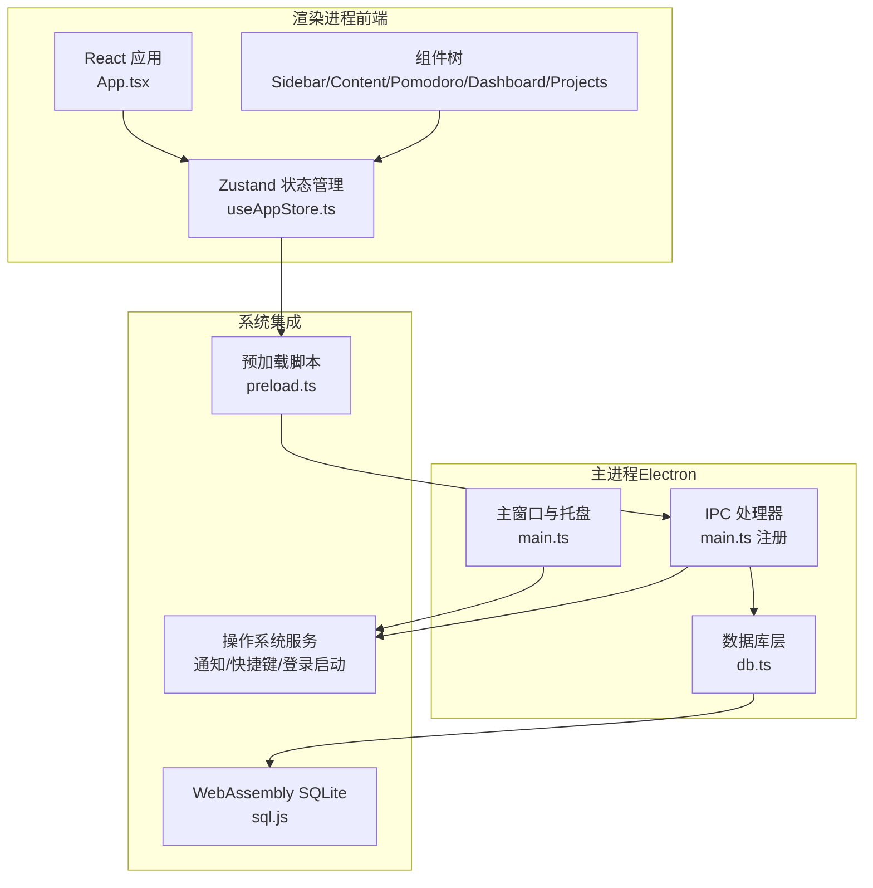
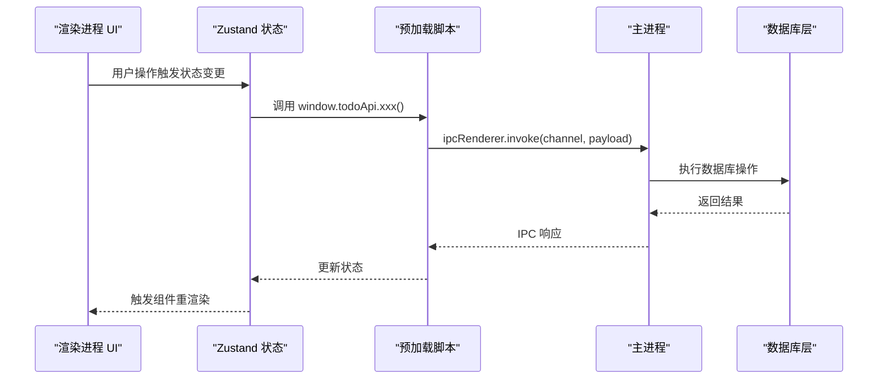
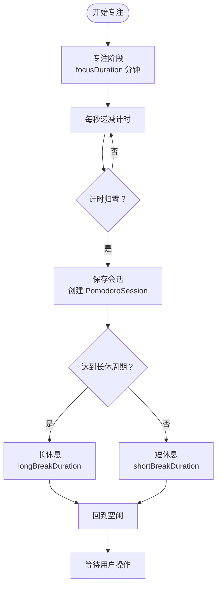
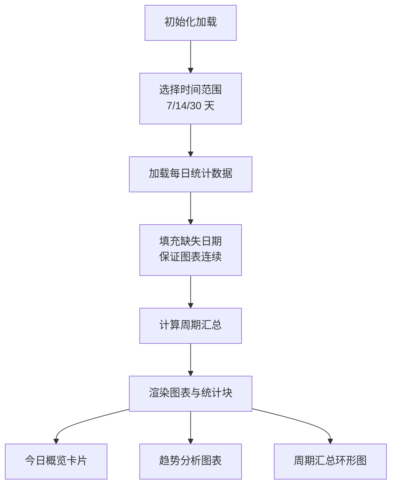
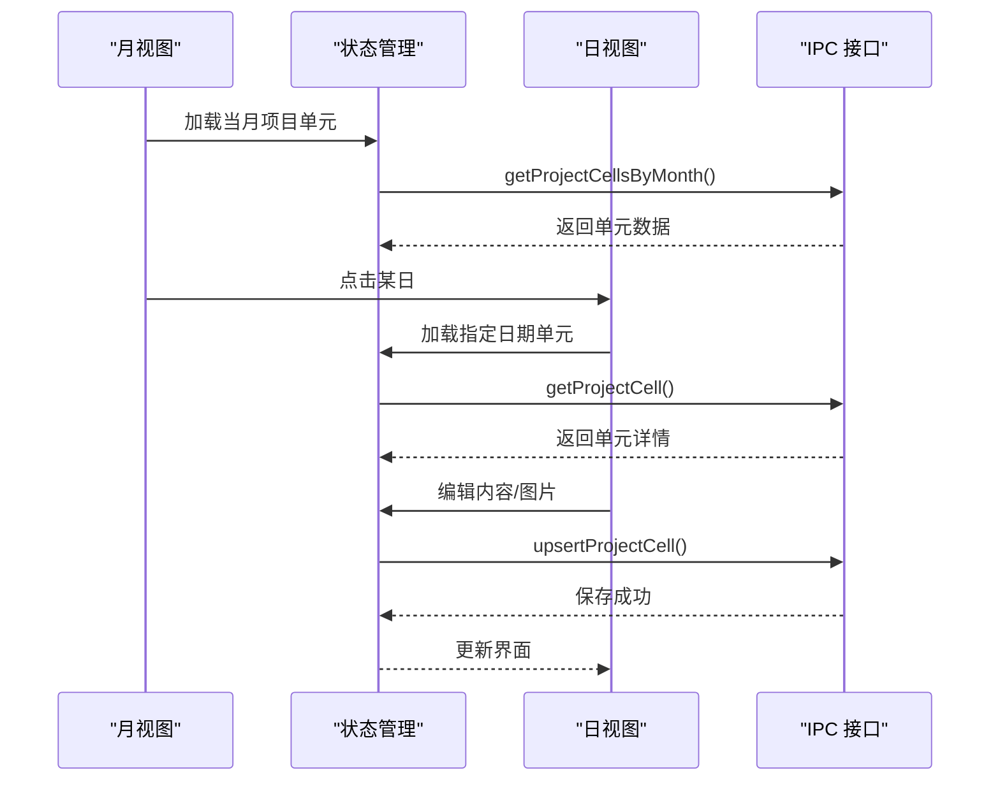
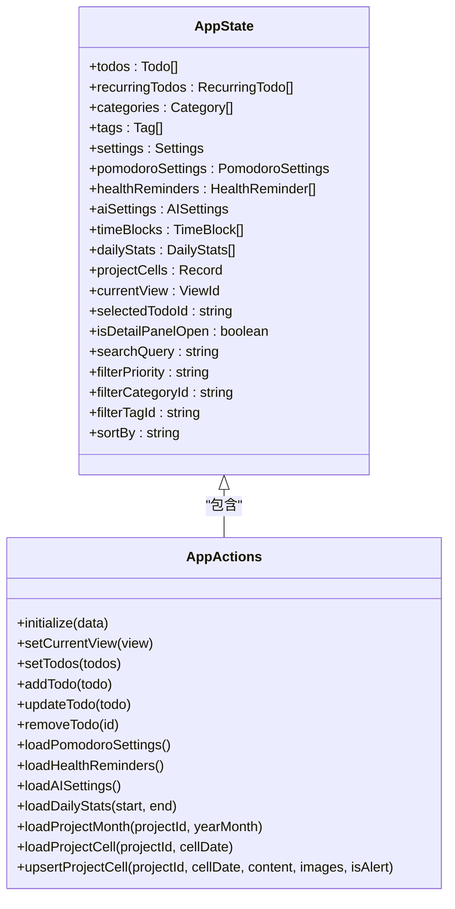
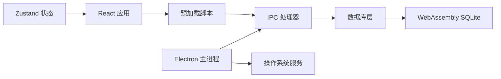

# 项目概述

<cite>
**本文档引用的文件**
- [app/package.json](file://app/package.json)
- [app/src/main.tsx](file://app/src/main.tsx)
- [app/src/App.tsx](file://app/src/App.tsx)
- [app/src/types.ts](file://app/src/types.ts)
- [app/src/store/useAppStore.ts](file://app/src/store/useAppStore.ts)
- [app/src/components/Content/Content.tsx](file://app/src/components/Content/Content.tsx)
- [app/src/components/Sidebar/Sidebar.tsx](file://app/src/components/Sidebar/Sidebar.tsx)
- [app/src/components/Pomodoro/PomodoroView.tsx](file://app/src/components/Pomodoro/PomodoroView.tsx)
- [app/src/components/Dashboard/DashboardView.tsx](file://app/src/components/Dashboard/DashboardView.tsx)
- [app/src/components/Projects/ProjectsView.tsx](file://app/src/components/Projects/ProjectsView.tsx)
- [app/electron/main.ts](file://app/electron/main.ts)
- [app/electron/db.ts](file://app/electron/db.ts)
- [app/electron/preload.ts](file://app/electron/preload.ts)
- [app/vite.config.ts](file://app/vite.config.ts)
- [README.md](file://README.md)
</cite>

## 目录
1. [引言](#引言)
2. [项目结构](#项目结构)
3. [核心组件](#核心组件)
4. [架构总览](#架构总览)
5. [详细组件分析](#详细组件分析)
6. [依赖关系分析](#依赖关系分析)
7. [性能考虑](#性能考虑)
8. [故障排除指南](#故障排除指南)
9. [结论](#结论)
10. [附录](#附录)

## 引言

SnowTodo 是一款面向知识工作者的本地跨平台桌面待办应用，基于 Electron 框架构建，专注于提供高效、简洁且可扩展的本地待办管理体验。项目以 React + TypeScript + Electron + SQL.js + Zustand 为核心技术栈，结合 WebAssembly 的 SQLite 数据库能力，实现了从基础待办管理到高级效率工具的完整功能体系。

项目的主要目标是帮助用户通过科学的时间管理和健康提醒机制提升生产力，同时提供 AI 智能助手、数据仪表盘、番茄工作法、时间块管理、项目管理等专业工具，满足不同场景下的个人与团队协作需求。

## 项目结构

项目采用典型的 Electron + React 前后端分离架构，主要分为以下层次：

- 应用入口与构建配置
  - Vite + Electron 插件链路，支持主进程与渲染进程的并行开发
  - 预加载脚本提供安全的 IPC API 暴露
- 主进程（Electron）
  - 负责窗口管理、系统通知、全局快捷键、数据库初始化与定时任务
  - 通过 IPC 暴露统一的数据访问接口
- 渲染进程（React）
  - 前端组件树，包含侧边栏导航、内容区域、工具面板等
  - Zustand 全局状态管理，集中维护应用状态与业务逻辑
- 数据层（SQL.js + WebAssembly）
  - 基于 sql.js 的 SQLite 数据库，支持迁移、索引与默认数据初始化
  - 所有写操作通过主进程封装，确保数据一致性与安全性

**图表来源**
- [app/src/App.tsx:1-60](file://app/src/App.tsx#L1-L60)
- [app/src/store/useAppStore.ts:1-604](file://app/src/store/useAppStore.ts#L1-L604)
- [app/electron/main.ts:1-383](file://app/electron/main.ts#L1-L383)
- [app/electron/db.ts:1-800](file://app/electron/db.ts#L1-L800)
- [app/electron/preload.ts:1-117](file://app/electron/preload.ts#L1-L117)

**章节来源**
- [README.md:120-152](file://README.md#L120-L152)
- [app/vite.config.ts:1-37](file://app/vite.config.ts#L1-L37)
- [app/package.json:1-100](file://app/package.json#L1-L100)

## 核心组件

SnowTodo 的核心功能围绕六大模块展开，每个模块都通过统一的 IPC 接口与主进程交互，确保数据持久化与状态同步的一致性。

- 基础待办管理
  - 支持多视图（今天/全部/即将到期/已完成/分类/标签）
  - 优先级、分类、标签、到期日、重复规则、提醒设置
  - 通过 IPC 完成 CRUD 操作与数据导入导出

- 番茄工作法（M1）
  - 环形计时器，专注/短休/长休三相循环
  - 全局快捷键控制，打断记录与原因标签
  - 与任务关联，自动记录专注时长与工时

- 健康提醒（M3）
  - 间隔提醒与固定时间提醒，支持系统通知与弹窗
  - 番茄专注期间智能延迟，工作日/周末差异化配置

- AI 智能助手（M5）
  - 支持多种模型提供商，OpenAI 兼容 API 配置
  - 任务智能拆分、优先级建议、效率洞察与周报生成

- 时间块管理（M6）
  - 日视图时间轴，64px/hour 显示
  - 任务与时间块双向关联，支持全天事件与备注

- 数据仪表盘（M4）
  - 本周完成率环形图、近 N 天柱状图
  - 今日累计专注时长、连续专注天数、分类分布饼图

- 项目管理
  - 月视图与日视图，支持内容文本与图片记录
  - 飘红标记、拖拽上传、剪贴板粘贴图片

**章节来源**
- [README.md:19-54](file://README.md#L19-L54)
- [app/src/types.ts:1-278](file://app/src/types.ts#L1-L278)
- [app/src/store/useAppStore.ts:1-604](file://app/src/store/useAppStore.ts#L1-L604)

## 架构总览

SnowTodo 的整体架构遵循“主进程负责系统集成与数据持久化，渲染进程负责 UI 与业务逻辑”的设计原则。IPC 作为前后端通信的桥梁，提供了类型安全的 API 暴露与事件订阅机制。

**图表来源**
- [app/src/store/useAppStore.ts:540-604](file://app/src/store/useAppStore.ts#L540-L604)
- [app/electron/preload.ts:18-117](file://app/electron/preload.ts#L18-L117)
- [app/electron/main.ts:219-350](file://app/electron/main.ts#L219-L350)

**章节来源**
- [app/src/App.tsx:11-60](file://app/src/App.tsx#L11-L60)
- [app/src/components/Content/Content.tsx:14-65](file://app/src/components/Content/Content.tsx#L14-L65)
- [app/src/components/Sidebar/Sidebar.tsx:30-203](file://app/src/components/Sidebar/Sidebar.tsx#L30-L203)

## 详细组件分析

### 番茄工作法模块（M1）

该模块实现了完整的番茄工作法流程，包括计时器、阶段切换、打断记录与统计分析。

**图表来源**
- [app/src/components/Pomodoro/PomodoroView.tsx:234-283](file://app/src/components/Pomodoro/PomodoroView.tsx#L234-L283)
- [app/src/types.ts:27-48](file://app/src/types.ts#L27-L48)

**章节来源**
- [app/src/components/Pomodoro/PomodoroView.tsx:160-499](file://app/src/components/Pomodoro/PomodoroView.tsx#L160-L499)
- [app/src/store/useAppStore.ts:394-421](file://app/src/store/useAppStore.ts#L394-L421)

### 数据仪表盘模块（M4）

仪表盘模块提供多维度的可视化分析，支持时间范围切换与图表填充。

**图表来源**
- [app/src/components/Dashboard/DashboardView.tsx:125-272](file://app/src/components/Dashboard/DashboardView.tsx#L125-L272)

**章节来源**
- [app/src/components/Dashboard/DashboardView.tsx:1-272](file://app/src/components/Dashboard/DashboardView.tsx#L1-L272)
- [app/src/store/useAppStore.ts:467-471](file://app/src/store/useAppStore.ts#L467-L471)

### 项目管理模块（Projects）

项目管理提供月视图与日视图的双层交互，支持内容文本与图片的富文本记录。

**图表来源**
- [app/src/components/Projects/ProjectsView.tsx:45-144](file://app/src/components/Projects/ProjectsView.tsx#L45-L144)
- [app/src/components/Projects/ProjectsView.tsx:147-315](file://app/src/components/Projects/ProjectsView.tsx#L147-L315)

**章节来源**
- [app/src/components/Projects/ProjectsView.tsx:1-355](file://app/src/components/Projects/ProjectsView.tsx#L1-L355)
- [app/src/store/useAppStore.ts:474-507](file://app/src/store/useAppStore.ts#L474-L507)

### 状态管理模式

Zustand 作为轻量级状态管理库，提供了集中式的全局状态与派生状态计算能力。

**图表来源**
- [app/src/store/useAppStore.ts:30-176](file://app/src/store/useAppStore.ts#L30-L176)

**章节来源**
- [app/src/store/useAppStore.ts:181-508](file://app/src/store/useAppStore.ts#L181-L508)

## 依赖关系分析

项目的技术栈选择体现了对易用性、性能与可维护性的平衡。

- Electron 41.x：提供跨平台桌面应用能力，支持窗口、托盘、通知、全局快捷键等系统级功能
- React 19.x + TypeScript 6.x：现代化前端开发体验，强类型保障与组件化架构
- Vite 8.x + electron-builder：快速构建与打包，支持热更新与多目标发布
- sql.js：SQLite 的 WebAssembly 实现，无需外部依赖即可实现本地持久化
- Zustand 5.x：轻量级状态管理，避免样板代码与复杂状态流

**图表来源**
- [app/electron/main.ts:1-383](file://app/electron/main.ts#L1-L383)
- [app/electron/db.ts:1-800](file://app/electron/db.ts#L1-L800)
- [app/electron/preload.ts:1-117](file://app/electron/preload.ts#L1-L117)
- [app/src/store/useAppStore.ts:1-604](file://app/src/store/useAppStore.ts#L1-L604)

**章节来源**
- [README.md:65-76](file://README.md#L65-L76)
- [app/package.json:16-49](file://app/package.json#L16-L49)

## 性能考虑

- 数据库优化
  - 通过索引优化常用查询（如 pomodoro_sessions、time_blocks、daily_stats 等）
  - 迁移脚本自动处理表结构演进与默认数据初始化
- 前端性能
  - Zustand 的原子化状态更新减少不必要的重渲染
  - 组件按需加载与懒加载策略降低首屏压力
- IPC 通信
  - 通过预加载脚本统一暴露 API，避免直接访问 Node.js API
  - 合理使用 invoke/call 与事件监听，避免阻塞主线程

## 故障排除指南

- 数据库初始化失败
  - 检查 sql-wasm.wasm 文件路径是否正确（开发/生产环境路径不同）
  - 确认用户数据目录权限与磁盘空间充足
- IPC 调用超时
  - 确认主进程已正确注册对应通道处理器
  - 检查渲染进程预加载脚本中的 API 暴露是否完整
- 番茄钟计时异常
  - 检查全局快捷键冲突与权限设置
  - 确认系统通知权限已开启
- 健康提醒未触发
  - 检查提醒规则（间隔/固定时间/工作日限制）
  - 确认番茄专注期间的跳过设置

**章节来源**
- [app/electron/db.ts:60-90](file://app/electron/db.ts#L60-L90)
- [app/electron/main.ts:171-185](file://app/electron/main.ts#L171-L185)
- [app/electron/preload.ts:18-117](file://app/electron/preload.ts#L18-L117)

## 结论

SnowTodo 通过精心设计的模块化架构与现代化技术栈，为知识工作者提供了一套完整的本地待办解决方案。项目不仅具备强大的功能特性，还注重用户体验与可维护性，适合个人使用与团队协作场景。随着功能的持续迭代与生态的完善，SnowTodo 有望成为本地化效率工具领域的优秀代表。

## 附录

- 快速开始
  - 环境要求：Node.js ≥ 18.x，npm/pnpm，Windows 10/11
  - 开发模式：npm run dev
  - 构建发布：npm run build
- 开发指南
  - 新模块开发流程：类型定义 → 状态管理 → 数据持久化 → IPC 注册 → 组件实现
  - 样式规范：CSS 变量主题系统，避免硬编码颜色值
  - 数据库规范：所有写操作通过主进程封装，确保数据一致性

**章节来源**
- [README.md:79-117](file://README.md#L79-L117)
- [README.md:156-181](file://README.md#L156-L181)